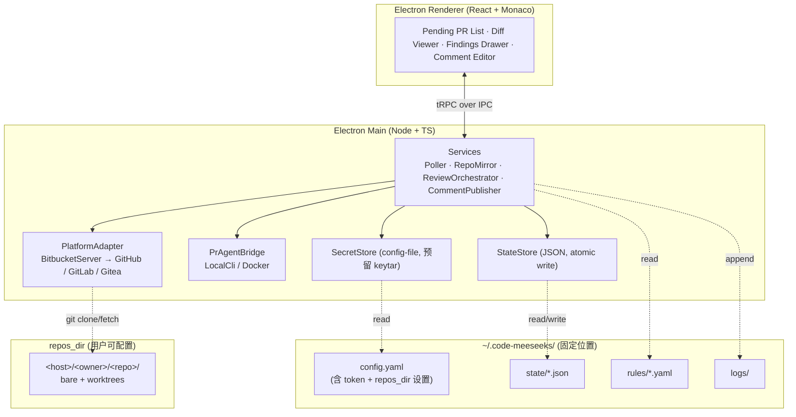

# Code Meeseeks Roadmap

> 最后更新：2026-06-04
> 状态：M0 + M1 + M2 + M3 + M4 已交付，下一步 M5（多平台扩展 + 打磨）
>
> **命名约定**：对外品牌 **Code Meeseeks**（灵感来自 Rick and Morty 的 Mr. Meeseeks）；
> 代码内部统一用中性代号 **meebox**（npm 作用域 `@meebox/*`），数据目录 `~/.code-meeseeks`。
> 文档正文沿用代号 meebox。上游工具 pr-agent 为第三方依赖，不在重命名范围内。

## 1. 项目定位

**Code Meeseeks**（代号 meebox）是面向 Reviewer **个人**的本地化、半自动化代码评审 GUI 客户端，基于 [Qodo pr-agent](https://docs.pr-agent.ai/) 构建。

三句话定位：

- **决策权在人**：所有评论必须经 Reviewer 二次确认 / 编辑后才发布到远端。
- **规则在本地**：每位 Reviewer 配置自己的检查规则、风格偏好、LLM Provider。
- **数据在本地**：仓库副本、PR 元数据、待办列表、评论草稿都保存在本地工作目录。

### 1.1 目标用户

- 需要承担 code review 工作的工程师 / Tech Lead
- 希望用 AI 工具加速评审，但不愿把决策权完全交给 bot
- 多数在企业内网，使用自建 Bitbucket / GitLab / Gitea 等

### 1.2 非目标

- ❌ 不是 CI 上跑的自动化 review bot（这是 pr-agent 本身的定位）
- ❌ 不是团队协同评审平台，不做服务端、不做多用户同步
- ❌ 不替代代码托管平台的原生评审 UI
- ❌ 一期不考虑团队规则共享 / 中心化治理

---

## 2. 架构总览



详细决策见 [ADR 目录](./adr/)：

- [ADR-0001](./adr/0001-pr-agent-integration.md) · pr-agent 集成方式
- [ADR-0002](./adr/0002-bitbucket-server-adapter.md) · Bitbucket Server 平台适配
- [ADR-0003](./adr/0003-state-storage-and-workspace-layout.md) · 状态存储与工作目录布局
- [ADR-0004](./adr/0004-package-manager-and-monorepo.md) · 包管理器与 Monorepo 工具
- [ADR-0006](./adr/0006-pr-state-storage-redesign.md) · PR 状态存储重新设计（per-PR 目录 + hash localId + 软删 + 安全 invariants）
- [ADR-0007](./adr/0007-m4-draft-workflow.md) · M4 评审 → 发布闭环的草稿工作流（/review code-feedback → 草稿池 → 内联编辑 → 批量发布）
- [ADR-0008](./adr/0008-pragent-packaging-and-runtime.md) · pr-agent 打包与运行时策略（嵌入式 Python 解释器 + 隔离环境依赖，Docker 改配置可选；扩展 ADR-0001）

---

## 3. 技术栈

| 维度              | 选择                                                     | 备注                                                                                                   |
| ----------------- | -------------------------------------------------------- | ------------------------------------------------------------------------------------------------------ |
| 包管理 / Monorepo | npm (workspaces) + Nx                                    | 见 [ADR-0004](./adr/0004-package-manager-and-monorepo.md)                                              |
| 桌面壳            | Electron + Vite                                          | `contextIsolation` on、preload 白名单、CSP                                                             |
| 渲染层            | React + Vite + TS strict                                 | 优先 shadcn/ui，避免重型组件库                                                                         |
| IPC               | tRPC over IPC                                            | Renderer ↔ Main 全类型化                                                                               |
| 编辑器            | Monaco                                                   | side-by-side diff、文件树虚拟化                                                                        |
| pr-agent 集成     | 本地 CLI 子进程优先；Docker fallback                     | 见 [ADR-0001](./adr/0001-pr-agent-integration.md)                                                      |
| Git 平台（M1）    | Bitbucket Server / DC，REST API v1                       | 见 [ADR-0002](./adr/0002-bitbucket-server-adapter.md)                                                  |
| 状态存储          | JSON 文件（原子写）+ `StateStore` 抽象                   | 一期规模小；未来可切 SQLite；见 [ADR-0003](./adr/0003-state-storage-and-workspace-layout.md)           |
| 凭据存储          | 合并在 `config.yaml`，权限收紧；模块级 `SecretStore`     | 用户自负；未来可切 keytar                                                                              |
| 工作目录          | 应用数据固定在 `~/.code-meeseeks/`；**仅 `repos_dir` 可配置** | `repos_dir` 默认 `~/.code-meeseeks/repos/`；见 [ADR-0003](./adr/0003-state-storage-and-workspace-layout.md) |
| Git 操作          | simple-git + 系统 `git`                                  | partial clone + worktree per PR                                                                        |

### 3.1 目录布局

**应用数据目录**（固定位置：`~/.code-meeseeks/`，跨 OS 一致）：

```
~/.code-meeseeks/
├── config.yaml          # 所有配置（含 token / API key + repos_dir 设置），权限 600 / Windows ACL
│                        # (rules 默认不放这里，见下方 `rules.dir`)
├── state/               # JSON 状态文件（per-PR 目录，详见 ADR-0006）
│   ├── connections.json
│   ├── watched-repos.json
│   ├── posted-comments.json
│   └── prs/
│       ├── index.json                   # hash localId → PrIndexEntry (含 archivedAt)
│       └── <localId-hash>/
│           ├── meta.json                # PR 完整元数据 (StoredPullRequest)
│           ├── comments.json            # 评论缓存 + cache key (pr_updated_at)
│           └── runs/<run-id>.json       # agent 会话
└── logs/                # 滚动日志
```

**仓库镜像目录** `repos_dir`（**唯一可配置的存储位置**，默认 `~/.code-meeseeks/repos/`，在 `config.yaml` 中修改）：

```
<repos_dir>/
└── <host>/<owner>/<repo>/
    ├── <bare>/          # partial clone 镜像
    └── worktrees/<pr-id>/
```

为什么只让 `repos_dir` 可配置：

- 仓库镜像是磁盘占用主体（GB 级），用户可能想放到大盘 / 外置盘
- config / state / logs 总量极小（< 100 MB），固定在 home 路径反而便于备份和定位
- 不需要 locator 文件，启动逻辑直接读固定路径

首次启动无需用户介入：自动创建 `~/.code-meeseeks/` + 默认 `config.yaml`（`repos_dir` 默认值生效）；用户后续可在设置页修改 `repos_dir`。

**规则目录** `rules.dir`（可选；用于个性化 PR review 规约，详见 [ADR-0005](adr/0005-rules-directory.md)）：

```
<rules.dir>/                # 路径任意，建议指向一个 git repo 让团队共享
├── global/
│   └── coding-style.md
└── projects/
    └── FX/
        ├── common.md
        └── fx-help-api.md
```

- 每个 `.md` 文件 = 一条规则，YAML frontmatter 声明 `applies_to` (project/repo/target_branch 正则) + `tools` + `priority`，markdown 正文是给 pr-agent 的 `extra_instructions`
- `rules.dir` 为空 = 不启用规则；指向一个独立路径让规则跟 `~/.code-meeseeks/` 解耦，可以单独提交 git 跟团队共享
- pragent run 时同一 PR 多条命中按 `priority desc + 文件路径 asc` 取**首条**，避免 prompt 膨胀和规则互相矛盾

---

## 4. 数据模型（JSON 状态文件）

### 4.1 文件划分原则

- 频繁读写 + 体积小 → 单文件聚合（如 `pull-requests.json` 索引）
- 单条体积大 / 写入独立 → 每实例一文件（如每次 review run）
- 所有写入走 "tmp + fsync + rename" 原子模式
- 单写者：Electron Main 进程独占，无需文件锁

### 4.2 文件清单与 schema 草图

> M3 起 PR 状态布局按 ADR-0006 重新组织：hash localId + per-PR 目录 + 软删 + 安全 invariants。下面 schema 是当前形态。

```ts
// state/connections.json
type ConnectionsFile = {
  schema_version: 1;
  connections: Array<{
    id: string;
    host: string;
    kind: 'bitbucket-server' | 'github' | 'gitlab' | 'gitea';
    base_url: string;
    display_name: string;
    created_at: string; // ISO
  }>;
};

// state/watched-repos.json
type WatchedReposFile = {
  schema_version: 1;
  repos: Array<{
    id: string;
    connection_id: string;
    project_key: string;
    repo_slug: string;
    enabled: boolean;
  }>;
};

// PR identity 多平台抽象 (Bitbucket Server=projectKey/repoSlug / GH=owner/name / GL=namespace/name / Gitea=owner/name 都对齐到 group/repo)
type PrIdentity = {
  platform: 'bitbucket-server' | 'github' | 'gitlab' | 'gitea';
  connectionId: string;   // 本地分账户标识
  group: string;          // Bitbucket Server=projectKey / GH=owner / GL=namespace
  repo: string;           // 仓库 slug
  remoteId: string;       // PR id 字符串
  url?: string;           // 远端 URL 快照，不进 hash
};

// state/prs/index.json (PR 全局索引，仅 lookup / 退场判定字段)
type PrIndexFile = {
  schema_version: 1;
  prs: Record<
    string, // hash localId = sha1(platform|conn|group|repo|remoteId).slice(0,12)
    {
      identity: PrIdentity;
      updatedAt: string;        // 远端 PR.updatedAt 镜像，cache 失效用
      discoveredAt: string;
      lastSeenAt: string;
      archivedAt: string | null; // 软删时间戳，距 now > 1 周才硬清
    }
  >;
};

// state/prs/<localId>/meta.json (单 PR 完整元数据)
type PrMetaFile = {
  schema_version: 1;
  pr: {
    /* StoredPullRequest 完整字段：title / description / refs / reviewers /
       localStatus / discoveredAt / lastSeenAt，外加 platform: PlatformKind 字段
       让 meta 自描述 (不依赖 index.json 也能知道来自哪个平台) */
  };
};

// state/prs/<localId>/comments.json (评论缓存)
type CommentsCacheFile = {
  schema_version: 1;
  pr_updated_at: string;  // 写入时 PR meta updatedAt 快照，cache 失效判定
  fetched_at: string;
  comments: PrComment[];
};

// state/prs/<localId>/runs/<runId>.json (单次 agent 调用)
type ReviewRunFile = {
  schema_version: 1;
  run: {
    id: string;             // yyyymmdd-HHmmss-mmm 时序 id
    prLocalId: string;      // 跟父目录 <localId> 一致
    prIdentitySnapshot?: PrIdentity;  // M5 归档单 run 时反查 PR 用，M3 默认不填
    tool: 'describe' | 'review' | 'ask';
    question?: string;
    prAgentVersion: string;
    strategy: 'local-cli' | 'docker';
    status: 'running' | 'succeeded' | 'failed' | 'cancelled';
    startedAt: string;
    finishedAt?: string;
    durationMs?: number;
    exitCode?: number;
    errorReason?: 'timeout' | 'spawn-failed' | 'non-zero-exit' | 'killed' | 'cancelled';
    errorMessage?: string;
    stdout?: string;
    stderr?: string;
    findings?: Finding[];    // M3-B2 解析得到；schema 同 §3.1
    summary?: string;
  };
};

// Finding 在 M3 只填 body / anchor / sectionKey；severity / status / draft_body /
// posted_remote_id 是 M4 评审发布闭环字段，schema 提前预留
type Finding = {
  id: string;
  category: 'description' | 'general' | 'code-feedback';
  sectionKey?: PrDocSectionKey;
  title?: string;
  body: string;
  anchor?: { path: string; startLine?: number; endLine?: number };
  // ── M4 评审发布闭环字段 (M3 不填) ──
  severity?: 'info' | 'warning' | 'error';
  status?: 'pending' | 'accepted' | 'edited' | 'rejected' | 'posted';
  draft_body?: string;       // 用户改写正文，仅 status='edited' 时填
  posted_remote_id?: string; // 发布成功后远端 comment id，幂等 key
};

// state/posted-comments.json (横向幂等记录，防重复发送；跟 prs/ 目录解耦)
type PostedCommentsFile = {
  schema_version: 1;
  posted: Array<{
    finding_id: string;
    remote_id: string;
    posted_at: string;
  }>;
};
```

### 4.3 容错与最终一致

state 目录可能被外部操作 (用户手动 / 清理工具 / 同步软件) 改变。设计保证最终一致：

| 外部操作 | 当前行为 | 恢复机制 |
|---|---|---|
| `prs/index.json` 被删 | 下一次 `read` 返回 null；list 返回空数组 | 下一轮 poll 拿到远端列表 → 重建索引 |
| 某个 `prs/<localId>/meta.json` 被删 | `listStoredPullRequests` 跳过该条目 (索引有 entry 但 meta null) | 下一轮 poll：若 PR 仍在远端 → 重写 meta；若已不在 → 软删进 grace |
| `prs/<localId>/comments.json` 被删 | `readCommentsCache` 返回 null | 下一次 `diff:listComments` 调用 → 从远端拉 + 重写缓存 |
| `prs/<localId>/runs/<runId>.json` 被删 | `listReviewRunsForPr` 跳过该 run | 不可恢复 (历史事件)，但不会崩；新 run 不受影响 |
| 整个 `prs/<localId>/` 目录被删 | UI 该 PR 历史 / 评论缓存全清；索引 entry 暂时孤立 | PR 仍在远端 → 下一轮 poll 重建 meta；评论按需重拉；runs 历史永久丢 |
| `prs/index.json` 损坏（无效 JSON） | `read` 抛错；poll 当轮 fail，不动磁盘 | 用户介入 (删坏文件 / 修复) 后下一轮自动重建 |
| `prs/<hash>/` 目录在索引中没条目 (孤儿) | 占磁盘但不影响功能 | 暂不主动清理；下次主动 reconcile 时处理 (待 M5) |

设计原则：**读操作宽容 (null/skip)，写操作幂等 (覆盖)，poll 是唯一权威，远端是最终 truth**。

### 4.4 安全 invariants

详见 ADR-0006 §5。关键：

- 上游 PR list 失败 → 不写 meta / 不软删 / 不剔除条目 / 不重写 index（保证 mtime 不变）
- `StateStore` 所有 fs 操作必须在 `stateDir` 内：`..` 跳出 / 绝对路径 / `deleteDir('')` 都被屏障拦截，避免 key 拼接漏过未净化输入时越界

`schema_version` 字段保证后续做格式迁移时有版本号可判断。

---

## 5. 分期 Roadmap

每一期都设计为**可独立交付**的里程碑，可以停在任意一期而仍有可用产品形态。

### M0 · 工程基线 ✅ 已完成

**目标**：可双击启动的空壳应用，工程链路打通。

**实际落地**：

- ✅ npm workspaces + Nx 20 单仓多包结构（`apps/desktop` + `packages/{shared, config, logger, pr-agent-bridge}`）
- ✅ Electron 42 + Vite 7 + React 19 + Monaco 0.55 脚手架（electron-vite 5 三段式）
- ✅ TS strict × 3 tsconfig（renderer / node / base）
- ✅ 类型化 IPC bridge（自研 `IpcChannels` 契约 + preload contextBridge）
- ✅ 安全基线：contextIsolation + sandbox:false + CSP（dev 含 `unsafe-eval`、Monaco worker 需 `blob:`）
- ✅ pino 日志 + 文件滚动（`~/.code-meeseeks/logs/`，按日切，保留 7 份）
- ✅ 首次启动 `ensureWorkspace`：创建 `~/.code-meeseeks/` 目录树 + 写默认 `config.yaml`
- ✅ pr-agent 可用性探测策略模式（LocalCli 优先 → Docker fallback）
- ✅ GitHub Actions CI：`npm ci` + Nx cache + typecheck + build（test 在 M1-A 起加入）

**决策变更**：

- **IPC**：原计划 tRPC over IPC，实际改为手写 `IpcChannels` 契约。避免引入 trpc + electron-trpc 复杂度，类型安全等价
- **Monaco loader**：原计划 CDN loader，CSP 阻断后切到本地 `monaco-editor` + Vite `?worker` import，彻底去掉 CDN（顺手完成 ROADMAP M2 该做的事）

**推迟事项**：

- ESLint flat config + 全包 lint target（CI 已留占位注释，正补齐中）
- electron-builder 多平台打包及 CI 矩阵（推迟到 M5 发布阶段，先在本地做 `--dir` 烟雾测试）

**Done when** ✅：`npm run dev` 启动 Electron，自动创建 `~/.code-meeseeks/`，状态栏显示 pr-agent 探测结果。

### M1 · Bitbucket Server 接入 + PR 发现 ✅ 已完成

**目标**：能在 UI 里看到 pending PR 列表。

**实际落地**：

- ✅ `PlatformAdapter` 抽象（精简到 ping + listPendingPullRequests）
- ✅ `@meebox/platform-bitbucket-server`：BBClient (Bearer PAT + paginate + AbortController 超时) + BitbucketServerAdapter (走 `/dashboard/pull-requests?role=REVIEWER&state=OPEN`，硬下限 7.0)；7 个 mock-fetch 单测
- ✅ `@meebox/state-store`：StateStore 接口 + JsonFileStateStore (tmp→fsync→rename 原子写)；10 个单测覆盖 read/write/list/delete 全路径
- ✅ `@meebox/poller`：跨连接合并、增量发现、错误隔离、重入保护；9 个单测
- ✅ 状态文件 schema：`state/pull-requests.json` schema_version:1
- ✅ vitest 立起来 + CI 接入 `nx run-many -t test`（共 27 单测）
- ✅ IPC channels：`prs:list` / `prs:refresh` / `prs:setLocalStatus` / `app:openConfigFile`；窗口外链通过 `setWindowOpenHandler` 走 `shell.openExternal`
- ✅ React Layout UI：Header（标题 + pr-agent badge + PRs 计数 + 刷新 / 设置）+ Sidebar（按 `projectKey/repoSlug` 分组 + 手风琴折叠 + updatedAt 倒序 + 4 状态过滤 + 搜索强制展开）+ MainPane（PR detail + 三态切换 + 浏览器外链）+ SettingsModal（read-only 视图 + "编辑 config.yaml" 调 OS 默认编辑器）
- ✅ `Menu.setApplicationMenu(null)` 干掉 Electron 默认顶栏菜单

**范围收窄 / 推迟**：

- **`SecretStore` 抽象**：推迟到 M5 keytar 真落地时再起。当前 Poller 直接读 `Config.connections`，避免引入未使用抽象
- **设置页 UI 内编辑连接（CRUD + connection ping）**：放弃。M5 改为完善"以 OS 默认文本编辑器打开 config.yaml"路径——更适合开发者用户群、减少冗余 UI
- **`repos_dir` 配置 UI**：推迟到 M2，配合仓库镜像功能一起做才有意义

**Done when** ✅：在 `config.yaml` 加 Bitbucket Server 连接后，应用自动发现 PR 并展示；可标记跳过 / 已评 / 重置；可一键开浏览器看远端。

### M2 · 仓库镜像 + 本地 Diff 展示 ✅ 已完成

**目标**：选中一个 PR 后能在 Monaco 里看到 side-by-side diff。

**实际落地**：

- ✅ `@meebox/repo-mirror` (`RepoMirrorManager`)：首次 `git clone --bare --filter=blob:none --no-hardlinks`，后续 `git fetch '+refs/heads/*:refs/heads/*'`；27 个单测覆盖 sync / dedup / blame / diff
- ✅ 并发调度：**全局 sync 队列**（任意时刻最多 1 个 repo 在 clone/fetch）+ **per-repo 在飞 Promise 复用**（同 repo 并发调用共用同一次 sync，进度共享）。读操作 (listChangedFiles / getFileContent / getSize / getBlame) 不走队列，并发只读安全
- ✅ Sync 进度实时推送：simple-git progress → main `onProgress` → `sync:progress` IPC 事件 → renderer 按 repo 过滤显示阶段 + 百分比 + 进度条
- ✅ Diff 计算：`listChangedFiles` 走 `git diff -z --name-status base...head`（三点 diff，自分叉后引入的变化）；`getFileContent` 走 `git show <sha>:<path>`（按需拉 blob）+ null-byte 启发判断二进制
- ✅ Monaco DiffEditor 接入 (`@monaco-editor/react`)：side-by-side / unified 切换 + localStorage 持久化 + `hideUnchangedRegions` 前后保留 10 行（GitHub 风格折叠）
- ✅ Clone 协议双轨：**PAT** (`https://<user>:<pat>@host/scm/proj/repo.git`，Bitbucket Server 7+ 用户名+PAT 风格) + **SSH** (走系统 `~/.ssh/config`)；`cloneProtocol` 配置项控制，默认 PAT
- ✅ 文件树 (`FileTree`)：嵌套虚拟树 + Material Icon Theme (`material-icon-theme:folder-base[-open]` + 30+ 扩展名 fileIconFor map) + VS Code Git decoration 配色 (added 绿 / modified 橙 / deleted 红，folder 按聚合状态着色，mixed > added > deleted 优先级) + 状态点右侧 sticky 锁定 + inline-block 内层让所有 row 统一最宽行宽度
- ✅ 行内评论 (Monaco view zones)：Bitbucket Server `/activities` 拉 inline + summary，按文件锚定行号；glyph margin 蓝点 + 行下方 view zone (createRoot + React) 渲染评论 markdown (react-markdown + remark-gfm)；多条同行合并 hover；commentCountByPath → 文件树右侧蓝色数字 chip
- ✅ Blame：`git blame --porcelain` + porcelain 解析，行首 `before.content` 注入「作者 + 相对时间 · 短 sha」，同 commit 连续行只首行展示，hover 完整 commit message；toggle 按钮 + localStorage 持久化
- ✅ Settings：可视化编辑 `repos_dir`（写回 config.yaml，重启生效）+ 本地镜像总占用展示（去重 repoKey 聚合 dirSize）+ 调试工具入口（detached DevTools）
- ✅ Sidebar 增强：宽度可拖拽 (240-720px) + 整体收起 + 两者 localStorage 持久化；reviewer 状态胶囊 (✓N approved 绿 / ✗N needsWork 红)；`Reviewer.status` 类型重构 (approved | needsWork | unapproved)
- ✅ StatusBar 增强：sidebar 切换 icon + 刷新 / 设置 icon 化 + 最近同步时间 chip（相对时间，30s 自更新，紧贴刷新按钮）+ VS Code remote 配色 (#16825d)；`prs:lastSync` 查询 + `poll:tick` 事件双轨
- ✅ repo 体积统计 (`repo:getTotalSize`)：递归 dirSize 聚合所有 bare 镜像，设置页可见

**决策变更**：

- **Worktree per PR → `git show <sha>:<path>`**：原计划 `git worktree add` 给每个 PR 一份工作树，实际发现 diff 展示只需要按 sha 读 blob，partial clone + `git show` 已经足够，磁盘 / IO 都更省。Worktree 推到 M3 看 pr-agent 是否真要文件系统路径再说
- **"一仓一锁" → 全局单队列 + per-repo Promise 复用**：原计划仓库级互斥，实际改为全局只允许一个 sync 在跑（避免抢带宽 + 进度更稳）+ 同 repo 并发调用复用同一 in-flight Promise（不重复 sync）
- **跳转到 hunk 按钮**：Monaco DiffEditor 内置 F7 / Shift+F7 已经有了，UI 上没单独暴露按钮，低优先级，需要时再补
- **按文件折叠 → 文件树侧切换**：原计划在 diff 区按文件折叠，实际左侧文件树点击切换更直观，diff 区只渲染当前文件
- **GitHub-like diff 缩略**：`hideUnchangedRegions: { contextLineCount: 10, minimumLineCount: 5 }`，把未变更段缩成可展开占位行

**范围收窄 / 推迟**：

- **5 万行 diff 性能预算验证**：暂无合适案例，推迟到找到真实大 PR 时实测。Monaco 自身有 virtualization + `hideUnchangedRegions` 把未变更段折叠掉，体感应满足
- **`SecretStore` 抽象**：仍延续 M1 推迟决定，PAT 直接读 `Config.connections`，推到 M5 keytar 时落地
- **Worktree per PR**：推到 M3，看 pr-agent 接入时是否需要

**Done when** ✅：选中 PR → 自动 sync 本地 bare 镜像 → 显示完整 side-by-side diff（带文件树、行内评论、blame、reviewer 状态），文件切换体感 < 200ms（未实测大 PR）。

### M3 · pr-agent 集成 ✅ 已完成

**目标**：点"开始 review" 后，pr-agent 跑完并把结果结构化进状态文件。

**实际落地**：

- ✅ `@meebox/pr-agent-bridge`：`PrAgentBridge` 策略模式 (`LocalCliBridge` / `DockerBridge`)，统一 `run()` 接口；版本探测 + 自动 fallback；`AbortSignal` 贯通到 spawn 层支持取消（见 [ADR-0001](./adr/0001-pr-agent-integration.md)）
- ✅ 工具集 `/describe` + `/review` + **额外** `/ask`：ChatPane 对话式 UI，`/` 命令补全 + 自然语言追问，`/ask` 走 `pr_questions` 配置段 + 语言指示注入
- ✅ pr-agent local provider 接入：`materializeWorktree` 物化 PR head/base 命名分支 (`meebox/head` / `meebox/base`)，`docker run -v <worktree>:/workspace -w /workspace --entrypoint python /app/pr_agent/cli.py` 完全不出网到 Bitbucket Server（除 LLM API）；LFS 走 filter bypass 防 smudge fail
- ✅ 输出解析：`parseReviewOutput` 切 markdown sections → `Finding[]`，`PrDocSectionKey` 归一不同 pr-agent 版本的 section 标题；`stripAnsi` + `trimNoise` 清掉控制序列 / 临时分支名 leak
- ✅ `rules.dir` 规则注入闭合（见 [ADR-0005](./adr/0005-rules-directory.md)）：`loadRules` + `pickMatchingRule` 走 frontmatter project/repo/target_branch 正则匹配，命中后填 `PR_REVIEWER__EXTRA_INSTRUCTIONS` 等 env
- ✅ LLM Provider 配置：OpenAI / openai-compatible / DeepSeek / Anthropic / Ollama 全覆盖；`buildPragentEnv` 按 provider 自动加 litellm 前缀（`deepseek/...` 等），全局 `CONFIG__MAX_MODEL_TOKENS=128000` 解开 32k 默认上限
- ✅ 中断恢复：`AbortSignal` 链路 + UI cancel 按钮 + 失败/取消的 retry 按钮；全局**队列模型**取代单并发互斥，新提交进队列串行执行，StatusBar 队列 popover + × 取消
- ✅ 状态持久化：`state/prs/<localId>/runs/<runId>.json` 按 ADR-0006 per-PR 目录布局；时间戳游标分页 `pragent:listRuns(limit, beforeId)` 支持向上滚动懒加载历史
- ✅ ChatPane 对话式 UX：输入历史 ↑↓ 翻 5 次 + textarea 拖拽 2-5 行 + token 用量 chip + 阶段推断 (启动/解析/组装/等待 LLM) + 原始输出折叠区 + 翻译字典 30+ 模板词
- ✅ MainPane 标签页扩展：变更 / 评论 / 提交 / 详情 四 tab，评论/提交角标懒展示；评论 inline 代码上下文走 Monaco read-only mini editor（前 10 auto-mount，超额 click-to-expand）
- ✅ StatusBar 状态指示：PR Agent active/idle/queue chip + repo sync chip（拉取中显示，idle 隐藏）+ commits 数 / PRs 数 / 同步时间各种胶囊
- ✅ 跨 PR 切换状态保活：模块级 `chatRunStore` + `repoSyncStore` 用 `useSyncExternalStore`，runProgress / queueChanged 事件流跨 ChatPane 实例存活

**决策变更**：

- **状态存储重构 (ADR-0006)**：原计划 `state/runs/<sanitized-localId>/<runId>.json` + 单文件 `pull-requests.json`；M3 中重构为 hash localId (`sha1(platform|conn|group|repo|remoteId).slice(0,12)`) + per-PR 目录 `state/prs/<localId>/{meta,comments,runs}`。理由：Bitbucket Server 不同 repo 同 PR id 撞 + 评论缓存自然落位 + 路径友好。多平台 identity 字段（`platform / group / repo`）预留 M5
- **全局并发 → 队列**：原计划单并发互斥（第二个 run 直接 reject）；用户实战反馈"被阻塞太硬"，改为 FIFO 队列。runId 入队时分配（沿用到落盘），cancel(runId) 在 active / waiting 两态都精准定位；queued 不落盘，被取消 reject 不留 disk artifact
- **跨 PR 状态保活 (renderer 架构)**：原 ChatPane 用本地 useState 存 runs/active，PR 切换就丢；M3 中提到模块级 store，让 pr-agent 跑过的状态、实时 stdout 流跨实例存活
- **`/ask` 工具**：ROADMAP 没列，实战发现自然语言追问场景很常用，顺手做了
- **评论缓存**：原计划只解析 pr-agent 输出，无 BBS 评论缓存；实战发现切走再回 PR 评论再拉一遍体验差，加 `prs/<hash>/comments.json` 走 `pr_updated_at` 失效

**范围收窄 / 推迟**：

- **`/improve` 工具**：原列入 ReviewRunTool 候选，M3 不接。Finding schema 已预留 `severity / status / draft_body / posted_remote_id` 字段给 M4，`/improve` 跟 M4 评审 → 发布闭环一起做更经济（数据形态相关）
- **inline (unified) 模式下的评论 view zone**：Monaco diffEditor inline 模式不渲染 `originalEditor`，view zones 不可见；用户确认仅在并排模式使用，不修
- **pr-agent run 启动开销优化**：固定 ~60s docker/python/diff 预处理开销，已写 [pragent-run-overhead.md](pragent-run-overhead.md) 分析 + 6 条削减方案；M5 按需做
- **大 PR 性能验证 + worktree-per-PR**：实施顺序 §7 第 8 项；pr-agent 已经走 worktree (`materializeWorktree`)，剩"实测大 PR 跑通"等真实样本时再补
- **completion tokens 显示**：pr-agent 0.35 社区版不主动暴露 litellm usage；只显示 prompt tokens 预估值。完整 prompt+completion 需要 launcher monkey-patch litellm，留作后续

**衍生 ADR 与设计文档**：

- [ADR-0006](./adr/0006-pr-state-storage-redesign.md) PR 状态存储重新设计（per-PR 目录 + hash localId + 多平台 identity + 软删 + 安全 invariants）
- [pragent-run-overhead.md](./pragent-run-overhead.md) pr-agent run 启动开销分析（M5 优化备忘）

**Done when** ✅：选 PR → `/describe` / `/review` / `/ask` → pr-agent 跑完 finding 结构化展示；rules.dir 命中规则有 chip 提示；cancel 任意时刻可终止；retry 一键重跑；新任务进队列串行；状态栏可见队列 + 取消。

### M4 · 确认 → 评论发布闭环 ✅ 已完成

**目标**：勾选 finding 后真正发到 Bitbucket。

**实际落地**（详见 [ADR-0007](./adr/0007-m4-draft-workflow.md)）：

- ✅ 草稿池持久化：`state/prs/<localId>/drafts.json` per-PR；状态机
  `pending → edited → posted(=删) / rejected`；`createDraft / updateDraft /
  deleteDraft / listDrafts` 在 `@meebox/poller`；reactive store
  `useDraftsForPr` 跨 ChatPane / DiffView / DraftsPanel 复用，`drafts:changed`
  事件流自动刷新
- ✅ ChatPane finding card 操作：→ 编辑 (懒创建 draft + 跳 Diff +
  自动 enter edit) / ✗ 拒绝 (status='rejected')；关联草稿状态 chip
  (pending/edited/posted/rejected) 实时显示
- ✅ DraftZone (Monaco view zone) 行内编辑：read/edit 双模式 + `[发布]`
  主按钮 (先 auto-save 再 POST) + `[暂存]`/`[取消]` 动态文案 + `[🗑]`
  删除 + Cmd/Ctrl+Enter 发布 / Esc 取消；dirty 自动 save 避免内容丢失；
  row hover '+' 创建 manual draft
- ✅ DraftsPanel "草稿" tab：跨文件浏览 / 待发布·全部·已拒绝 筛选 +
  单条 [发布] / [删除]，跟评论 tab 对照本地未发 vs 远端已发；文件树右侧
  amber 草稿数 chip + PR header "提交评论 (N)" 入口；N=0 时按钮 + tab 都
  隐藏不占视觉
- ✅ 发布闭环：`PlatformAdapter.publishInlineComment` 接口 + BBS 实现
  `POST /pull-requests/{id}/comments` payload `{text, anchor:{path, line,
  lineType, fileType, diffType=EFFECTIVE}}`；anchor 映射 side→FROM/TO +
  默认 lineType (new→ADDED / old→REMOVED)；多行草稿锚到 `endLine` 让评论
  出现在标注范围底部不破坏阅读顺序
- ✅ `drafts:publishBatch` IPC handler：串行发，单条失败收集 error 不阻断；
  成功后**直接删本地草稿** (不留 'posted' 历史) + force-refresh BBS 评论
  (清 cache + 广播 `comments:changed`)，UI 立即看到自己发的评论
- ✅ 两条发布入口同源：PR header "提交评论 (N)" → `PublishReviewModal`
  批量勾选 / 默认全选 / 失败明细；DraftZone 单条 [发布] 复用同一 IPC
  传 `[draftId]` 单元素，零分叉
- ✅ `PublishReviewModal` 列表 anchor 可点 → 关 modal + 复用
  `pendingDiffNav` 跳 Diff (`runId/findingId` 改可选，仅 navigate 不进 edit)
- ✅ 评论 reply / edit / delete 完整能力：`replyToComment` /
  `editComment` / `deleteComment` 三套 adapter 方法 + IPC handler；
  `canDelete` / `canEdit` 字段 main 端 `annotateOwnership` 预判
  (`author.name === cachedUser.name` + version 乐观锁 + reply 守卫)，
  renderer 直读 flag 不再透传 currentUserName；BBS 4xx 错误原文 inline
  红条显示；ConfirmModal 二次确认删除
- ✅ chat 快捷命令：`/approve` / `/needswork` 走 `prs:setLocalStatus`
  跟 PR header 按钮共用 IPC；`/ask` 答案 anchor marker (`[file: ...,
  lines: ...]`) prompt directive + parser 兜底升级 `code-feedback`，
  AI 答案也能转 inline 评论草稿
- ✅ DiffView 跨文件搜索 (Bitbucket "Search code" 风格)：sidebar header
  搜索按钮 + `DiffSearchPanel` (Aa 大小写持久化 + Esc 退出)；范围限定
  "变更行 ±10 行 context" (Multiset consume 算变更行)；Monaco
  `editor.colorize` 异步语法着色；每条 [+/-] marker + 行号 + 关键词
  `<mark>` 高亮；点击跳 Diff
- ✅ LLM 适配 + 失败检测：dashscope / volcengine-ark / openai-compatible
  走 OpenAI 兼容协议必须 `openai/` 前缀 + base_url fallback (历史 profile
  留空)；`OPENAI__KEY` / `OPENAI__API_BASE` 双下划线 env 走 pr-agent 注入
  路径，不再设单下划线 env (会覆盖 pr-agent 的 `litellm.api_base` 让请求
  打到 OpenAI)；`detectLlmFailure` 扫 stdout 找 "Failed to generate
  prediction" / litellm AuthError，pr-agent exit 0 但 LLM 全失败时升级
  `status='failed'` + `errorReason='llm-error'`
- ✅ 远端 `mergeStatus` 集成：BBS `/merge` 端点 `canMerge / conflicted /
  vetoes` 三态 → `MergeStatus` 中性 schema；PR header 在 `canMerge` 时
  显示绿色 "合并" 按钮，触发 `prs:merge` IPC → adapter 调 BBS merge；
  merge 后 PR 转 MERGED 下一轮 poll 软删，UI 自动退场
- ✅ run meta 行展示模型名：`ReviewRun.model` 字段持久化 (active LLM
  profile.model 原文)，ChatPane RunMeta / RunningView chip 行用模型名
  取代 Docker/CLI strategy chip — model 才是真正影响 review 质量的变量；
  RunningView 跟 RunMeta 共享 chip 结构 + 开始时间右对齐

**决策变更**：

- **发布成功 = 删本地草稿**：原 ADR-0007 草稿状态机含 `posted` 终态保留
  历史；实际发现远端 force-refresh 评论后跟 posted draft zone 视觉重复，
  改为发布成功直接删本地草稿，"已发布"由 CommentZone 接管。schema 仍保留
  `posted` 值兼容历史数据；DiffView 兜底过滤 posted 防老数据双显
- **多行评论锚到 endLine 不锚 startLine**：BBS REST anchor 只支持单行，
  多行草稿 (`endLine > startLine`) 之前压成 startLine 单行；改为锚到
  endLine，评论出现在标注范围底部不打断用户从上往下阅读的代码上下文
- **canDelete / canEdit main 端预判替代 currentUserName 透传**：原计划
  renderer 端 `comment.author.name === currentUserName` 比对；实测发现
  boot.connections.user 链路在某些场景没及时填充导致按钮不显示。改为
  main listComments 后调 `annotateOwnership` 给每条 comment 打 flag，
  renderer 直读，链路最短不会断
- **`mergeStatus` 中性 schema 替代 `hasConflict` 单字段**：原
  `PullRequest.hasConflict` 只表达冲突一维；M4 中拓宽到
  `MergeStatus { canMerge, conflicted, vetoes }` 三态 + 多平台中性形状
  (BBS `/merge` / GitHub required status / GitLab detailed_merge_status
  都映射到这一份)；`hasConflict` 保留作为 `conflicted` 的派生镜像兼容
  现有冲突角标
- **`/improve` 永久屏蔽**：实测 pr-agent `/improve` 工具依赖在线平台
  (GitHub / GitLab / Bitbucket Cloud) 的 inline code suggestion / best
  practices 集成，跟 meebox 本地 PR 管理路径不兼容。ChatPane COMMANDS
  里注释掉，shared schema / parser / IPC 仍保留等上游支持 local provider
  时再放开

**范围收窄 / 推迟**：

- **草稿外部编辑器打开**：ADR-0007 §8 标注 M4 之后；长 body 在小
  textarea 里改不舒服时有用，但 90% 场景 inline 够，留待 M5 看反馈
- **评论编辑 409 友好化**：当前显示 BBS 原文 "expected version X"，
  用户能看懂但需要懂 BBS 协议；后续可加中文翻译 + "刷新后重试" 引导
- **`/review` marker 命中率验证**：依赖 prompt directive 让 model 输出
  `[file: ..., lines: ...]` marker；实测在 qwen / deepseek 偶尔丢，
  需要采样一批 stdout 看丢率再决定是否加强 prompt。**→ 已找到根因解法**
  （get_line_link 注入，从源头拿结构化 anchor 不再依赖 marker），见 M5
  「`/review` finding anchor 根因修复」
- **审计日志 (模型原文 vs Reviewer 改文)**：原 M4 列入；实际发现 finding
  body 跟 draft body 都已持久化 (run.findings + drafts.json)，已经够调
  规则用，不再单独建审计文件

**衍生 ADR 与设计文档**：

- [ADR-0007](./adr/0007-m4-draft-workflow.md) M4 评审 → 发布闭环的草稿
  工作流（finding → 草稿池 → 内联编辑 → 批量发布 / 单条发布 / 删除）

**Done when** ✅：finding / hover '+' 创建草稿 → DraftZone / DraftsPanel
编辑 → 单条 / 批量发布到 BBS → 远端评论自动 force-refresh 立即可见；
重复发布不会产生重复 (发完即删本地草稿)；自己作者的远端评论支持编辑 /
删除 (canDelete/canEdit 预判)；远端 `canMerge=true` 时一键合并 PR。

### M5 · 打磨与多平台扩展（持续）

- GitHub / GitLab / Gitea Adapter（按用户实际需求排序）
- 规则市场：导入 / 导出 rules.dir 片段
- 本地模型支持：Ollama / vLLM
- 离线模式
- 可观测性：Token 用量统计、规则命中率、模型对比
- pr-agent run 启动开销优化（worktree 缓存 / PR 上下文缓存 / 镜像预热 / 容器长驻；详见 [pragent-run-overhead](pragent-run-overhead.md)）
- **`/review` finding anchor 根因修复（get_line_link 注入）**：现状 `/review` 的 code-feedback 经常缺 file:line 定位，只能靠 prompt 让 model 自报 `[file:..., lines:...]` marker（弱模型常丢，见 M4 推迟项「marker 命中率验证」）+ 正文 regex 兜底。**已定位根因**（非数据丢失，是渲染丢弃）：pr-agent `convert_to_markdown_v2` 渲染 `key_issues_to_review` 时调 `git_provider.get_line_link(relevant_file, start_line, end_line)`，非空才渲染 `[**header**](link)`、为空走 `**header**` 分支把 file/line 抹掉；而 `LocalGitProvider` 未实现该方法，继承基类默认 `return ""`（pr-agent 0.36.0 已核对源码）。`relevant_file/start_line/end_line` 在 model 的 YAML 里本就齐全，仅卡在这一步。**修复方案（非侵入，不 fork / 不重建镜像）**：随 app 附带一个 `sitecustomize.py` shim，Python 启动时经 `site` 自动 import，猴补 `LocalGitProvider.get_line_link` 返回 `meebox:///<file>#L<s>-L<e>`；bridge 两种 strategy 各注入一次（Docker 复用 `dockerExtraVolumes` 挂载 + `-e PYTHONPATH`，LocalCli 设 `env.PYTHONPATH`）；[parse-output.ts](../packages/poller/src/parse-output.ts) `expandKeyIssuesSection` 的 header 正则扩成兼容 `[**header**](meebox://…)` 取 anchor，旧 marker / regex 兜底保留向后兼容。收益：anchor 来自结构化 YAML（与真 BBS/GitHub provider 同源），逐条基本全覆盖，不再看模型是否输出 marker；对 `/improve` 无副作用（其 file+lines 在链接文字里，parser 只读到 `](` 忽略 url）。诊断细节见 [parse-output.ts:217-221](../packages/poller/src/parse-output.ts#L217) 与 [ipc.ts marker directive](../apps/desktop/src/main/ipc.ts#L776)
- 凭据存储升级到 keytar（首次引入 `SecretStore` 抽象 + 替换实现）
- 状态存储按需升级到 SQLite（替换 `StateStore` 实现，触发条件见 ADR-0003）
- **(M1 残项)** 设置页"编辑 config.yaml"按钮目前依赖 shell 关联程序；M5 改为调用 OS 默认文本编辑器（Windows: `notepad.exe`/`code` / macOS: `open -t` / Linux: `$EDITOR` 兜底 `xdg-open`），避免落到 Word/Excel 这类非文本编辑器。**不再实现 UI 内连接 CRUD**——直接打开 config.yaml 更适合开发者 + 减少冗余 UI 维护成本
- **pr-agent 嵌入式运行时打包**（见 [ADR-0008](./adr/0008-pragent-packaging-and-runtime.md)）：随 app 内嵌可重定位 Python 解释器 + 构建期隔离安装 pinned pr-agent，新增 `embedded` strategy 做默认，免除用户装 Python/Docker；Docker 模式经 `pr_agent.strategy` 配置保留。初版只出 **Windows x64 + macOS arm64**（mac 需签名 + 公证）。同时把 `sitecustomize.py` monkeypatch shim 永久就位（首发 `get_line_link` anchor 修复），配 CI smoke test 兜上游漂移
- **(M0 残项)** electron-builder CI 矩阵（Windows / macOS / Linux 三平台自动出包）

---

## 6. 风险与未决项

| 风险 / 议题                          | 影响期 | 应对                                                                                        |
| ------------------------------------ | ------ | ------------------------------------------------------------------------------------------- |
| pr-agent 升级破坏输出格式            | M3+    | 输出解析层独立；CI 跑兼容测试                                                               |
| Bitbucket Server 不同小版本 API 差异 | M1     | M1 之前先做 API 探针，固化最小可用版本                                                      |
| 大型 PR 性能 / `/diff` 截断          | M2     | 检测 `truncated=true` 时按文件拉 per-file diff；Monaco 侧文件级懒加载 + 二进制 / 大文件跳过 |
| 大型仓库挤爆磁盘                     | M2+    | `repos_dir` 可配置；设置页显示 repo 体积；提供清理操作                                      |
| 明文凭据（在 `config.yaml`）         | 全周期 | 文档警示 + 文件权限收紧 + `SecretStore` 抽象预留 keytar                                     |
| JSON 状态文件随使用量膨胀            | M3+    | 监控单文件大小（> 5 MB 告警）；触发条件达成时切 SQLite（见 ADR-0003）                       |
| LLM 调用成本不可控                   | M3+    | M5 加 Token 统计；规则层支持 max_tokens / 模型分级                                          |
| Windows / macOS / Linux 三平台打包   | M0+    | electron-builder + GH Actions 矩阵构建                                                      |

---

## 7. 实施顺序与进度

1. ✅ ROADMAP.md + ADR-0001 + ADR-0002 + ADR-0003 + ADR-0004
2. ✅ Bitbucket Server API 探针（`tools/probes/bitbucket-server-probe.mjs`，已验证 7.17.10 实例 6 个只读端点）
3. ✅ M0 工程基线（A 工作区 → B Electron 壳 → C IPC/CSP/bootstrap → D pr-agent 探测 + CI）
4. ✅ M1 Bitbucket Server 接入 + PR 发现（A state-store + vitest → B Bitbucket Server adapter → C Poller / IPC → D React Layout UI + sidebar 分组排序）
5. ✅ ESLint flat config + 全包 lint target（M0 残项补齐；electron-builder 本地 `--dir` 烟雾测试推到 M4 发布前）
6. ✅ M2 仓库镜像 + Monaco diff（A repo-mirror + clone url → B listChangedFiles / getFileContent → C 主进程接线 + diff IPC → D MainPane diff 视图 + 文件树 + 评论 inline + blame + reviewer 胶囊 + statusbar 增强）
7. ✅ M3 pr-agent 集成（A bridge + docker local provider + worktree 物化 → B `/describe` + `/review` + `/ask` + 输出解析 + rules.dir 注入 → C ChatPane 对话式 + 队列模型 + 中断/重试 → D 标签页扩展 + 评论 inline Monaco + StatusBar 队列 popover；状态存储重构走 ADR-0006）
8. ✅ M4 评审 → 发布闭环（A 草稿池 + DraftZone 行内编辑 → B publishInlineComment + drafts:publishBatch + PR header 入口 → C DraftsPanel 草稿 tab + 文件树 chip + 单条发布 → D 评论 reply/edit/delete + canDelete/canEdit 预判 → E DiffView 跨文件搜索 + LLM 适配 + run meta 模型名 + mergeStatus + 合并按钮；草稿工作流走 ADR-0007）
9. ⏭️ M5 多平台扩展 + 打磨（PlatformAdapter conformance 测试套件 → GitHub adapter → 大 PR 性能验证 + pr-agent 启动开销削减；样本到了再做）
