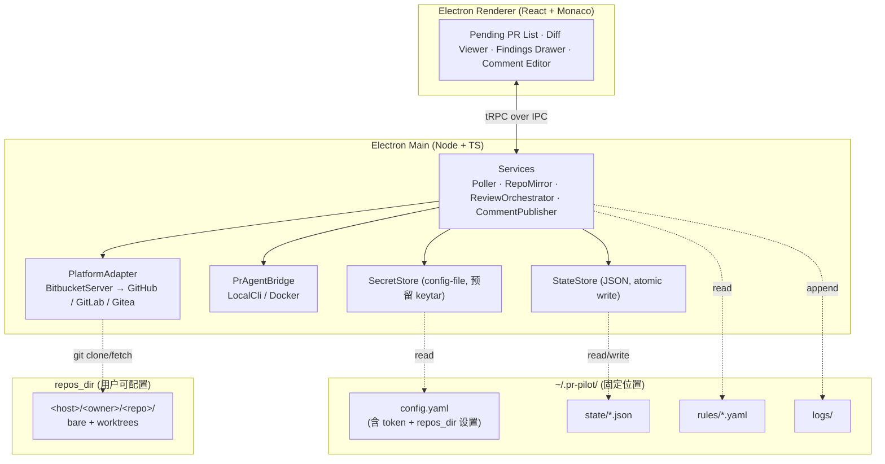

# pr-pilot Roadmap

> 最后更新：2026-05-28
> 状态：草案（M0 之前）

## 1. 项目定位

**pr-pilot** 是面向 Reviewer **个人**的本地化、半自动化代码评审 GUI 客户端，基于 [Qodo pr-agent](https://docs.pr-agent.ai/) 构建。

三句话定位：

- **决策权在人**：所有评论必须经 Reviewer 二次确认 / 编辑后才发布到远端。
- **规则在本地**：每位 Reviewer 配置自己的检查规则、风格偏好、LLM Provider。
- **数据在本地**：仓库副本、PR 元数据、待办列表、评论草稿都保存在本地工作目录。

### 1.1 目标用户

- 需要承担 code review 工作的工程师 / Tech Lead
- 希望用 AI 工具加速评审，但不愿把决策权完全交给 bot
- 多数在企业内网，使用自建 Bitbucket / GitLab / Gitea 等

### 1.2 非目标

- ❌ 不是 CI 上跑的自动化 review bot（这是 pr-agent 本身的定位）
- ❌ 不是团队协同评审平台，不做服务端、不做多用户同步
- ❌ 不替代代码托管平台的原生评审 UI
- ❌ 一期不考虑团队规则共享 / 中心化治理

---

## 2. 架构总览



详细决策见 [ADR 目录](./adr/)：

- [ADR-0001](./adr/0001-pr-agent-integration.md) · pr-agent 集成方式
- [ADR-0002](./adr/0002-bitbucket-server-adapter.md) · Bitbucket Server 平台适配
- [ADR-0003](./adr/0003-state-storage-and-workspace-layout.md) · 状态存储与工作目录布局
- [ADR-0004](./adr/0004-package-manager-and-monorepo.md) · 包管理器与 Monorepo 工具

---

## 3. 技术栈

| 维度              | 选择                                                     | 备注                                                                                                   |
| ----------------- | -------------------------------------------------------- | ------------------------------------------------------------------------------------------------------ |
| 包管理 / Monorepo | npm (workspaces) + Nx                                    | 见 [ADR-0004](./adr/0004-package-manager-and-monorepo.md)                                              |
| 桌面壳            | Electron + Vite                                          | `contextIsolation` on、preload 白名单、CSP                                                             |
| 渲染层            | React + Vite + TS strict                                 | 优先 shadcn/ui，避免重型组件库                                                                         |
| IPC               | tRPC over IPC                                            | Renderer ↔ Main 全类型化                                                                               |
| 编辑器            | Monaco                                                   | side-by-side diff、文件树虚拟化                                                                        |
| pr-agent 集成     | 本地 CLI 子进程优先；Docker fallback                     | 见 [ADR-0001](./adr/0001-pr-agent-integration.md)                                                      |
| Git 平台（M1）    | Bitbucket Server / DC，REST API v1                       | 见 [ADR-0002](./adr/0002-bitbucket-server-adapter.md)                                                  |
| 状态存储          | JSON 文件（原子写）+ `StateStore` 抽象                   | 一期规模小；未来可切 SQLite；见 [ADR-0003](./adr/0003-state-storage-and-workspace-layout.md)           |
| 凭据存储          | 合并在 `config.yaml`，权限收紧；模块级 `SecretStore`     | 用户自负；未来可切 keytar                                                                              |
| 工作目录          | 应用数据固定在 `~/.pr-pilot/`；**仅 `repos_dir` 可配置** | `repos_dir` 默认 `~/.pr-pilot/repos/`；见 [ADR-0003](./adr/0003-state-storage-and-workspace-layout.md) |
| Git 操作          | simple-git + 系统 `git`                                  | partial clone + worktree per PR                                                                        |

### 3.1 目录布局

**应用数据目录**（固定位置：`~/.pr-pilot/`，跨 OS 一致）：

```
~/.pr-pilot/
├── config.yaml          # 所有配置（含 token / API key + repos_dir 设置），权限 600 / Windows ACL
├── rules/               # 用户自定义规则集
│   └── *.yaml
├── state/               # JSON 状态文件（详见 §4）
│   ├── connections.json
│   ├── watched-repos.json
│   ├── pull-requests.json
│   ├── pull-requests/<pr-id>.json
│   ├── runs/<pr-id>/<run-id>.json
│   └── posted-comments.json
└── logs/                # 滚动日志
```

**仓库镜像目录** `repos_dir`（**唯一可配置的存储位置**，默认 `~/.pr-pilot/repos/`，在 `config.yaml` 中修改）：

```
<repos_dir>/
└── <host>/<owner>/<repo>/
    ├── <bare>/          # partial clone 镜像
    └── worktrees/<pr-id>/
```

为什么只让 `repos_dir` 可配置：

- 仓库镜像是磁盘占用主体（GB 级），用户可能想放到大盘 / 外置盘
- config / state / logs 总量极小（< 100 MB），固定在 home 路径反而便于备份和定位
- 不需要 locator 文件，启动逻辑直接读固定路径

首次启动无需用户介入：自动创建 `~/.pr-pilot/` + 默认 `config.yaml`（`repos_dir` 默认值生效）；用户后续可在设置页修改 `repos_dir`。

---

## 4. 数据模型（JSON 状态文件）

### 4.1 文件划分原则

- 频繁读写 + 体积小 → 单文件聚合（如 `pull-requests.json` 索引）
- 单条体积大 / 写入独立 → 每实例一文件（如每次 review run）
- 所有写入走 "tmp + fsync + rename" 原子模式
- 单写者：Electron Main 进程独占，无需文件锁

### 4.2 文件清单与 schema 草图

```ts
// state/connections.json
type ConnectionsFile = {
  schema_version: 1;
  connections: Array<{
    id: string;
    host: string;
    kind: 'bitbucket-server' | 'github' | 'gitlab' | 'gitea';
    base_url: string;
    display_name: string;
    created_at: string; // ISO
  }>;
};

// state/watched-repos.json
type WatchedReposFile = {
  schema_version: 1;
  repos: Array<{
    id: string;
    connection_id: string;
    project_key: string;
    repo_slug: string;
    enabled: boolean;
  }>;
};

// state/pull-requests.json (索引，轻量字段；用于快速渲染列表)
type PullRequestsIndexFile = {
  schema_version: 1;
  pull_requests: Array<{
    id: string; // 本地 id
    connection_id: string;
    repo_id: string;
    remote_id: string; // 平台侧 PR id
    title: string;
    author: string;
    source_ref: string;
    target_ref: string;
    state: 'open' | 'merged' | 'declined';
    local_status: 'pending' | 'reviewed' | 'skipped';
    discovered_at: string;
    updated_at: string;
  }>;
};

// state/pull-requests/<pr-id>.json (单 PR 详情)
type PullRequestDetailFile = {
  schema_version: 1;
  pr: {
    /* 完整字段，含 source_sha / target_sha / 描述等 */
  };
  latest_run_id?: string;
};

// state/runs/<pr-id>/<run-id>.json (单次 review run)
type ReviewRunFile = {
  schema_version: 1;
  run: {
    id: string;
    pr_id: string;
    started_at: string;
    finished_at?: string;
    pr_agent_version: string;
    model: string;
    ruleset_hash: string;
    status: 'running' | 'succeeded' | 'failed';
  };
  findings: Array<{
    id: string;
    file_path: string;
    start_line: number;
    end_line: number;
    severity: 'info' | 'warning' | 'error';
    category: string;
    suggestion: string;
    rationale: string;
    status: 'pending' | 'accepted' | 'edited' | 'rejected' | 'posted';
    draft_body?: string; // 用户编辑后的内容
    posted_remote_id?: string;
  }>;
};

// state/posted-comments.json (幂等记录，防重复发送)
type PostedCommentsFile = {
  schema_version: 1;
  posted: Array<{
    finding_id: string;
    remote_id: string;
    posted_at: string;
  }>;
};
```

`schema_version` 字段保证后续做格式迁移时有版本号可判断。

---

## 5. 分期 Roadmap

每一期都设计为**可独立交付**的里程碑，可以停在任意一期而仍有可用产品形态。

### M0 · 工程基线 (~1 周)

**目标**：可双击启动的空壳应用，工程链路打通。

- npm workspaces + Nx 单仓多包结构（`apps/desktop`, `packages/shared`, `packages/platform-bitbucket`, ...）
- Electron + Vite + React + Monaco 脚手架，TS strict
- tRPC IPC 通道
- 安全基线：`contextIsolation`、preload 白名单、CSP
- 日志（pino + 文件滚动）
- 首次启动初始化：创建 `~/.pr-pilot/` + 默认 `config.yaml`（`repos_dir` 默认值 = `~/.pr-pilot/repos/`）
- pr-agent 可用性探测：`pr-agent --version` 或 `docker --version` 二选一
- CI（GitHub Actions）：lint + typecheck + unit test + electron-builder 构建产物

**Done when**：`pnpm dev` 启动 Electron，首次启动引导走通，状态栏正确显示 pr-agent 可用与否。

### M1 · Bitbucket Server 接入 + PR 发现 (~2 周)

**目标**：能在 UI 里看到 pending PR 列表。

- `PlatformAdapter` 抽象 + `BitbucketServerAdapter` 实现（见 ADR-0002）
- `SecretStore` 抽象 + `ConfigFileSecretStore` 实现（一期读 `config.yaml`；预留 keytar 实现）
- Poller：可配置间隔（默认 5 min），增量发现 + 去重
- `StateStore` 抽象 + `JsonFileStateStore` 实现（原子写）
- 状态文件 schema 落地（见 §4）+ schema_version 校验
- UI：
  - 设置页：repos_dir 位置 / 连接配置 / 仓库勾选 / 轮询间隔
  - Pending PR 列表（含搜索 / 过滤 / 标记跳过）

**Done when**：配置一个 Bitbucket Server 实例后，应用自动发现 PR 并展示。

### M2 · 仓库镜像 + 本地 Diff 展示 (~1.5 周)

**目标**：选中一个 PR 后能在 Monaco 里看到 side-by-side diff。

- `RepoMirrorManager`：首次 `git clone --filter=blob:none --bare`，后续 `git fetch`
- 并发安全：一仓一锁，避免同一仓库 fetch 冲突
- 每 PR 用 `git worktree add` 隔离工作树
- Monaco Diff Viewer：side-by-side、文件树、跳转到 hunk、按文件折叠
- 性能预算：单 PR ≤ 5 万行 diff 不卡顿（lazy load + virtualize）
- repo 体积统计（设置页可见，方便用户判断是否需要换 workspace）

**Done when**：选中 PR → 看到完整 diff，文件切换 < 200ms。

### M3 · pr-agent 集成 (~2 周，核心)

**目标**：点"开始 review" 后，pr-agent 跑完并把结果结构化进状态文件。

- `PrAgentBridge`（策略模式：`LocalCli` / `Docker`，详见 ADR-0001）
- 工具调用最小集：`/describe`（摘要）、`/review`（发现问题）
- 输出解析：把 pr-agent 文本输出 → `findings`
- 个性化规则：`rules/*.yaml` → 注入 pr-agent `extra_instructions` / `custom_labels`
- LLM Provider 配置：模型、key、base_url（兼容 OpenAI 协议）
- 中断恢复：review run 失败 / 中断可重试

**Done when**：一次完整 review 流：选 PR → 跑 pr-agent → finding 列表显示。

### M4 · 确认 → 评论发布闭环 (~1.5 周)

**目标**：勾选 finding 后真正发到 Bitbucket。

- Findings Drawer：勾选 / 编辑 / 丢弃 / 合并多条；快捷键
- 草稿持久化（应用关闭后可恢复）
- 发布策略：
  - 单条 inline comment（带文件 + 行号）
  - 整体 summary 评论（PR 顶层）
- 幂等：`posted-comments.json` 落库，避免重发
- 失败重试 + 退避
- 审计日志：模型原文 vs Reviewer 修改后文本（便于日后调规则）

**Done when**：发布的评论出现在 Bitbucket PR 页，重复发布操作不会产生重复评论。

### M5 · 打磨与多平台扩展（持续）

- GitHub / GitLab / Gitea Adapter（按用户实际需求排序）
- 规则市场：导入 / 导出 rules.yaml 片段
- 本地模型支持：Ollama / vLLM
- 离线模式
- 可观测性：Token 用量统计、规则命中率、模型对比
- 凭据存储升级到 keytar（替换 `SecretStore` 实现）
- 状态存储按需升级到 SQLite（替换 `StateStore` 实现，触发条件见 ADR-0003）

---

## 6. 风险与未决项

| 风险 / 议题                          | 影响期 | 应对                                                                                        |
| ------------------------------------ | ------ | ------------------------------------------------------------------------------------------- |
| pr-agent 升级破坏输出格式            | M3+    | 输出解析层独立；CI 跑兼容测试                                                               |
| Bitbucket Server 不同小版本 API 差异 | M1     | M1 之前先做 API 探针，固化最小可用版本                                                      |
| 大型 PR 性能 / `/diff` 截断          | M2     | 检测 `truncated=true` 时按文件拉 per-file diff；Monaco 侧文件级懒加载 + 二进制 / 大文件跳过 |
| 大型仓库挤爆磁盘                     | M2+    | `repos_dir` 可配置；设置页显示 repo 体积；提供清理操作                                      |
| 明文凭据（在 `config.yaml`）         | 全周期 | 文档警示 + 文件权限收紧 + `SecretStore` 抽象预留 keytar                                     |
| JSON 状态文件随使用量膨胀            | M3+    | 监控单文件大小（> 5 MB 告警）；触发条件达成时切 SQLite（见 ADR-0003）                       |
| LLM 调用成本不可控                   | M3+    | M5 加 Token 统计；规则层支持 max_tokens / 模型分级                                          |
| Windows / macOS / Linux 三平台打包   | M0+    | electron-builder + GH Actions 矩阵构建                                                      |

---

## 7. 实施顺序建议

1. ✅ ROADMAP.md + ADR-0001 + ADR-0002 + ADR-0003 + ADR-0004
2. ⏭️ Bitbucket Server API 探针（最小 Node 脚本，验证 token + 关键端点）
3. ⏭️ M0 脚手架
