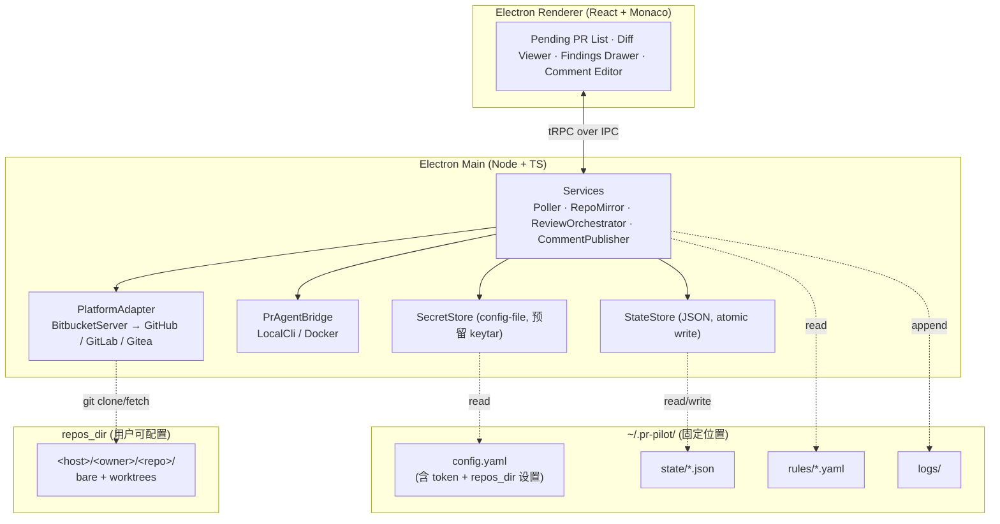

# pr-pilot Roadmap

> 最后更新：2026-05-29
> 状态：M0 + M1 + M2 已交付，下一步 M3 (pr-agent 集成)

## 1. 项目定位

**pr-pilot** 是面向 Reviewer **个人**的本地化、半自动化代码评审 GUI 客户端，基于 [Qodo pr-agent](https://docs.pr-agent.ai/) 构建。

三句话定位：

- **决策权在人**：所有评论必须经 Reviewer 二次确认 / 编辑后才发布到远端。
- **规则在本地**：每位 Reviewer 配置自己的检查规则、风格偏好、LLM Provider。
- **数据在本地**：仓库副本、PR 元数据、待办列表、评论草稿都保存在本地工作目录。

### 1.1 目标用户

- 需要承担 code review 工作的工程师 / Tech Lead
- 希望用 AI 工具加速评审，但不愿把决策权完全交给 bot
- 多数在企业内网，使用自建 Bitbucket / GitLab / Gitea 等

### 1.2 非目标

- ❌ 不是 CI 上跑的自动化 review bot（这是 pr-agent 本身的定位）
- ❌ 不是团队协同评审平台，不做服务端、不做多用户同步
- ❌ 不替代代码托管平台的原生评审 UI
- ❌ 一期不考虑团队规则共享 / 中心化治理

---

## 2. 架构总览



详细决策见 [ADR 目录](./adr/)：

- [ADR-0001](./adr/0001-pr-agent-integration.md) · pr-agent 集成方式
- [ADR-0002](./adr/0002-bitbucket-server-adapter.md) · Bitbucket Server 平台适配
- [ADR-0003](./adr/0003-state-storage-and-workspace-layout.md) · 状态存储与工作目录布局
- [ADR-0004](./adr/0004-package-manager-and-monorepo.md) · 包管理器与 Monorepo 工具

---

## 3. 技术栈

| 维度              | 选择                                                     | 备注                                                                                                   |
| ----------------- | -------------------------------------------------------- | ------------------------------------------------------------------------------------------------------ |
| 包管理 / Monorepo | npm (workspaces) + Nx                                    | 见 [ADR-0004](./adr/0004-package-manager-and-monorepo.md)                                              |
| 桌面壳            | Electron + Vite                                          | `contextIsolation` on、preload 白名单、CSP                                                             |
| 渲染层            | React + Vite + TS strict                                 | 优先 shadcn/ui，避免重型组件库                                                                         |
| IPC               | tRPC over IPC                                            | Renderer ↔ Main 全类型化                                                                               |
| 编辑器            | Monaco                                                   | side-by-side diff、文件树虚拟化                                                                        |
| pr-agent 集成     | 本地 CLI 子进程优先；Docker fallback                     | 见 [ADR-0001](./adr/0001-pr-agent-integration.md)                                                      |
| Git 平台（M1）    | Bitbucket Server / DC，REST API v1                       | 见 [ADR-0002](./adr/0002-bitbucket-server-adapter.md)                                                  |
| 状态存储          | JSON 文件（原子写）+ `StateStore` 抽象                   | 一期规模小；未来可切 SQLite；见 [ADR-0003](./adr/0003-state-storage-and-workspace-layout.md)           |
| 凭据存储          | 合并在 `config.yaml`，权限收紧；模块级 `SecretStore`     | 用户自负；未来可切 keytar                                                                              |
| 工作目录          | 应用数据固定在 `~/.pr-pilot/`；**仅 `repos_dir` 可配置** | `repos_dir` 默认 `~/.pr-pilot/repos/`；见 [ADR-0003](./adr/0003-state-storage-and-workspace-layout.md) |
| Git 操作          | simple-git + 系统 `git`                                  | partial clone + worktree per PR                                                                        |

### 3.1 目录布局

**应用数据目录**（固定位置：`~/.pr-pilot/`，跨 OS 一致）：

```
~/.pr-pilot/
├── config.yaml          # 所有配置（含 token / API key + repos_dir 设置），权限 600 / Windows ACL
│                        # (rules 默认不放这里，见下方 `rules.dir`)
├── state/               # JSON 状态文件（详见 §4）
│   ├── connections.json
│   ├── watched-repos.json
│   ├── pull-requests.json
│   ├── pull-requests/<pr-id>.json
│   ├── runs/<pr-id>/<run-id>.json
│   └── posted-comments.json
└── logs/                # 滚动日志
```

**仓库镜像目录** `repos_dir`（**唯一可配置的存储位置**，默认 `~/.pr-pilot/repos/`，在 `config.yaml` 中修改）：

```
<repos_dir>/
└── <host>/<owner>/<repo>/
    ├── <bare>/          # partial clone 镜像
    └── worktrees/<pr-id>/
```

为什么只让 `repos_dir` 可配置：

- 仓库镜像是磁盘占用主体（GB 级），用户可能想放到大盘 / 外置盘
- config / state / logs 总量极小（< 100 MB），固定在 home 路径反而便于备份和定位
- 不需要 locator 文件，启动逻辑直接读固定路径

首次启动无需用户介入：自动创建 `~/.pr-pilot/` + 默认 `config.yaml`（`repos_dir` 默认值生效）；用户后续可在设置页修改 `repos_dir`。

**规则目录** `rules.dir`（可选；用于个性化 PR review 规约，详见 [ADR-0005](adr/0005-rules-directory.md)）：

```
<rules.dir>/                # 路径任意，建议指向一个 git repo 让团队共享
├── global/
│   └── coding-style.md
└── projects/
    └── FX/
        ├── common.md
        └── fx-help-api.md
```

- 每个 `.md` 文件 = 一条规则，YAML frontmatter 声明 `applies_to` (project/repo/target_branch 正则) + `tools` + `priority`，markdown 正文是给 pr-agent 的 `extra_instructions`
- `rules.dir` 为空 = 不启用规则；指向一个独立路径让规则跟 `~/.pr-pilot/` 解耦，可以单独提交 git 跟团队共享
- pragent run 时同一 PR 多条命中按 `priority desc + 文件路径 asc` 取**首条**，避免 prompt 膨胀和规则互相矛盾

---

## 4. 数据模型（JSON 状态文件）

### 4.1 文件划分原则

- 频繁读写 + 体积小 → 单文件聚合（如 `pull-requests.json` 索引）
- 单条体积大 / 写入独立 → 每实例一文件（如每次 review run）
- 所有写入走 "tmp + fsync + rename" 原子模式
- 单写者：Electron Main 进程独占，无需文件锁

### 4.2 文件清单与 schema 草图

```ts
// state/connections.json
type ConnectionsFile = {
  schema_version: 1;
  connections: Array<{
    id: string;
    host: string;
    kind: 'bitbucket-server' | 'github' | 'gitlab' | 'gitea';
    base_url: string;
    display_name: string;
    created_at: string; // ISO
  }>;
};

// state/watched-repos.json
type WatchedReposFile = {
  schema_version: 1;
  repos: Array<{
    id: string;
    connection_id: string;
    project_key: string;
    repo_slug: string;
    enabled: boolean;
  }>;
};

// state/pull-requests.json (索引，轻量字段；用于快速渲染列表)
type PullRequestsIndexFile = {
  schema_version: 1;
  pull_requests: Array<{
    id: string; // 本地 id
    connection_id: string;
    repo_id: string;
    remote_id: string; // 平台侧 PR id
    title: string;
    author: string;
    source_ref: string;
    target_ref: string;
    state: 'open' | 'merged' | 'declined';
    local_status: 'pending' | 'reviewed' | 'skipped';
    discovered_at: string;
    updated_at: string;
  }>;
};

// state/pull-requests/<pr-id>.json (单 PR 详情)
type PullRequestDetailFile = {
  schema_version: 1;
  pr: {
    /* 完整字段，含 source_sha / target_sha / 描述等 */
  };
  latest_run_id?: string;
};

// state/runs/<pr-id>/<run-id>.json (单次 review run)
type ReviewRunFile = {
  schema_version: 1;
  run: {
    id: string;
    pr_id: string;
    started_at: string;
    finished_at?: string;
    pr_agent_version: string;
    model: string;
    ruleset_hash: string;
    status: 'running' | 'succeeded' | 'failed';
  };
  findings: Array<{
    id: string;
    file_path: string;
    start_line: number;
    end_line: number;
    severity: 'info' | 'warning' | 'error';
    category: string;
    suggestion: string;
    rationale: string;
    status: 'pending' | 'accepted' | 'edited' | 'rejected' | 'posted';
    draft_body?: string; // 用户编辑后的内容
    posted_remote_id?: string;
  }>;
};

// state/posted-comments.json (幂等记录，防重复发送)
type PostedCommentsFile = {
  schema_version: 1;
  posted: Array<{
    finding_id: string;
    remote_id: string;
    posted_at: string;
  }>;
};
```

`schema_version` 字段保证后续做格式迁移时有版本号可判断。

---

## 5. 分期 Roadmap

每一期都设计为**可独立交付**的里程碑，可以停在任意一期而仍有可用产品形态。

### M0 · 工程基线 ✅ 已完成

**目标**：可双击启动的空壳应用，工程链路打通。

**实际落地**：

- ✅ npm workspaces + Nx 20 单仓多包结构（`apps/desktop` + `packages/{shared, config, logger, pr-agent-bridge}`）
- ✅ Electron 42 + Vite 7 + React 19 + Monaco 0.55 脚手架（electron-vite 5 三段式）
- ✅ TS strict × 3 tsconfig（renderer / node / base）
- ✅ 类型化 IPC bridge（自研 `IpcChannels` 契约 + preload contextBridge）
- ✅ 安全基线：contextIsolation + sandbox:false + CSP（dev 含 `unsafe-eval`、Monaco worker 需 `blob:`）
- ✅ pino 日志 + 文件滚动（`~/.pr-pilot/logs/`，按日切，保留 7 份）
- ✅ 首次启动 `ensureWorkspace`：创建 `~/.pr-pilot/` 目录树 + 写默认 `config.yaml`
- ✅ pr-agent 可用性探测策略模式（LocalCli 优先 → Docker fallback）
- ✅ GitHub Actions CI：`npm ci` + Nx cache + typecheck + build（test 在 M1-A 起加入）

**决策变更**：

- **IPC**：原计划 tRPC over IPC，实际改为手写 `IpcChannels` 契约。避免引入 trpc + electron-trpc 复杂度，类型安全等价
- **Monaco loader**：原计划 CDN loader，CSP 阻断后切到本地 `monaco-editor` + Vite `?worker` import，彻底去掉 CDN（顺手完成 ROADMAP M2 该做的事）

**推迟事项**：

- ESLint flat config + 全包 lint target（CI 已留占位注释，正补齐中）
- electron-builder 多平台打包及 CI 矩阵（推迟到 M5 发布阶段，先在本地做 `--dir` 烟雾测试）

**Done when** ✅：`npm run dev` 启动 Electron，自动创建 `~/.pr-pilot/`，状态栏显示 pr-agent 探测结果。

### M1 · Bitbucket Server 接入 + PR 发现 ✅ 已完成

**目标**：能在 UI 里看到 pending PR 列表。

**实际落地**：

- ✅ `PlatformAdapter` 抽象（精简到 ping + listPendingPullRequests）
- ✅ `@pr-pilot/platform-bitbucket-server`：BBClient (Bearer PAT + paginate + AbortController 超时) + BitbucketServerAdapter (走 `/dashboard/pull-requests?role=REVIEWER&state=OPEN`，硬下限 7.0)；7 个 mock-fetch 单测
- ✅ `@pr-pilot/state-store`：StateStore 接口 + JsonFileStateStore (tmp→fsync→rename 原子写)；10 个单测覆盖 read/write/list/delete 全路径
- ✅ `@pr-pilot/poller`：跨连接合并、增量发现、错误隔离、重入保护；9 个单测
- ✅ 状态文件 schema：`state/pull-requests.json` schema_version:1
- ✅ vitest 立起来 + CI 接入 `nx run-many -t test`（共 27 单测）
- ✅ IPC channels：`prs:list` / `prs:refresh` / `prs:setLocalStatus` / `app:openConfigFile`；窗口外链通过 `setWindowOpenHandler` 走 `shell.openExternal`
- ✅ React Layout UI：Header（标题 + pr-agent badge + PRs 计数 + 刷新 / 设置）+ Sidebar（按 `projectKey/repoSlug` 分组 + 手风琴折叠 + updatedAt 倒序 + 4 状态过滤 + 搜索强制展开）+ MainPane（PR detail + 三态切换 + 浏览器外链）+ SettingsModal（read-only 视图 + "编辑 config.yaml" 调 OS 默认编辑器）
- ✅ `Menu.setApplicationMenu(null)` 干掉 Electron 默认顶栏菜单

**范围收窄 / 推迟**：

- **`SecretStore` 抽象**：推迟到 M5 keytar 真落地时再起。当前 Poller 直接读 `Config.connections`，避免引入未使用抽象
- **设置页 UI 内编辑连接（CRUD + connection ping）**：推迟到 M5。M1 提供 read-only modal + "编辑 config.yaml" 调 OS 编辑器作过渡
- **`repos_dir` 配置 UI**：推迟到 M2，配合仓库镜像功能一起做才有意义

**Done when** ✅：在 `config.yaml` 加 BBS 连接后，应用自动发现 PR 并展示；可标记跳过 / 已评 / 重置；可一键开浏览器看远端。

### M2 · 仓库镜像 + 本地 Diff 展示 ✅ 已完成

**目标**：选中一个 PR 后能在 Monaco 里看到 side-by-side diff。

**实际落地**：

- ✅ `@pr-pilot/repo-mirror` (`RepoMirrorManager`)：首次 `git clone --bare --filter=blob:none --no-hardlinks`，后续 `git fetch '+refs/heads/*:refs/heads/*'`；27 个单测覆盖 sync / dedup / blame / diff
- ✅ 并发调度：**全局 sync 队列**（任意时刻最多 1 个 repo 在 clone/fetch）+ **per-repo 在飞 Promise 复用**（同 repo 并发调用共用同一次 sync，进度共享）。读操作 (listChangedFiles / getFileContent / getSize / getBlame) 不走队列，并发只读安全
- ✅ Sync 进度实时推送：simple-git progress → main `onProgress` → `sync:progress` IPC 事件 → renderer 按 repo 过滤显示阶段 + 百分比 + 进度条
- ✅ Diff 计算：`listChangedFiles` 走 `git diff -z --name-status base...head`（三点 diff，自分叉后引入的变化）；`getFileContent` 走 `git show <sha>:<path>`（按需拉 blob）+ null-byte 启发判断二进制
- ✅ Monaco DiffEditor 接入 (`@monaco-editor/react`)：side-by-side / unified 切换 + localStorage 持久化 + `hideUnchangedRegions` 前后保留 10 行（GitHub 风格折叠）
- ✅ Clone 协议双轨：**PAT** (`https://<user>:<pat>@host/scm/proj/repo.git`，BBS 7+ 用户名+PAT 风格) + **SSH** (走系统 `~/.ssh/config`)；`cloneProtocol` 配置项控制，默认 PAT
- ✅ 文件树 (`FileTree`)：嵌套虚拟树 + Material Icon Theme (`material-icon-theme:folder-base[-open]` + 30+ 扩展名 fileIconFor map) + VS Code Git decoration 配色 (added 绿 / modified 橙 / deleted 红，folder 按聚合状态着色，mixed > added > deleted 优先级) + 状态点右侧 sticky 锁定 + inline-block 内层让所有 row 统一最宽行宽度
- ✅ 行内评论 (Monaco view zones)：BBS `/activities` 拉 inline + summary，按文件锚定行号；glyph margin 蓝点 + 行下方 view zone (createRoot + React) 渲染评论 markdown (react-markdown + remark-gfm)；多条同行合并 hover；commentCountByPath → 文件树右侧蓝色数字 chip
- ✅ Blame：`git blame --porcelain` + porcelain 解析，行首 `before.content` 注入「作者 + 相对时间 · 短 sha」，同 commit 连续行只首行展示，hover 完整 commit message；toggle 按钮 + localStorage 持久化
- ✅ Settings：可视化编辑 `repos_dir`（写回 config.yaml，重启生效）+ 本地镜像总占用展示（去重 repoKey 聚合 dirSize）+ 调试工具入口（detached DevTools）
- ✅ Sidebar 增强：宽度可拖拽 (240-720px) + 整体收起 + 两者 localStorage 持久化；reviewer 状态胶囊 (✓N approved 绿 / ✗N needsWork 红)；`Reviewer.status` 类型重构 (approved | needsWork | unapproved)
- ✅ StatusBar 增强：sidebar 切换 icon + 刷新 / 设置 icon 化 + 最近同步时间 chip（相对时间，30s 自更新，紧贴刷新按钮）+ VS Code remote 配色 (#16825d)；`prs:lastSync` 查询 + `poll:tick` 事件双轨
- ✅ repo 体积统计 (`repo:getTotalSize`)：递归 dirSize 聚合所有 bare 镜像，设置页可见

**决策变更**：

- **Worktree per PR → `git show <sha>:<path>`**：原计划 `git worktree add` 给每个 PR 一份工作树，实际发现 diff 展示只需要按 sha 读 blob，partial clone + `git show` 已经足够，磁盘 / IO 都更省。Worktree 推到 M3 看 pr-agent 是否真要文件系统路径再说
- **"一仓一锁" → 全局单队列 + per-repo Promise 复用**：原计划仓库级互斥，实际改为全局只允许一个 sync 在跑（避免抢带宽 + 进度更稳）+ 同 repo 并发调用复用同一 in-flight Promise（不重复 sync）
- **跳转到 hunk 按钮**：Monaco DiffEditor 内置 F7 / Shift+F7 已经有了，UI 上没单独暴露按钮，低优先级，需要时再补
- **按文件折叠 → 文件树侧切换**：原计划在 diff 区按文件折叠，实际左侧文件树点击切换更直观，diff 区只渲染当前文件
- **GitHub-like diff 缩略**：`hideUnchangedRegions: { contextLineCount: 10, minimumLineCount: 5 }`，把未变更段缩成可展开占位行

**范围收窄 / 推迟**：

- **5 万行 diff 性能预算验证**：暂无合适案例，推迟到找到真实大 PR 时实测。Monaco 自身有 virtualization + `hideUnchangedRegions` 把未变更段折叠掉，体感应满足
- **`SecretStore` 抽象**：仍延续 M1 推迟决定，PAT 直接读 `Config.connections`，推到 M5 keytar 时落地
- **Worktree per PR**：推到 M3，看 pr-agent 接入时是否需要

**Done when** ✅：选中 PR → 自动 sync 本地 bare 镜像 → 显示完整 side-by-side diff（带文件树、行内评论、blame、reviewer 状态），文件切换体感 < 200ms（未实测大 PR）。

### M3 · pr-agent 集成 (~2 周，核心)

**目标**：点"开始 review" 后，pr-agent 跑完并把结果结构化进状态文件。

- `PrAgentBridge`（策略模式：`LocalCli` / `Docker`，详见 ADR-0001）
- 工具调用最小集：`/describe`（摘要）、`/review`（发现问题）
- 输出解析：把 pr-agent 文本输出 → `findings`
- 个性化规则：`rules.dir/**/*.md` → 注入 pr-agent `extra_instructions` / `custom_labels` (详见 [ADR-0005](adr/0005-rules-directory.md))
- LLM Provider 配置：模型、key、base_url（兼容 OpenAI 协议）
- 中断恢复：review run 失败 / 中断可重试

**Done when**：一次完整 review 流：选 PR → 跑 pr-agent → finding 列表显示。

### M4 · 确认 → 评论发布闭环 (~1.5 周)

**目标**：勾选 finding 后真正发到 Bitbucket。

- Findings Drawer：勾选 / 编辑 / 丢弃 / 合并多条；快捷键
- 草稿持久化（应用关闭后可恢复）
- 发布策略：
  - 单条 inline comment（带文件 + 行号）
  - 整体 summary 评论（PR 顶层）
- 幂等：`posted-comments.json` 落库，避免重发
- 失败重试 + 退避
- 审计日志：模型原文 vs Reviewer 修改后文本（便于日后调规则）

**Done when**：发布的评论出现在 Bitbucket PR 页，重复发布操作不会产生重复评论。

### M5 · 打磨与多平台扩展（持续）

- GitHub / GitLab / Gitea Adapter（按用户实际需求排序）
- 规则市场：导入 / 导出 rules.dir 片段
- 本地模型支持：Ollama / vLLM
- 离线模式
- 可观测性：Token 用量统计、规则命中率、模型对比
- 凭据存储升级到 keytar（首次引入 `SecretStore` 抽象 + 替换实现）
- 状态存储按需升级到 SQLite（替换 `StateStore` 实现，触发条件见 ADR-0003）
- **(M1 残项)** 设置页 UI 内连接 CRUD + 保存前 `connection:ping` 验证
- **(M0 残项)** electron-builder CI 矩阵（Windows / macOS / Linux 三平台自动出包）

---

## 6. 风险与未决项

| 风险 / 议题                          | 影响期 | 应对                                                                                        |
| ------------------------------------ | ------ | ------------------------------------------------------------------------------------------- |
| pr-agent 升级破坏输出格式            | M3+    | 输出解析层独立；CI 跑兼容测试                                                               |
| Bitbucket Server 不同小版本 API 差异 | M1     | M1 之前先做 API 探针，固化最小可用版本                                                      |
| 大型 PR 性能 / `/diff` 截断          | M2     | 检测 `truncated=true` 时按文件拉 per-file diff；Monaco 侧文件级懒加载 + 二进制 / 大文件跳过 |
| 大型仓库挤爆磁盘                     | M2+    | `repos_dir` 可配置；设置页显示 repo 体积；提供清理操作                                      |
| 明文凭据（在 `config.yaml`）         | 全周期 | 文档警示 + 文件权限收紧 + `SecretStore` 抽象预留 keytar                                     |
| JSON 状态文件随使用量膨胀            | M3+    | 监控单文件大小（> 5 MB 告警）；触发条件达成时切 SQLite（见 ADR-0003）                       |
| LLM 调用成本不可控                   | M3+    | M5 加 Token 统计；规则层支持 max_tokens / 模型分级                                          |
| Windows / macOS / Linux 三平台打包   | M0+    | electron-builder + GH Actions 矩阵构建                                                      |

---

## 7. 实施顺序与进度

1. ✅ ROADMAP.md + ADR-0001 + ADR-0002 + ADR-0003 + ADR-0004
2. ✅ Bitbucket Server API 探针（`tools/probes/bitbucket-server-probe.mjs`，已验证 7.17.10 实例 6 个只读端点）
3. ✅ M0 工程基线（A 工作区 → B Electron 壳 → C IPC/CSP/bootstrap → D pr-agent 探测 + CI）
4. ✅ M1 BBS 接入 + PR 发现（A state-store + vitest → B BBS adapter → C Poller / IPC → D React Layout UI + sidebar 分组排序）
5. ✅ ESLint flat config + 全包 lint target（M0 残项补齐；electron-builder 本地 `--dir` 烟雾测试推到 M4 发布前）
6. ✅ M2 仓库镜像 + Monaco diff（A repo-mirror + clone url → B listChangedFiles / getFileContent → C 主进程接线 + diff IPC → D MainPane diff 视图 + 文件树 + 评论 inline + blame + reviewer 胶囊 + statusbar 增强）
7. ⏭️ M3: pr-agent 集成 (`PrAgentBridge` LocalCli / Docker + `/describe` + `/review` + findings 结构化 + rules.dir markdown 注入)
8. ⏭️ 大 PR 性能验证（找到真实案例后跑一次）+ worktree-per-PR（如果 M3 pr-agent 需要文件系统路径）
