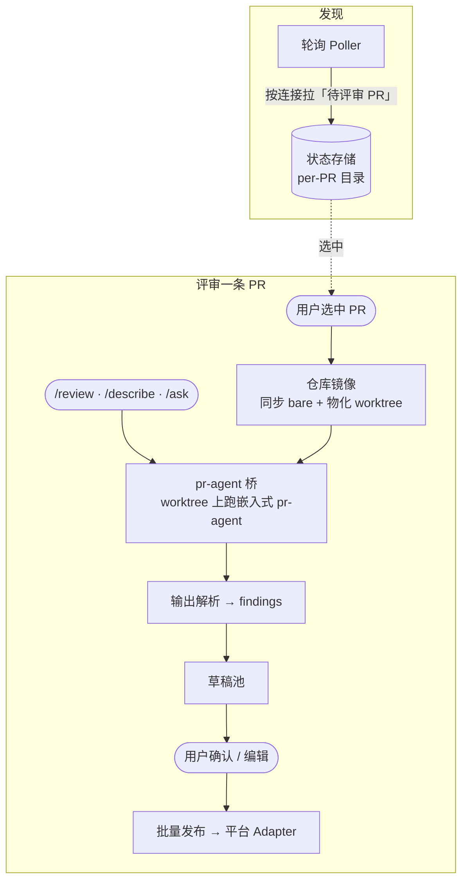

# 架构总览

## 职责与边界

本篇给出整体架构与各模块的关系，作为其余模块文档的入口。具体设计落在各分篇。

形态：单用户**本地桌面应用**（Electron），无服务端、无多用户同步。主进程（Node）承载所有
业务与 IO；渲染层（React）只做展示与交互，经 IPC 调主进程。

## 核心设计

### 进程模型

- **Main（Node + TS）**：业务与 IO 的唯一所在——轮询、仓库镜像、跑 pr-agent、状态读写、发布评论。
  单写者，独占状态目录，无需文件锁。
- **Renderer（React）**：UI（PR 列表 / Diff / 对话 / 草稿）。`contextIsolation` 开、无 `nodeIntegration`、走 CSP。
- **Preload**：经 `contextBridge` 只暴露一个泛型 `invoke(channel, req)` 与少量事件订阅，不暴露 Node 能力。

### IPC

Renderer ↔ Main 全部走 `ipcMain.handle(channel, …)` + 渲染侧泛型 `invoke<K>(channel, req)`，由一份
集中的 `IpcChannels` 类型映射约束请求/响应类型。新增交互＝先在该映射加通道类型，再两侧实现。
（注意：早期设想用 tRPC，实际是这套手写类型映射。）

### 数据流（一次评审的主链路）

### 模块地图（packages / 主进程子系统）

- **`01-platform/`** —— 平台集成与 PR 操作
  - [代码平台适配](01-platform/01-adapter.md) —— `platform-bitbucket-server` + `PlatformAdapter` 抽象
  - [仓库镜像与 Diff](01-platform/02-repo-mirror.md) —— `repo-mirror`
  - [评审→发布闭环](01-platform/03-review-workflow.md) —— `poller`(输出解析) + 主进程草稿 / 发布
  - [评论互动](01-platform/04-comment-interactions.md) —— 渲染层评论 UI + Adapter 反应 / 附件能力
- **`02-agent/`** —— Agent 与规则
  - [Agent 与上下文](02-agent/01-agent.md) —— Agent 目录 / 上下文注入 / 工具红线
  - [会话 Agent 化](02-agent/02-session.md) —— 自然语言委派 + 规划循环
  - [AutoPilot 与调度](02-agent/03-autopilot.md) —— 自动预评审 + 优先级队列
  - [规则系统](02-agent/04-rules.md) —— `rules`
  - [pr-agent 集成与运行时](02-agent/05-pragent-runtime.md) —— `pr-agent-bridge` + 嵌入式运行时
- **`03-gui/`** —— GUI 与交互
  - [GUI 与交互](03-gui/01-ui-interaction.md) —— 渲染层 React（布局 / 面板 / 跨 PR 保活）
  - [命令面板](03-gui/02-command-palette.md) —— 渲染层标题栏入口 + 分域命令注册表
  - [消息通知](03-gui/03-notifications.md) —— `poller` 事件投影 + 主进程系统通知 / dock 角标
  - [国际化](03-gui/04-i18n.md) —— react-i18next + 主 / 渲染双运行时 locale
- **`99-core/`** —— 基础设施 / 横切
  - [状态存储与数据模型](99-core/01-state-storage.md) —— `state-store` + `poller` 的 pr-state
  - [配置与凭据](99-core/02-config-and-secrets.md) —— `config` + 设置页
  - [出站网络与代理](99-core/03-networking-proxy.md) —— 主进程 proxy plumbing
  - [错误码与传递](99-core/04-error-codes.md) —— `shared` 的 `AppError` + 跨 IPC 编码

> 打包 / 构建 / 签名 / CI 见开发专题 [`../development/packaging-release.md`](../development/packaging-release.md)（非产品子系统）。

`shared` 是跨包共享类型（含 `IpcChannels` 契约、PR/Finding/Run 等领域类型）；`logger` 是统一日志。

### 工程基线

- npm workspaces + Nx 单仓多包；统一 `lint`/`typecheck`/`test`/`build` 任务（详见根 `AGENTS.md`）。
- 桌面壳 Electron + electron-vite；渲染 React + Monaco（并排/内联 diff）。

### 数据与隐私边界

- **本地优先**：仓库副本、PR 元数据、评论缓存、草稿、配置全部留在本地工作目录 `~/.code-meeseeks/`
  （仓库镜像可改到 `repos_dir`）。无服务端、不做多用户同步。
- **出站只有两类**（除此不向任何第三方上报数据；两类都可经统一 HTTP 代理管控，见 [网络与代理](99-core/03-networking-proxy.md)）：
  - 评审者自配的 **LLM API**（经 pr-agent / litellm）；
  - 所配置的**代码平台**（PR / 评论 REST + git 拉取）。
- **发给 LLM 的内容**：pr-agent 评审时只把 **PR diff + 命中的规则**（extra_instructions）发给 LLM，不发其它本地数据。
- **凭据**：平台 token / LLM API key / 代理密码**明文**存 `config.yaml`（文件权限收紧），属已知风险；
  抽象层预留 keytar 升级（见 [配置与凭据](99-core/02-config-and-secrets.md)）。
- **安全基线**：渲染层 `contextIsolation` 开、无 `nodeIntegration`、CSP；preload 仅暴露白名单能力（见 [GUI 交互](03-gui/01-ui-interaction.md)）。

## 数据 / 接口契约

- **IPC 契约**：集中在 `shared` 的 `IpcChannels` 类型映射（`channel → { request, response }`）。
- **领域类型**：PR（`StoredPullRequest` / `PrIdentity`）、评论（`PrComment`）、评审 run（`ReviewRun`，含
  `findings` / `tokenUsage`）、平台抽象（`PlatformAdapter`）均在 `shared`，被各包共享。

## 扩展与注意事项

- **加新代码平台**：实现 `PlatformAdapter`，业务层（Poller/发布/镜像）不感知具体平台。见 [平台适配](01-platform/01-adapter.md)。
- **跨进程能力**一律走 IPC 通道 + 类型映射，别在渲染层直接碰 Node / 文件 / 网络。
- 各分篇描述「当前实现」，演进时同步更新对应分篇即可。
