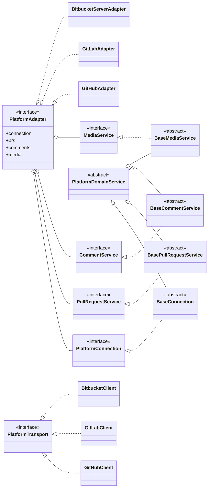

# 01 · 代码平台适配

把「代码托管平台」的差异收口到一个统一抽象 `PlatformAdapter`，业务层（轮询、镜像、评审发布）
只依赖该抽象、不感知具体平台。`PlatformAdapter` 不是单一巨接口，而是**按业务领域拆分的服务容器**
（连接 / PR 操作 / 评论 / 用户与媒体四个领域），各领域共享一份平台连接。本章是平台适配的**统一设计
与维护入口**：分层与领域拆分、能力位与降级、评论统一模型，以及各平台（Bitbucket / GitHub / GitLab）
差异化适配逻辑。

已实现：**Bitbucket Server / Data Center**、**GitHub（github.com + GitHub Enterprise Server）**、
**GitLab（gitlab.com + Self-Managed，CE/EE，REST API v4）**。不负责：git 本地操作（见
[02](02-repo-mirror.md)）、pr-agent 调用（见 [04](04-pragent-runtime.md)）。

---

## 1. 核心抽象设计

### 分层

三层，契约与传输实现解耦：

> **图说**（`<|..` 实现 / `<|--` 继承 / `o--` 持有组合）：
>
> - **契约层** `@meebox/platform-core`：每个领域接口由对应 `Base*` 实现、承载跨平台逻辑；`Base*` 共同继承 `PlatformDomainService`；容器接口 `PlatformAdapter` 持有四个领域接口。
> - **平台扩展**（**GitHub / GitLab / Bitbucket** 同构）：`*Adapter` 实现容器接口 `PlatformAdapter`、`*Client` 实现传输端口 `PlatformTransport`。
> - 每个 `*Adapter` 组合该平台四个领域服务（分别 `extends` 对应 `Base*`）、各服务经 `ConnectionContext` 共享同一 `*Client`——为免图杂未展开。

- **契约层 `@meebox/platform-core`**：只声明业务契约，零 HTTP 实现。含四个**领域接口**与对应**领域基类**
  （`BaseConnection` / `BasePullRequestService` / `BaseCommentService` / `BaseMediaService`，承载跨平台业务
  逻辑）、**传输端口 `PlatformTransport`**（领域服务发请求的唯一接缝）、连接上下文 `ConnectionContext`、
  组合器 `composePlatformAdapter`，以及可选传输 helper（超时 / URL 拼接 / 错误解析 / Link 分页等自由函数）。
- **实现层 `@meebox/platform-{github,gitlab,bitbucket-server}`**：每平台一个**统一连接封装实例**（client，
  实现 `PlatformTransport`）+ 四个领域服务（`extends` 对应基类、注入 client）。平台特有的响应类型放
  `types.ts`、跨领域工具放 `utils.ts`、领域专属映射作各服务私有方法。
- **根 `PlatformAdapter`（领域服务容器）**：`{ kind, connection, prs, comments, media }`，不含业务逻辑，
  只持有并暴露四个领域。业务层按领域取服务（`adapter.comments.list(...)` / `adapter.prs.listPending(...)`）。

**领域拆分**（替代旧的单一约 20 方法巨接口）：

| 领域 | 接口 | 职责 |
| --- | --- | --- |
| `connection` | `PlatformConnection` | 连接探测 `ping()`、当前用户缓存、能力聚合 `capabilities()`、clone URL |
| `prs` | `PullRequestService` | PR 发现、提交（**newest-first**）、活动决断、审批、合并 |
| `comments` | `CommentService` | 评论读 / 发 / 回复 / 编辑 / 删除 |
| `media` | `MediaService` | 头像、评论内嵌附件代理 |

- **统一连接封装实例（每平台一个 client）**：实现 `PlatformTransport` 端口，是该平台连接 / 鉴权配置的
  单一持有者——base URL 归一与 web/git host 推导、PAT、单请求超时、代理解析、clone 协议与 clone URL 构造，
  全收口于此。token 经凭据层读取、**绝不进日志**。四领域经 `ConnectionContext`（持 client + `cachedUser`）
  共享同一连接态，不重复持有 transport 或 token。
- **传输端口 `PlatformTransport`**：仅声明三平台同构的最小连接能力——`get/getWithHeaders/post/put/del`
  + `paginate`（纯 JSON 读写 + 分页）。二进制拉取、`search`/`patch`、clone URL 等平台特有方法是各 client
  的端口外扩展（信任模型迥异，不入通用契约）。领域基类只依赖此端口，不知底层 fetch / 鉴权头 / 翻页风格。
- **平台中性的 PR 身份 `PrIdentity`**：`platform / group / repo / remoteId / connectionId`（+ 可选 url）。
  各平台把自己的概念映射进来；这套身份也是状态存储 hash localId 的输入（见 [03](03-state-storage.md)）。

  | 中性概念 | Bitbucket | GitHub | GitLab |
  | --- | --- | --- | --- |
  | group | projectKey | owner（org/user） | namespace |
  | repo | repoSlug | repo | project path |
  | remoteId | PR id | PR number | MR **iid**（项目内编号） |

- **认证只用 PAT**：`Authorization: Bearer <token>`（GitLab 走 `PRIVATE-TOKEN` 头）。token 经凭据层读取，绝不进日志。
- **代理统一进连接层**：连接配置 `PlatformConnectionConfig` 携带 `proxy`，client 构造时据 baseUrl host
  **一次性**解析有效 fetch（loopback 直连 / 否则挂代理）。为不让 core 依赖 undici，解析经注入的
  `ProxyFetchFactory` 完成（组合根 desktop 提供实现）。分页按平台风格封装成异步迭代器（Bitbucket
  `start/limit`；GitHub/GitLab `Link` 头）。
- **Diff 不走 adapter 抓取**：平台 `/diff` 端点对大 PR 会 `truncated`；Diff 展示一律由本地镜像 `git` 算
  （见 [02](02-repo-mirror.md)），与平台解耦。**仅「发布行内评论」时用平台锚点**——本地算 diff 时已知每行
  新旧行号与 added/removed/context 角色，正是各平台锚点都需要的输入，这是抽象能成立的关键。
- **clone 协议二选一**：`pat`（默认，URL 里嵌 `<user>:<PAT>`）或 `ssh`（`git@host:...`，走系统 ssh 配置）。

### 接口与中性数据模型

各领域服务方法：

- `connection`：`capabilities()`（静态能力描述符，见 §2）、`ping()`（版本 + 用户）、`getCurrentUser()`
  （同步读 ping 缓存，判 approved 用）、`getCloneUrl(repo)`。
- `prs`：`listPendingPullRequests()`（reviewer 待处理，跨仓）、`listPullRequestCommits()`（**newest-first**）、
  `listPullRequestActivity()`、`setPullRequestReviewStatus()`、`mergePullRequest()`。
- `comments`：`listPullRequestComments()`、`publishSummaryComment()`、`publishInlineComment()`、
  `replyToComment()`、`editComment()`、`deleteComment()`。
- `media`：`getUserAvatar(slug, avatarUrl?)`、`getAttachment(url, repo?)`。

中性类型要点：

- `PrComment`：`anchor`（null=summary / 非空=inline）、`replies[]`、可选 `version`（**仅 Bitbucket 乐观锁**）、
  `kind`（'summary' | 'inline'）、`threadId`（回复目标抽象：Bitbucket=父评论 id / GitHub=review-comment id / GitLab=discussion id）。
- `PrCommentAnchor`：`(path, line, side('old'|'new'), lineType('added'|'removed'|'context'))`。
- `PrDiffRefs`：`{ headSha, baseSha, startSha? }`——行内评论发布锚点用（GitHub head sha / GitLab 三 sha；Bitbucket 忽略）。
- `MergeStatus`：`{ canMerge, conflicted, vetoes[] }`；保真度见 §2 的 `mergeVetoFidelity`。

---

## 2. 能力描述符与功能降级

无法在所有平台等价实现的能力，用 `capabilities()` 返回的 **`PlatformCapabilities`** 显式声明，
UI 据此 显/隐/灰，业务层据此调策略——**绝不在调用处 `try/catch` 猜，也不写 `if (platform === ...)`**。

`PlatformCapabilities` 字段：`reviewStatuses`（支持的审批决断）、`inlineComments`、`inlineMultiline`、
`commentOptimisticLock`、`commentHardBreaks`（单 `\n` 是否按 hard-break 渲染）、`mergeVetoFidelity`
（'full' | 'partial'）、`discoveryRateLimited`、`discoveryFilters`（PR 发现分类）、`resolvableThreads`、
`suggestions`、`reviewGrouping`、`activityTimeline`（是否提供决断活动事件流）。

**合并否决原因走中性码**：`MergeVeto` 不在后台拼面向用户的本地化文案。GitHub / GitLab 把派生原因归一到
`@meebox/platform-core` 的稳定码 `MergeVetoCode`（`conflict` / `branchProtected` / `behind` / `checksFailed`
/ `checking` / `draft` / `discussionsUnresolved` / `notApproved` / `notOpen` / `blockedByDependency` /
`notMergeable`），前端按码 i18n（`mergeVeto.<code>`）；Bitbucket 直接透传服务端文案（`summary`，无码）。
同理连接探测的版本不支持等后台用户态错误以错误码承载（见 [12](12-error-codes.md)），不在后台拼中文。

各平台能力一览：

| 能力 | Bitbucket | GitHub | GitLab |
| --- | --- | --- | --- |
| reviewStatuses | 通过/需修改/撤销 | 通过/需修改/撤销 | Premium：通过/撤销；CE：无 API 审批 |
| commentOptimisticLock | 是（version） | 否 | 否 |
| mergeVetoFidelity | full（/merge vetoes） | partial（拼 mergeable_state） | full（detailed_merge_status） |
| discoveryRateLimited | 否 | 是（search 30/分） | 否 |
| resolvableThreads / suggestions | 否 / 否 | 概念有，当前未实现 | 概念有，当前未实现 |

### 功能降级三态与判据

- **置灰 + 原因 tooltip**：用户预期存在、但因平台版本 / 权限暂不可用 → 保留可发现性并说明原因。
- **隐藏不渲染**：平台概念上根本没有该能力。
- **降级替代**：有可用的弱替代动作。

判据：**「本可有但此实例没有」→ 置灰说明；「平台无此概念」→ 隐藏；「有弱替代」→ 替代 + 提示。**

两层能力来源：

- **静态**（平台/版本/套餐）← `capabilities()`：经 `ConnectionSummary.capabilities` 下发渲染层，决定 feature 级 显/隐/灰。
- **动态**（本 PR / 本用户权限 / 异步未就绪）← PR 数据：决定 instance 级 灰 + 原因（如合并按钮仅 `mergeStatus.canMerge` 时出现；
  GitHub `mergeable=null` 用「计算中」中性态而非永久置灰；自己作者的 PR 审批按钮灰显）。

---

## 3. 评论交互：统一模型 + 能力位

**不按平台分设计评论 UI**，而是一套交互模型，差异收敛成能力位。渲染层只消费中性 `PrComment` 树 +
`capabilities()`；各平台评论概念由 **adapter 归一**成同一棵嵌套结构。核心动作（读 / 回复 / 编辑 / 删除 /
草稿→确认发布）三家一致。**归一可行 = 不分叉**；只有当某平台模型无法被 `PrComment` 无损表达时，才重估「专门组件」。

能力位（面向评论 UI）：`resolvableThreads`（线程解决 + 折叠）、`suggestions`（行内建议一键应用）、
`reviewGrouping`（决断 + 行内评论成组提交，映射到本地「草稿池→批量发布」，见 [05](05-review-workflow.md)）、
`commentOptimisticLock`（删改是否带 version）。能力位为 false 时按 §2 降级（隐藏 / 置灰）。

---

## 4. 平台差异化适配

### 4.1 Bitbucket Server / Data Center（REST API v1，≥ 7.0）

- **发现**：dashboard 聚合端点 `/dashboard/pull-requests?role=REVIEWER&state=OPEN`，一次拿全跨项目跨仓库的待评审 PR。
- **当前用户**：每个鉴权请求响应头带 `X-AUSERNAME`（slug），ping 时据此 + `/users/{slug}` 取 displayName。
- **版本下限 7.0**：`ping()` 读 `application-properties` 版本，低于 7.0 拒绝（multilineMarker 等关键能力 7.0 起）。
- **评论**：走 `/activities` 拿全部活动，过滤 `COMMENTED` + `ADDED`；单棵评论树，reply 走 `comment.comments[]` 嵌套。
- **行内锚点**：`anchor{path, line, lineType(ADDED/REMOVED/CONTEXT), fileType(FROM/TO)}` + `diffType=EFFECTIVE`
  （锚到「当前生效 diff」，PR 后续 push 仍跟着行走）；多行用 multilineMarker。
- **乐观锁**：评论删 / 改必带 `version`（query / body），不一致回 409；删除带 reply 的评论被拒（409）。
- **审批**：`PUT …/participants/{userSlug}` 写 status（APPROVED / NEEDS_WORK / UNAPPROVED），幂等可来回切。
- **合并**：`/merge` 一次给 `canMerge / conflicted / vetoes`（full 保真）；`POST …/merge?version=N` 带乐观锁。
- **clone**：pat → `https://<user>:<PAT>@host/scm/<proj>/<repo>.git`（用户名取 cachedUser）；ssh → `git@host:<proj>/<repo>.git`（默认 7999 端口需 ssh config 配）。

### 4.2 GitHub（github.com + GitHub Enterprise Server，REST API v3）

> 以下是「代码本身讲不清」的核心逻辑，务必随实现一起维护。

- **Base URL 与 host 推导**：连接 base 是 **API base**（github.com→`https://api.github.com`；GHE→`https://<host>/api/v3`）。
  clone / 头像 / 网页用的 **web/git host** 由 adapter 推导：`api.github.com → github.com`；GHE → 同 host（去掉 `/api/v3`）。
- **发现（强限流 + 最终一致 + 两段取数）**：无 dashboard，用 Search `GET /search/issues?q=is:open is:pr review-requested:@me archived:false`。
  - search **约 30 次/分钟限流** → `capabilities.discoveryRateLimited=true`，该平台轮询间隔单独拉长。
  - search 返回的是 **issue 形态**（含 `repository_url` + `number`），需逐条再取 `GET /repos/{o}/{r}/pulls/{n}`（拿 head/base sha、
    mergeable、draft）+ `GET …/pulls/{n}/reviews`（算 reviewer 状态），并行 N+1。
  - 结果**最终一致**：刚被请求评审的 PR 可能短暂查不到——属预期，靠下一轮轮询补上。
- **评论三分体系归一**：GitHub 把评论拆三套 ——
  - issue 评论 `/issues/{n}/comments` = PR 级讨论（≈ summary，无线程）；
  - review 评论 `/pulls/{n}/comments` = 行内（带 `path/line/side/in_reply_to_id`）；
  - reviews `/pulls/{n}/reviews` = 决断。
  adapter 把 issue 评论作 summary、review 评论按 `in_reply_to_id` 还原成顶层 + 嵌套 reply，统一成 `PrComment` 树。
- **行内锚点需 head sha**：`POST …/pulls/{n}/comments` 必带 `commit_id`（= PR head sha）。按抽象决策，**adapter 内部
  先拉 PR 取 head sha** 再发，调用方无需改。side：内部 'old'→`LEFT` / 'new'→`RIGHT`。行号须落在该 commit 的 diff 内，否则 422。
- **审批是追加事件**：通过→`POST …/reviews{event:APPROVE}`；需修改→`{event:REQUEST_CHANGES, body}`（GitHub 要求带 body）；
  撤销→找当前用户最近一条 APPROVED/CHANGES_REQUESTED review，`PUT …/reviews/{id}/dismissals`。
  **不能审批自己的 PR**（422）→ UI 对自己作者的 PR 灰显审批按钮。「当前状态」取该用户最近一条决断性 review。
- **评论删 / 改 / 回复无 version**：先按 inline（`/pulls/comments/{id}` 改删、`/pulls/{n}/comments/{id}/replies` 回复），
  404/422 退化为 issue 评论端点（`/issues/comments/{id}`、新建 issue 评论）。
- **合并与可合并（partial）**：`mergeable`（bool|**null**，异步计算，初次可能 null）+ `mergeable_state`
  （clean/dirty/blocked/behind/unstable）。逐条否决项无单一端点，由 adapter 按 `mergeable_state` **派生近似**
  （fidelity=partial）；`null` 不当 false，标「计算中」。合并 `PUT …/pulls/{n}/merge`。
- **提交**：`/pulls/{n}/commits` 为 oldest-first，adapter **反转**为 newest-first。
- **头像 / 附件**：头像直链 `<webBase>/<login>.png`；评论内嵌图片是绝对 URL（user-attachments / githubusercontent / GHE host），
  经 main 端带 PAT 代理拉（私有需鉴权）。
- **Token 权限**：见 [代码平台配置 · GitHub PAT 权限参考](../guide/01-code-platform.md)（经典 `repo`；细粒度 Pull requests RW + Contents RW + Metadata R）。

### 4.3 GitLab（gitlab.com + Self-Managed CE/EE，REST API v4）

- **Base URL 与 host 推导**：连接 base 是 **API base**（gitlab.com→`https://gitlab.com/api/v4`；自建→`https://<host>/api/v4`），
  可留空默认官方。clone / 附件 / 网页用的 web host 由 adapter 推导（取 base 的 host，去掉 `/api/v4`）。鉴权走 `PRIVATE-TOKEN` 头。
- **身份映射**：`projectKey`=namespace（**含嵌套 group**，如 `group/subgroup`）、`repoSlug`=project、`remoteId`=MR **iid**。
  端点 `:id` 用 `encodeURIComponent(projectKey/repoSlug)`（GitLab 接受 URL-encoded 全路径作 project id）。MR web_url 解析出项目路径。
- **发现（三类）**：`GET /merge_requests?scope=all&state=opened&...`（全局跨项目）。`discoveryFilters` =
  待我评审（`reviewer_username`）/ 我创建（`author_username`）/ 指派我（`assignee_username`）；GitLab 无 "mentioned"
  概念故不含。poller 逐类轮询 union 打标，renderer 切标签。列表项再逐条取详情（`diff_refs` 三 sha +
  `detailed_merge_status`）+（EE）`/approvals`（approved_by → reviewer 状态），N+1。
- **评论 = discussions + notes**：`GET …/discussions` 一棵棵讨论，首 note 作顶层、其余作 reply；过滤 `system` note。
  inline = note 带 `position`（`new_path/new_line` 或 `old_path/old_line`）。reply 走 **discussion_id**（= `threadId`）；改 / 删走
  **note_id**（= `remoteId`）—— 二者不同，故 renderer 回复入口改传 `threadId ?? remoteId`（Bitbucket/GitHub 不受影响）。
- **行内锚点需三 sha**：`POST …/discussions{body, position}`，position 含 `base/start/head_sha`（adapter 内部先拉 MR 取 `diff_refs`）+
  `position_type:'text'` + 按 side 填 `new_line`/`old_line`。当前**单行**（`inlineMultiline=false`）。
- **审批（edition 降级）**：approve/unapprove API **自 13.9 起为 Premium/Ultimate**，CE / EE-Free 无；GitLab 审批二元、**无
  needsWork**。`ping()` 经 `GET /metadata`（15.2+）的 `enterprise` 标志探测 edition（旧实例退 `/version` 保守按 CE）；
  `capabilities.reviewStatuses` = EE→`['approved','unapproved']` / CE→`[]`（UI 灰显）。注：`enterprise=true` 不绝对保证审批可用
  （EE-Free 无），故写路径仍优雅失败提示。
- **可合并（full 保真）**：`detailed_merge_status`（15.6+，`mergeable` / `broken_status` / `not_approved` / `ci_must_pass` …）逐条派生
  veto + `has_conflicts` 定 conflicted；旧实例退 `merge_status`。合并 `PUT …/merge`。
- **提交**：`/commits` 已是 newest-first，无需反转。
- **头像 / 附件**：头像用 `avatar_url` 直链（仅本实例 host 才带 PAT）；评论内嵌相对 `/uploads/...` 补成
  `<webBase>/<project>/uploads/...` 经 PAT 代理拉，外部 host 不带凭据。

---

## 5. 扩展与注意事项

- **加新平台 = 新 `@meebox/platform-<name>` 包**：① 一个实现 `PlatformTransport` 的连接 client（自管鉴权 /
  分页 / host 推导 / clone）；② 四个领域服务，分别 `extends` `BaseConnection` / `BasePullRequestService` /
  `BaseCommentService` / `BaseMediaService`，补平台端点与映射（映射作各服务私有方法，响应类型放 `types.ts`、
  跨领域工具放 `utils.ts`）；③ 用 `composePlatformAdapter` 组装成容器适配器；④ adapters.ts 加 case +
  config schema（discriminatedUnion）+ 配置 UI 放开平台选项；⑤ 内部包两步登记（见 [AGENTS.md](../../AGENTS.md)）。
  建议先用既有平台的 **adapter 契约测试**作基线，新平台过套件再开。可只实现 / 测试单个领域，不必一次补齐全部。
- **能力位驱动 UI**：审批/合并/评论交互一律读 `capabilities` + PR 状态分支，**不出现 `if (platform === ...)`**（守住接缝）。
- **写路径有副作用**：合并不可逆；评论发布要幂等（成功落远端 id 防重发，见 [05](05-review-workflow.md)）；
  审批 / 合并远端失败要给用户明确提示（toast），不可静默。
- **作者字段双名**：展示名（中文/真名）与登录名（英文 id）分清——展示用前者，匹配「当前用户 / 是否自己的 PR」用后者。
- **后续未尽项**：评论「解决线程 / suggestion 应用」UI（能力位已留位，未实现）；真实 GHE / GitLab Self-Managed 端到端联调。
