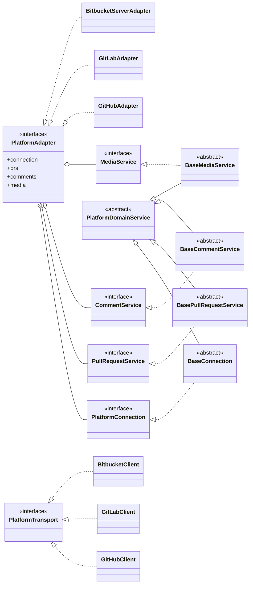

# Code platform adaptation

Funnel the differences between "code hosting platforms" into a single unified abstraction, `PlatformAdapter`; the business layers (polling, mirroring, review publishing) depend only on this abstraction and are unaware of the concrete platform. `PlatformAdapter` is not one monolithic interface but a **service container split by business domain** (four domains: connection / PR operations / comments / user & media), all sharing one platform connection. This chapter is the **unified design and maintenance entry point** for platform adaptation: layering and the domain split, capability flags and degradation, the unified comment model, and the differential adaptation logic of each platform (Bitbucket / GitHub / GitLab).

Implemented: **Bitbucket Server / Data Center**, **GitHub (github.com + GitHub Enterprise Server)**, **GitLab (gitlab.com + Self-Managed, CE/EE, REST API v4)**. Out of scope: local git operations (see [Repo mirror](02-repo-mirror.md)), pr-agent invocation (see [pr-agent runtime](../02-agent/05-pragent-runtime.md)).

---

## 1. Core abstraction design

### Layering

Three layers, with the contract decoupled from the transport implementation:

> **Legend** (`<|..` implements / `<|--` inherits / `o--` holds by composition):
>
> - **Contract layer** `@meebox/platform-core`: each domain interface is implemented by its corresponding `Base*`, which carries the cross-platform logic; the `Base*` classes all inherit `PlatformDomainService`; the container interface `PlatformAdapter` holds the four domain interfaces.
> - **Platform extensions** (**GitHub / GitLab / Bitbucket** isomorphic): `*Adapter` implements the container interface `PlatformAdapter`, `*Client` implements the transport port `PlatformTransport`.
> - Each `*Adapter` composes that platform's four domain services (each `extends` the corresponding `Base*`); the services share the same `*Client` via `ConnectionContext` — not expanded in the diagram to avoid clutter.

- **Contract layer `@meebox/platform-core`**: declares only business contracts, zero HTTP implementation. Contains the four **domain interfaces** and their corresponding **domain base classes** (`BaseConnection` / `BasePullRequestService` / `BaseCommentService` / `BaseMediaService`, carrying the cross-platform business logic), the **transport port `PlatformTransport`** (the sole seam through which domain services issue requests), the connection context `ConnectionContext`, the composer `composePlatformAdapter`, and optional transport helpers (free functions for timeouts / URL joining / error parsing / Link pagination, etc.).
- **Implementation layer `@meebox/platform-{github,gitlab,bitbucket-server}`**: one **unified connection-wrapper instance** per platform (a client implementing `PlatformTransport`) + four domain services (each `extends` the corresponding base class and is injected with the client). Platform-specific response types go in `types.ts`, cross-domain utilities in `utils.ts`, domain-specific mappings as private methods of each service.
- **Root `PlatformAdapter` (domain-service container)**: `{ kind, connection, prs, comments, media }`, no business logic — it only holds and exposes the four domains. Business layers pull services by domain (`adapter.comments.list(...)` / `adapter.prs.listPending(...)`).

**Domain split** (replacing the old single ~20-method monolithic interface):

| Domain | Interface | Responsibility |
| --- | --- | --- |
| `connection` | `PlatformConnection` | connection probe `ping()`, current-user cache, capability aggregation `capabilities()`, clone URL |
| `prs` | `PullRequestService` | PR discovery, commits (**newest-first**), activity, review decision, merge |
| `comments` | `CommentService` | comment read / post / reply / edit / delete |
| `media` | `MediaService` | avatars, proxying comment-embedded attachments |

- **Unified connection-wrapper instance (one client per platform)**: implements the `PlatformTransport` port and is the single holder of that platform's connection / auth config — base-URL normalization and web/git host derivation, PAT, per-request timeout, proxy resolution, clone protocol and clone-URL construction, all funneled here. The token is read via the credential layer and **never enters logs**. The four domains share the same connection state via `ConnectionContext` (which holds the client + `cachedUser`), never independently holding the transport or token.
- **Transport port `PlatformTransport`**: declares only the minimal connection capability isomorphic across the three platforms — `get/getWithHeaders/post/put/del` + `paginate` (pure JSON read/write + pagination). Binary fetching, `search`/`patch`, clone URL, etc. are per-client extensions outside the port (their trust models differ sharply and do not belong in the generic contract). The domain base classes depend only on this port and are unaware of the underlying fetch / auth headers / pagination style.
- **Platform-neutral PR identity `PrIdentity`**: `platform / group / repo / remoteId / connectionId` (+ optional url). Each platform maps its own concepts into it; this identity is also the input for hashing the state store's `localId` (see [State storage](../99-core/01-state-storage.md)).

  | Neutral concept | Bitbucket | GitHub | GitLab |
  | --- | --- | --- | --- |
  | group | projectKey | owner (org/user) | namespace |
  | repo | repoSlug | repo | project path |
  | remoteId | PR id | PR number | MR **iid** (per-project number) |

- **Authentication is PAT-only**: `Authorization: Bearer <token>` (GitLab uses the `PRIVATE-TOKEN` header). The token is read via the credential layer and never enters logs.
- **Proxying is funneled into the connection layer**: the connection config `PlatformConnectionConfig` carries `proxy`, and at client construction the effective fetch is resolved **once** by baseUrl host (loopback = direct connection / otherwise attach proxy). To keep core from depending on undici, the resolution is done via the injected `ProxyFetchFactory` (the composition root, desktop, provides the implementation). Pagination is wrapped into an async iterator per platform style (Bitbucket `start/limit`; GitHub/GitLab `Link` header).
- **Diff is not fetched through the adapter**: a platform's `/diff` endpoint will `truncated` for large PRs; diff display is always computed by the local mirror's `git` (see [Repo mirror](02-repo-mirror.md)), decoupled from the platform. **Platform anchors are used only when "publishing an inline comment"** — the local diff computation already knows each line's old/new line numbers and its added/removed/context role, which is exactly the input every platform's anchor needs; this is the key that makes the abstraction hold.
- **Clone protocol is one of two**: `pat` (default, embedding `<user>:<PAT>` in the URL) or `ssh` (`git@host:...`, via the system ssh config).

### Interfaces & neutral data model

Per-domain service methods:

- `connection`: `capabilities()` (static capability descriptor, see §2), `ping()` (version + user), `getCurrentUser()` (synchronously reads the ping cache, used for the approved check), `getCloneUrl()`.
- `prs`: `listPendingPullRequests()` (reviewer's pending, cross-repo), `listPullRequestCommits()` (**newest-first**), `listPullRequestActivity()`, `setPullRequestReviewStatus()`, `mergePullRequest()`.
- `comments`: `listPullRequestComments()`, `publishSummaryComment()`, `publishInlineComment()`, `replyToComment()`, `editComment()`, `deleteComment()`.
- `media`: `getUserAvatar()`, `getAttachment()`.

Neutral-type highlights:

- `PrComment`: `anchor` (null = summary / non-null = inline), `replies[]`, optional `version` (**Bitbucket optimistic lock only**), `kind` ('summary' | 'inline'), `threadId` (the reply-target abstraction: Bitbucket = parent comment id / GitHub = review-comment id / GitLab = discussion id).
- `PrCommentAnchor`: `(path, line, side('old'|'new'), lineType('added'|'removed'|'context'))`.
- `PrDiffRefs`: `{ headSha, baseSha, startSha? }` — used for the inline-comment publish anchor (GitHub head sha / GitLab three shas; Bitbucket ignores it).
- `MergeStatus`: `{ canMerge, conflicted, vetoes[] }`; for fidelity see `mergeVetoFidelity` in §2.

---

## 2. Capability descriptor & capability degradation

Capabilities that cannot be implemented equivalently on all platforms are declared explicitly via the **`PlatformCapabilities`** returned by `capabilities()`; the UI shows / hides / greys accordingly, and the business layer switches strategy accordingly — **never `try/catch` to guess at the call site, and never write `if (platform === ...)`**.

`PlatformCapabilities` fields: `reviewStatuses` (supported review decisions), `inlineComments`, `inlineMultiline`, `commentOptimisticLock`, `commentHardBreaks` (whether a single `\n` renders as a hard break), `mergeVetoFidelity` ('full' | 'partial'), `discoveryRateLimited`, `discoveryFilters` (PR discovery categories), `resolvableThreads`, `suggestions`, `reviewGrouping`, `activityTimeline` (whether a review-decision activity event stream is provided), `commentCountIncludesReplies` (whether `PullRequest.commentCount` includes replies — determines the poller's comment-tracking trigger strategy, see [Notifications](../03-gui/03-notifications.md); true for GitHub/GitLab, false for Bitbucket).

**Merge-veto reasons go through neutral codes**: `MergeVeto` does not assemble user-facing localized text in the backend. GitHub / GitLab normalize their derived reasons to the stable codes `MergeVetoCode` in `@meebox/platform-core` (`conflict` / `branchProtected` / `behind` / `checksFailed` / `checking` / `draft` / `discussionsUnresolved` / `notApproved` / `notOpen` / `blockedByDependency` / `notMergeable`), and the frontend does i18n by code (`mergeVeto.<code>`); Bitbucket passes the server text through directly (`summary`, no code). Likewise, backend user-facing errors such as unsupported version from the connection probe are carried by error codes (see [Error codes](../99-core/04-error-codes.md)), not assembled as Chinese text in the backend.

Per-platform capability overview:

| Capability | Bitbucket | GitHub | GitLab |
| --- | --- | --- | --- |
| reviewStatuses | approve/needs work/revoke | approve/needs work/revoke | Premium: approve/revoke; CE: no review API |
| commentOptimisticLock | yes (version) | no | no |
| mergeVetoFidelity | full (/merge vetoes) | partial (assembled from mergeable_state) | full (detailed_merge_status) |
| discoveryRateLimited | no | yes (search 30/min) | no |
| resolvableThreads / suggestions | no / no | conceptually present, not yet implemented | conceptually present, not yet implemented |

### The three degradation states & the decision criteria

- **Grey out + reason tooltip**: the user expects it to exist, but it is temporarily unavailable due to platform version / permissions → preserve discoverability and state the reason.
- **Hidden (not rendered)**: the platform conceptually has no such capability at all.
- **Degraded substitute**: a usable weaker substitute action exists.

Criteria: **"could exist but this instance lacks it" → grey out with explanation; "the platform has no such concept" → hidden; "a weak substitute exists" → substitute + hint.**

Two layers of capability source:

- **Static** (platform / version / plan) ← `capabilities()`: pushed down to the render layer via `ConnectionSummary.capabilities`, deciding feature-level show / hide / grey.
- **Dynamic** (this PR / this user's permissions / async not-yet-ready) ← PR data: decides instance-level grey + reason (e.g. the merge button appears only when `mergeStatus.canMerge`; GitHub's `mergeable=null` uses a neutral "computing" state rather than a permanent grey; the review button is greyed on your own authored PR).

---

## 3. Comment interactions: unified model + capability flags

**Do not design a per-platform comment UI**; instead a single interaction model, with the differences converged into capability flags. The render layer consumes only the neutral `PrComment` tree + `capabilities()`; each platform's comment concepts are **normalized by the adapter** into the same nested structure. The core actions (read / reply / edit / delete / draft → confirm publish) are identical across the three. **Normalizable = no forking**; only when a platform's model cannot be expressed losslessly by `PrComment` do we reconsider a "dedicated component".

Capability flags (comment-UI-facing): `resolvableThreads` (thread resolve + collapse), `suggestions` (one-click apply of an inline suggestion), `reviewGrouping` (review decision + inline comments submitted as a group, mapping to the local "draft pool → batch publish", see [Review workflow](03-review-workflow.md)), `commentOptimisticLock` (whether delete/edit carries `version`). When a flag is false, degrade per §2 (hide / grey out).

---

## 4. Platform-specific adaptation

### 4.1 Bitbucket Server / Data Center (REST API v1, ≥ 7.0)

- **Discovery**: the dashboard aggregation endpoint `/dashboard/pull-requests?role=REVIEWER&state=OPEN` returns all pending-review PRs across projects and repos in one call.
- **Current user**: every authenticated request's response carries the `X-AUSERNAME` header (slug); at ping time, `/users/{slug}` is used to get the displayName.
- **Version floor 7.0**: `ping()` reads the `application-properties` version and rejects anything below 7.0 (key capabilities such as multilineMarker exist only from 7.0).
- **Comments**: fetch all activities via `/activities`, filtering `COMMENTED` + `ADDED`; a single comment tree, with replies nested via `comment.comments[]`.
- **Inline anchor**: `anchor{path, line, lineType(ADDED/REMOVED/CONTEXT), fileType(FROM/TO)}` + `diffType=EFFECTIVE` (anchored to the "currently effective diff", so it follows the line even after subsequent pushes to the PR); multi-line uses the multilineMarker.
- **Optimistic lock**: comment delete / edit must carry `version` (query / body); a mismatch returns 409; deleting a comment that has replies is rejected (409).
- **Review**: `PUT …/participants/{userSlug}` writes status (APPROVED / NEEDS_WORK / UNAPPROVED); idempotent and freely switchable back and forth.
- **Merge**: `/merge` returns `canMerge / conflicted / vetoes` in one call (full fidelity); `POST …/merge?version=N` carries the optimistic lock.
- **Clone**: pat → `https://<user>:<PAT>@host/scm/<proj>/<repo>.git` (username taken from cachedUser); ssh → `git@host:<proj>/<repo>.git` (the default port 7999 must be set in ssh config).

### 4.2 GitHub (github.com + GitHub Enterprise Server, REST API v3)

> The following is the core logic that "the code itself can't make clear" — be sure to maintain it alongside the implementation.

- **Base URL and host derivation**: the connection base is the **API base** (github.com → `https://api.github.com`; GHE → `https://<host>/api/v3`). The **web/git host** used for clone / avatars / web pages is derived by the adapter: `api.github.com → github.com`; GHE → the same host (with `/api/v3` stripped).
- **Discovery (heavy rate limit + eventual consistency + two-stage fetch)**: no dashboard, so use Search `GET /search/issues?q=is:open is:pr review-requested:@me archived:false`.
  - search is **rate-limited to ~30/min** → `capabilities.discoveryRateLimited=true`, and this platform's poll interval is lengthened separately.
  - search returns **issue-shaped** results (with `repository_url` + `number`), so each one must then fetch `GET /repos/{o}/{r}/pulls/{n}` (for head/base sha, mergeable, draft) + `GET …/pulls/{n}/reviews` (to compute reviewer status), an N+1 in parallel.
  - the results are **eventually consistent**: a PR that was just requested for review may briefly not be found — this is expected, and the next poll round picks it up.
- **Normalizing the three-comment system**: GitHub splits comments into three sets —
  - issue comments `/issues/{n}/comments` = PR-level discussion (≈ summary, no threads);
  - review comments `/pulls/{n}/comments` = inline (with `path/line/side/in_reply_to_id`);
  - reviews `/pulls/{n}/reviews` = decisions.
  The adapter treats issue comments as the summary and reconstructs review comments by `in_reply_to_id` into top-level + nested replies, unified into a `PrComment` tree.
- **Inline anchor needs head sha**: `POST …/pulls/{n}/comments` must carry `commit_id` (= PR head sha). By the abstraction's decision, **the adapter internally fetches the PR to get the head sha** before posting, so the caller needs no change. side: internal 'old' → `LEFT` / 'new' → `RIGHT`. The line must fall within that commit's diff, otherwise 422.
- **Review is an append event**: approve → `POST …/reviews{event:APPROVE}`; needs work → `{event:REQUEST_CHANGES, body}` (GitHub requires a body); revoke → find the current user's most recent APPROVED/CHANGES_REQUESTED review and `PUT …/reviews/{id}/dismissals`. **You cannot review your own PR** (422) → the UI greys the review button on your own authored PR. The "current status" is taken from the user's most recent decision review.
- **Comment delete / edit / reply have no version**: try inline first (`/pulls/comments/{id}` for edit/delete, `/pulls/{n}/comments/{id}/replies` for reply), and on 404/422 fall back to the issue-comment endpoints (`/issues/comments/{id}`, create a new issue comment).
- **Merge and mergeability (partial)**: `mergeable` (bool | **null**, computed async, may be null on the first fetch) + `mergeable_state` (clean/dirty/blocked/behind/unstable). There is no single endpoint for the individual veto items, so the adapter **derives an approximation** from `mergeable_state` (fidelity = partial); `null` is not treated as false but marked "computing". Merge via `PUT …/pulls/{n}/merge`.
- **Commits**: `/pulls/{n}/commits` is oldest-first, and the adapter **reverses** it to newest-first.
- **Avatars / attachments**: avatars are a direct link `<webBase>/<login>.png`; comment-embedded images are absolute URLs (user-attachments / githubusercontent / GHE host), fetched via the main-side PAT proxy (private ones need auth).
- **Token permissions**: see [Code platform config · GitHub PAT permission reference](../../guide/01-code-platform.md) (classic `repo`; fine-grained Pull requests RW + Contents RW + Metadata R).

### 4.3 GitLab (gitlab.com + Self-Managed CE/EE, REST API v4)

- **Base URL and host derivation**: the connection base is the **API base** (gitlab.com → `https://gitlab.com/api/v4`; self-hosted → `https://<host>/api/v4`), and may be left blank to default to the official one. The web host used for clone / attachments / web pages is derived by the adapter (take the base's host, strip `/api/v4`). Auth goes through the `PRIVATE-TOKEN` header.
- **Identity mapping**: `projectKey` = namespace (**including nested groups**, e.g. `group/subgroup`), `repoSlug` = project, `remoteId` = MR **iid**. The endpoint `:id` uses `encodeURIComponent(projectKey/repoSlug)` (GitLab accepts the URL-encoded full path as the project id). The project path is parsed from the MR web_url.
- **Discovery (three categories)**: `GET /merge_requests?scope=all&state=opened&...` (global cross-project). `discoveryFilters` = Review Requested (`reviewer_username`) / Created (`author_username`) / Assigned (`assignee_username`); GitLab has no "mentioned" concept and so excludes it. The poller polls each category, unions and tags them, and the renderer switches tabs. List items then fetch details one by one (`diff_refs` three shas + `detailed_merge_status`) + (EE) `/approvals` (approved_by → reviewer status), an N+1.
- **Comments = discussions + notes**: `GET …/discussions` returns discussions one by one, the first note as top-level and the rest as replies; `system` notes are filtered out. inline = a note with `position` (`new_path/new_line` or `old_path/old_line`). Reply goes through **discussion_id** (= `threadId`); edit / delete go through **note_id** (= `remoteId`) — the two differ, so the renderer's reply entry passes `threadId ?? remoteId` (Bitbucket/GitHub are unaffected).
- **Inline anchor needs three shas**: `POST …/discussions{body, position}`, where position contains `base/start/head_sha` (the adapter internally fetches the MR to get `diff_refs`) + `position_type:'text'` + `new_line`/`old_line` filled per side. Currently **single-line** (`inlineMultiline=false`).
- **Review (edition degradation)**: the approve/unapprove API is **Premium/Ultimate from 13.9 on**, absent in CE / EE-Free; GitLab review is binary, with **no needsWork**. `ping()` probes the edition via the `enterprise` flag of `GET /metadata` (15.2+) (older instances fall back to `/version`, conservatively treated as CE); `capabilities.reviewStatuses` = EE → `['approved','unapproved']` / CE → `[]` (UI greyed). Note: `enterprise=true` does not absolutely guarantee review is available (EE-Free lacks it), so the write path still degrades gracefully with a hint.
- **Mergeability (full fidelity)**: `detailed_merge_status` (15.6+, `mergeable` / `broken_status` / `not_approved` / `ci_must_pass` …) derives vetoes one by one + `has_conflicts` determines conflicted; older instances fall back to `merge_status`. Merge via `PUT …/merge`.
- **Commits**: `/commits` is already newest-first, no reversal needed.
- **Avatars / attachments**: avatars use the `avatar_url` direct link (PAT attached only for the same instance host); comment-embedded relative `/uploads/...` are completed to `<webBase>/<project>/uploads/...` and fetched via the PAT proxy, with no credentials sent to external hosts.

---

## 5. Extension & caveats

- **Adding a new platform = a new `@meebox/platform-<name>` package**:
  - one connection client implementing `PlatformTransport` (self-managing auth / pagination / host derivation / clone);
  - four domain services, each `extends` `BaseConnection` / `BasePullRequestService` / `BaseCommentService` / `BaseMediaService`, filling in the platform endpoints and mappings (mappings as private methods of each service, response types in `types.ts`, cross-domain utilities in `utils.ts`);
  - assemble them into the container adapter with `composePlatformAdapter`;
  - add a case in adapters.ts + config schema (discriminatedUnion) + expose the platform option in the config UI;
  - the two internal-package registration steps (see [AGENTS.md](../../../AGENTS.md)).

  It's recommended to first use an existing platform's **adapter contract test** as the baseline, and only ship the new platform once it passes the suite. You may implement / test a single domain first, without filling in all of them at once.
- **Capability flags drive the UI**: review/merge/comment interactions always branch on `capabilities` + PR status, with **no `if (platform === ...)`** (keep the seam intact).
- **The write path has side effects**: merge is irreversible; comment publishing must be idempotent (on success, record the remote id to prevent re-sending, see [Review workflow](03-review-workflow.md)); a remote failure of review / merge must give the user a clear hint (toast), never silent.
- **Author field, two names**: keep the display name (Chinese / real name) and the login name (English id) distinct — display uses the former, matching "current user / whether it's my own PR" uses the latter.
- **Remaining open items**: the comment "resolve thread / apply suggestion" UI (the capability flags are reserved, not yet implemented); real GHE / GitLab Self-Managed end-to-end integration testing.
