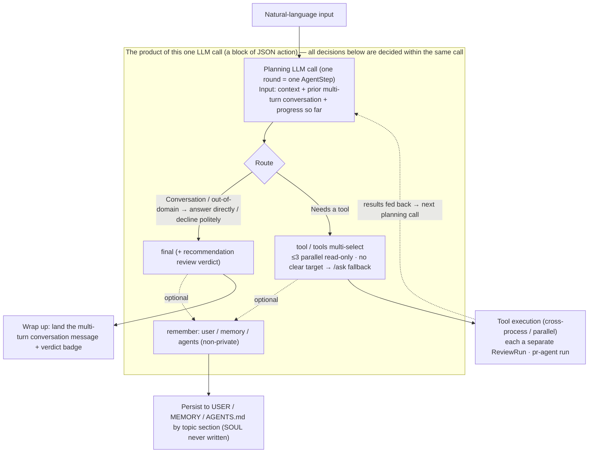

# Agentic sessions

## Responsibilities & boundaries

Upgrade the render layer's natural-language input from "route straight to `/ask`" to "hand off to the Agent runtime for delegation": read the local Agent context (see [Agent & context](01-agent.md)), plan tasks autonomously, orchestrate multiple pr-agent tools as needed, and retain and output the reasoning and results. Direct slash-tool instructions (`/describe` · `/review` · `/ask`) still keep the "direct tool" semantics and do not go through the Agent.

Owns: input routing (natural language vs direct tool), the Agent planning loop (ReAct), process retention (todo / transcript / progress), interaction control (one-click auto review / Stop to pause preserving state / Continue to resume), and sharing the run state with the existing queue.

Does not own: the Agent directory and context assembly, the tool red line (see [Agent & context](01-agent.md)), poll-triggered automatic pre-review and cross-PR scheduling (see [AutoPilot & scheduling](03-autopilot.md)), findings parsing and draft publishing (see [Review workflow](../01-platform/03-review-workflow.md)).

## Core design

### Input routing

Split at the render-layer input parser:

- Starts with `/describe`, `/review` → **direct tool**, keeping the existing "ignore the rest of the text, run that tool directly" semantics.
- `/ask <text>` → **direct tool**, the text runs `/ask` directly as the question. In CLI mode (claude/codex), `/ask` sets the CLI
  subprocess cwd to a (sanitized) throwaway worktree and answers with the full file context — rather than reasoning only from the diff in a neutral temp directory the way describe/review do; the mechanism (`MEEBOX_CLI_WORKDIR` + worktree instruction-file sanitization against injection) is in [pr-agent runtime](05-pragent-runtime.md).
  - **Structured segmented output**: the prompt constrains `/ask` to output under deterministic tags `<summary>` / `<analysis>` / `<suggestions>`
    (pr-agent-bridge `prompts.ts`), and the parse layer (poller `parseStructuredAsk`) splits by tag into separate findings: summary
    conclusion highlighted and expanded, analysis process collapsed by default, suggestions highlighted. When the model does not comply / has no tags, the whole thing falls back to plain parsing.
  - **Re-review reference closed loop**: a code finding card from review/improve has a "quote" button → attach it to the input bar to start a re-review `/ask` (carrying
    `referencedFinding` + the finding body as context). Re-review mode additionally produces `<verdict>` (replace / keep / drop, landing in
    `ReviewRun.askVerdict`), and the result card shows the verdict + **manual** adopt/close actions: adopt-supersede → create a new comment draft anchored at the original location +
    close the original finding; the close relationship is stored independently in `findingClosures` (not draft semantics), the original card turns to closed state and cross-links with the re-review card.
  - **Agent auto review auto-associates / supersedes**: in the auto-review micro-flow the judge can raise a re-review follow-up ask against a given review finding
    (`asks[].targetFindingId`, the judge prompt gives an addressable id list), the asks step dispatches that follow-up ask in re-review mode (carrying
    `referencedFinding`), and on a replace/drop verdict it **automatically** creates a `FindingClosure` to close the superseded original finding (via
    `ReviewOrchestratorDeps.closeFinding`). On by default and conservative (only closes on named + replace/drop; keep / unnamed leave it untouched);
    new comments do not auto-draft, still left for the user to "adopt" manually on the re-review card.
- Other direct tool / operation instructions → keep their own existing invocation.
- **Natural language without a slash** → **hand off to the Agent runtime** (the old behavior was the equivalent `/ask`; this is the core change of this module).
- Unknown `/xxx` → error (unchanged).

### Agent planning loop

The Agent runtime is an orchestrator layer sitting atop the existing run queue, with its own LLM channel (reusing the LLM
Profile credentials, the outbound proxy and token collection; see [pr-agent runtime](05-pragent-runtime.md), [Networking & proxy](../99-core/03-networking-proxy.md)). One session:

1. Read context (see [Agent & context](01-agent.md)) → produce / update the **task list (todo)**, persisted to this PR's working directory.
2. Execute step by step: each step is either one LLM call for planning / judgment, or one tool call (running `/describe` · `/review` · `/ask`
   **into the existing run queue** as a "tool", reusing worktree, concurrency and cancellation).
3. Each step's **thought summary** and **tool-call result** are written to the session transcript and streamed to the render layer in real time; the todo
   items are marked done and progress is persisted.
4. Wrap up once the completion condition is met or the step cap is reached.

**Tool selection & routing: which decisions are made within "one LLM call"**: the free-planning Agent (natural-language entry) is a
ReAct loop — **each round is one orchestration-level LLM call** (one `AgentStep`): inputs are "context, prior multi-turn conversation,
progress so far", output is a block of **JSON action**. The key boundary is — **routing, tool selection, wrap-up, and memory, these "decisions", are all decided within
this single call**; what actually takes time is the tools selected in the action running against pr-agent, plus the loop's own multi-round round-trips.

One action (the product of a single call) can carry simultaneously:

- `thought`: this round's thought summary (retained + streamed).
- **Tool selection**, one of three: `tool` (single, `/ask` may carry `question`); `tools` (**one parallel multi-select of read-only tools**,
  e.g. `["/describe","/review"]`, **cap 3**, staggered 100–200ms apart at start); or no tool selected and go straight to
  `final` (wrap up).
- `recommendation`: the non-binding verdict at a review-type wrap-up (`approve` / `needs_work` / `manual_review` + reason),
  produced in the **same call** as `final`, for the UI to show a verdict badge.
- `remember`: a proactively recorded **non-private** entry, grouped by target writable file (`user` → USER.md / `memory` → MEMORY.md
  / `agents` → AGENTS.md), returned together with this round's action and persisted after wrap-up (**`SOUL.md` is never written**). Each entry **must carry**
  `section`: the entry is **abstracted and generalized** and placed under the most fitting existing `## topic section` in the target file (append to that section's end if matched, or create a new one at the file's end if absent),
  rather than dumped uniformly into a single record area, for easier cross-session context management. **An entry that cannot fit any topic is not durable memory**
  (most likely a finding of this PR) — dropped, not recorded (no fallback area).

**Routing policy** (written into the planning prompt, also decided within this same call): natural conversation (greeting / self-introduction / clarification) answers directly with
`final` and calls no tool; a task outside the review domain is politely declined, no tool; something related to this PR but with no clear tool target defaults to
`/ask` as a fallback (with a focused question); a review wrap-up is fixed as `## Summary` / `## Key findings` / `## Suggestions` + `recommendation`.

**Within one call vs across multiple calls** — this boundary is the key to reading the run state and the metering (see "Step vs sub-task" below):

- **Within one LLM call**: the routing decision, the (parallelizable) tool selection, the wrap-up answer, the verdict recommendation, the memory-write intent.
- **Across multiple calls / processes**: the actual execution of selected tools (each a separate `ReviewRun` / pr-agent run), the multi-round
  ReAct loop (each round a new planning call), and, in the fixed micro-flow (see [AutoPilot & scheduling](03-autopilot.md)), judge / summary each as its own separate LLM call.



The fixed micro-flow (the auto review / AutoPilot of [AutoPilot & scheduling](03-autopilot.md)) is another form: the tool sequence is **predetermined** (describe + review → conditional
follow-up → summary), and judge / summary are each a **separate** orchestration-level LLM call, not going through the "free multi-select within one call"
planning above — the two are complementary; see the metering basis in "Step vs sub-task" below.

### Metering boundary: step vs sub-task (pr-agent run)

The **orchestration agent** (interactive is the PR's own agent; under autopilot it is each PR's sub-agent) is **not merely plan-and-dispatch** — each step (`AgentStep`) is one plan / judge /
tool-dispatch **orchestration-level LLM call**: planning the todo, reading findings to decide whether to follow up, and the wrap-up summary all count as its steps. Meanwhile
`/describe` · `/review` · `/ask` — **tasks handed off to run in a pr-agent subprocess** — count at the orchestration layer as **only the "dispatch"
step**; a pr-agent run's own **internal multiple LLM calls do not count toward `stepCount`** — it is a separate `ReviewRun`,
metered by its own `tokenUsage`. Hence two points:

1. Step count is an **orchestration-level** concept, measuring the orchestration agent's decision rounds, not inflated by a sub-task's internal complexity;
2. **Tokens are collected at both layers** — orchestration overhead + each pr-agent run's usage both go into the session metering (see "Agent LLM cost" in "Extension & caveats" below),
   just not mixed into the step count.

The step-count formula in [AutoPilot & scheduling](03-autopilot.md) counts by exactly this basis: describe / review / each ask / summary each count as one step.

### Process retention

Thought steps, tool results, todos and progress are all persisted in this PR's working directory, surviving cross-PR switches and component unmount (consistent with the
run store persistence in [Review workflow](../01-platform/03-review-workflow.md)), and can be reviewed afterward.

### Interaction control (chat box)

- **One-click auto review button**: to the right of the chat box's "instruction (`/`) button" there is an **auto Review button**; clicking it triggers the
  [AutoPilot & scheduling](03-autopilot.md) auto-review micro-flow for the current PR (`/describe`+`/review` → conditional follow-up only on severe issues → summary).
  It is **directly user-initiated**: goes at `user` priority, **executes immediately**, and is not subject to the AutoPilot master switch / minimum interval /
  ledger dedup (those three gates govern only background auto-triggering). It effectively reuses AutoPilot's micro-flow as a manual action on demand.
- **Stop (pause preserving state)**: the chat box's Stop button **stops all Agent tasks under the current PR in one click** — aborts the PR's
  running run (reusing `AbortController`), clears its Agent tasks waiting in the queue,
  but **preserves the context state** (`AgentSession` / todo / progress / transcript persisted as-is, session status set to `paused`).
  This differs from the existing `cancel` "discard without a trace": Stop is a **resumable pause**.
- **Continue (resume)**: resume a `paused` session in one click — plan and execute from the preserved todo / progress (the session loop already "reads the session snapshot to resume unfinished planning", and Continue reuses this path), no need to start over.
- **Run state visible and shared**: a PR session **directly shows the auto tasks running under that PR** — the
  steps orchestrated by AutoPilot / Agent and the runs the user manually initiates **go into the same session timeline** (same transcript + step streaming),
  with no hidden channel of "running in the background, invisible to the session". All three **share the same run-state occupancy**: they reuse the existing cross-PR-persisted
  run-state store (see [Review workflow](../01-platform/03-review-workflow.md), [GUI interaction](../03-gui/01-ui-interaction.md)) and the same run queue /
  concurrency budget (see the scheduling in [AutoPilot & scheduling](03-autopilot.md)) — an AutoPilot run occupies a visible concurrency slot just like a manual run, and the status-bar activity chip /
  queue popover and the PR session present it consistently. Switch away and back to the PR, and the running auto task is still in place.

### Avoiding overly long tasks

A session is constrained by the **step cap** `agent.max_steps` (defaults to a small value). The design stance is "a single automated operation in a review
scenario usually doesn't need 10 tasks" — the Agent should lean toward "few and precise" tool orchestration rather than unbounded divergence;
reaching the cap stops and annotates the transcript "aborted due to step cap", never silently truncating. The AutoPilot path has a tighter budget of its own (see
[AutoPilot & scheduling](03-autopilot.md)).

## Data / interface contract

**Per-PR session layout** (lands under `state/prs/<hash>/` in [State storage](../99-core/01-state-storage.md), isolated per PR):

```
state/prs/<hash>/agent/
├── session.json     # AgentSession: session metadata + todo + progress + step count
└── transcript.json  # AgentStep[]: thought summary + tool calls + results (streamed to disk)
```

Core shapes (described by name and shape, not bound to implementation):

- `AgentSession` (**one per PR**): `status` (`running` | `paused` | `done` | `failed` | `cancelled`) ·
  `todo[]` (task items + done state) · `stepCount` · `maxSteps` · `summary?` (this PR's wrap-up summary, length-limited by `summary_max_chars`) ·
  `recommendation?` (`approve` | `needs_work` | `manual_review` + reason; **non-binding**, triggers no write operation) ·
  timing and termination reason (including "aborted due to step cap", "user paused"). `paused` is resumable, set by `agent:stop` and revived by `agent:continue`.
- `AgentStep`: `kind` (`plan` | `tool` | `judge`) · `thought` · `toolCall?` (tool + args) · `result?` · `tokenUsage?`.

**IPC channels** (following the `invoke<K>` + `IpcChannels` constraint):

- `agent:run`: the natural-language entry, initiating a PR's Agent session.
- `agent:stop` / `agent:continue`: pause preserving state (abort all Agent tasks under this PR, set `paused`, keep state) / resume a `paused` session. **Distinct from** `agent:cancel` (discard without a trace).
- `agent:getSession`: read the session snapshot (including todo / progress / `summary`).
- `agent:stepProgress` (push): streaming of session steps (thought + tool result).
- The one-click auto review `agent:autoReview` is in [AutoPilot & scheduling](03-autopilot.md).

## Extension & caveats

- **Agent LLM cost**: the orchestration-level LLM calls for planning / judgment are separate from pr-agent, their tokens are likewise collected and go into the session metering; the UI
  must distinguish "Agent orchestration overhead" from "review-proper overhead", so cost isn't invisible.
