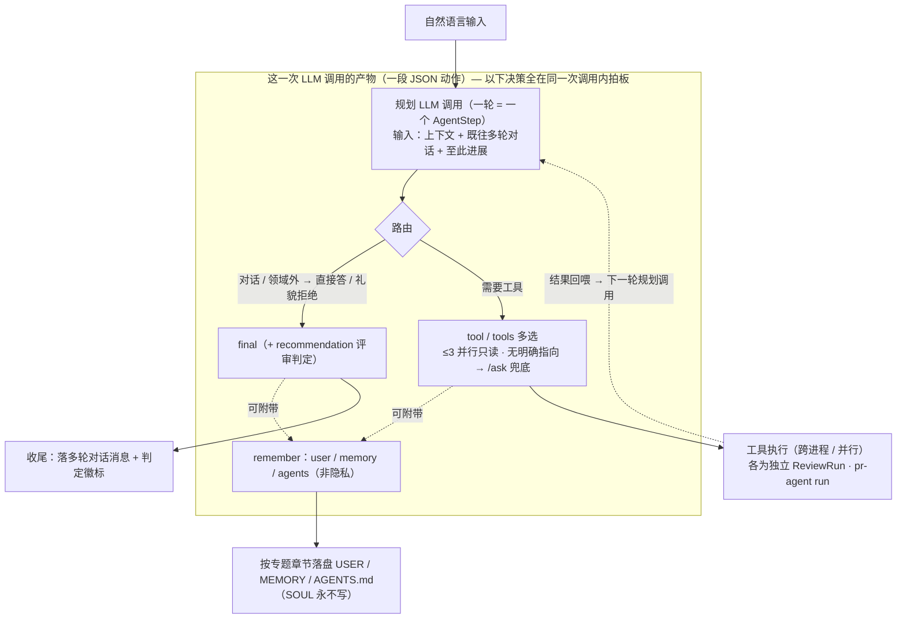

# 会话 Agent 化

## 职责与边界

把渲染层的自然语言输入从「直接落 `/ask`」升级为「交给 Agent 运行时委派」：读本地 Agent 上下文（见 [Agent 与上下文](01-agent.md)）、自主规划任务、按需编排多个 pr-agent 工具、把思考与结果留存输出。直接的斜杠工具指令（`/describe`·`/review`·`/ask`）仍维持「直达工具」语义、不经 Agent。

负责：输入路由（自然语言 vs 直达工具）、Agent 规划循环（ReAct）、过程留存（todo / transcript / 进度）、交互控制（一键自动评审 / Stop 暂停保态 / Continue 续跑）、运行态与既有队列共享。

不负责：Agent 目录与上下文装配、工具红线（见 [Agent 与上下文](01-agent.md)）、轮询触发的自动预评审与跨 PR 调度（见 [AutoPilot 与调度](03-autopilot.md)）、findings 解析与草稿发布（见 [评审闭环](../01-platform/03-review-workflow.md)）。

## 核心设计

### 输入路由

在渲染层输入解析处分流：

- `/describe`、`/review` 开头 → **直达工具**，维持既有「忽略其余文本、直接跑该 tool」语义。
- `/ask <text>` → **直达工具**，文本作为 question 直跑 `/ask`。CLI 模式（claude/codex）下 `/ask` 会把 CLI
  子进程 cwd 落到（已净化的）一次性 worktree，取完整文件上下文作答——而非像 describe/review 只基于 diff
  在中性临时目录推理；机制（`MEEBOX_CLI_WORKDIR` + worktree 指令文件净化防注入）见 [pr-agent 运行时](05-pragent-runtime.md)。
  - **结构化分段输出**：提示词约束 `/ask` 按确定性标签 `<summary>` / `<analysis>` / `<suggestions>` 输出
    （pr-agent-bridge `prompts.ts`），解析层（poller `parseStructuredAsk`）按标签切成独立 finding：summary
    结论高亮展开、analysis 过程默认收起、suggestions 建议高亮。模型未遵循 / 无标签时整体回退普通解析。
  - **复评引用闭环**：review/improve 的 code finding 卡片可点「引用」→ 挂到输入栏发起复评 `/ask`（携带
    `referencedFinding` + finding 正文上下文）。复评模式额外产出 `<verdict>`（replace / keep / drop，落
    `ReviewRun.askVerdict`），结果卡出裁决 + **手动**采纳/关闭动作：采纳取代 → 建新评论草稿锚定原位置 +
    关闭原 finding；关闭关系独立存于 `findingClosures`（非草稿语义），原卡转关闭态并与复评卡互链。
  - **agent 自动评审自动关联 / 取代**：自动评审微流程里 judge 可对某条 review finding 出复评追问
    （`asks[].targetFindingId`，judge prompt 给 id 可寻址清单），asks 步以复评模式派发该追问（携
    `referencedFinding`），裁决 replace/drop 时**自动**建 `FindingClosure` 关闭被取代的原 finding（经
    `ReviewOrchestratorDeps.closeFinding`）。默认开启、保守（仅点名 + replace/drop 才关，keep / 未点名不动）；
    新评论不自动落草稿，仍由用户在复评卡手动「采纳」。
- 其余直接的工具 / 操作指令 → 维持各自原有调用。
- **无斜杠的自然语言** → **交给 Agent 运行时**（旧行为是等价 `/ask`，此为本模块的核心改动）。
- 未知 `/xxx` → 报错（不变）。

### Agent 规划循环

Agent 运行时是一层位于既有运行队列之上的编排器，拥有独立的 LLM 通道（复用 LLM
Profile 凭据、出站代理与 token 采集；见 [pr-agent 运行时](05-pragent-runtime.md)、[网络与代理](../99-core/03-networking-proxy.md)）。一次会话：

1. 读上下文（见 [Agent 与上下文](01-agent.md)）→ 产出 / 更新 **任务清单（todo）**，落盘到本 PR 工作目录。
2. 逐步执行：每步或是一次规划 / 判断的 LLM 调用，或是一次工具调用（把 `/describe`·`/review`·`/ask`
   作为「工具」**入既有运行队列**执行，复用 worktree、并发与取消）。
3. 每步的**思考摘要**与**工具调用结果**写入会话 transcript，并实时流式推送渲染层；todo
   项随之标记完成、进度落盘。
4. 满足完成条件或触达步数上限即收尾。

**工具选择与路由：哪些决策在「同一次 LLM 调用」内完成**：自由规划 Agent（自然语言入口）是一个
ReAct 循环——**每一轮就是一次编排级 LLM 调用**（一个 `AgentStep`）：输入「上下文、既往多轮对话、
至此进展」，输出一段 **JSON 动作**。关键边界是——**路由、工具选择、收尾、记忆这几类「决策」全在
这一次调用内拍板**；真正耗时的是动作里被选中的工具去 pr-agent 执行、以及循环本身的多轮往返。

一段动作（单次调用的产物）可同时承载：

- `thought`：本轮思考摘要（留档 + 流式推送）。
- **工具选择**，三选一：`tool`（单个，`/ask` 可带 `question`）；`tools`（**一次并行多选只读工具**，
  如 `["/describe","/review"]`，**上限 3**、彼此错开 100~200ms 起跑）；或不选工具直接
  `final`（收尾）。
- `recommendation`：评审类收尾的非约束性判定（`approve` / `needs_work` / `manual_review` + 理由），
  与 `final` 在**同一次调用**产出，供 UI 展示判定徽标。
- `remember`：主动记下的**非隐私**条目，按目标可写文件分组（`user` → USER.md / `memory` → MEMORY.md
  / `agents` → AGENTS.md），随本轮动作一并返回、收尾后落盘（**`SOUL.md` 永不写**）。每条**必带**
  `section`：把条目**抽象归纳**后归入目标文件里最贴切的既有 `## 专题章节`（命中则追加到该节末尾、不存在则
  文件末尾新建），而非统一堆到单一记录区，便于跨会话上下文管理。**无法归入某个专题的条目不是耐久记忆**
  （多半是本 PR 的发现）——直接丢弃、不记录（无兜底区）。

**路由策略**（写进规划提示词，也在这同一次调用里裁决）：自然对话（问候 / 自我介绍 / 澄清）直接
`final` 回答、不调工具；评审领域外的任务礼貌拒绝、不调工具；与本 PR 相关但无明确工具指向时默认
`/ask` 兜底（带聚焦问题）；评审收尾固定为 `## 摘要` / `## 关键发现` / `## 建议` + `recommendation`。

**单次调用内 vs 跨多次调用**——这条边界是读懂运行态与计量（见下「步 vs 子任务」）的关键：

- **同一次 LLM 调用内**：路由判定、（可并行的）工具选择、收尾答复、判定建议、记忆写入意图。
- **跨多次调用 / 多进程**：被选中工具的实际执行（各为独立 `ReviewRun` / pr-agent run）、ReAct 的
  多轮循环（每轮一次新的规划调用）、以及固定微流程（见 [AutoPilot 与调度](03-autopilot.md)）里 judge / summary 各自的独立 LLM 调用。



固定微流程（[AutoPilot 与调度](03-autopilot.md) 的自动评审 / AutoPilot）是另一种形态：工具序列**预定**（describe + review → 条件
追问 → 总结），judge / summary 各是**独立**的编排级 LLM 调用，不走上面这套「单次调用内自由多选」的
规划——两者互补，见下「步 vs 子任务」的计量口径。

### 步 vs 子任务（pr-agent run）的计量边界

**编排 agent**（交互式即 PR 自身的 agent，autopilot
即各 PR 的子 agent）**不只是规划分发**——每一步（`AgentStep`）是一次 plan / judge /
工具分发的**编排级 LLM 调用**：规划 todo、读 findings 判断是否追问、收尾总结都算它的步。而
`/describe`·`/review`·`/ask` 这些**拆给 pr-agent 子进程跑的任务**，在编排层维度**只计「分发」
那一步**；pr-agent run **内部**自己的多次 LLM 调用**不计入 `stepCount`**——它是一条独立 `ReviewRun`，
按自身 `tokenUsage` 计量。由此两点：

1. 步数是**编排级**概念，衡量编排 agent 的决策回合，不被子任务内部复杂度撑大；
2. **token 两层都采**——编排开销 + 各 pr-agent run 用量都归入会话计量（见下「扩展与注意事项」的
   Agent LLM 成本），只是不混进步数。

[AutoPilot 与调度](03-autopilot.md) 的步数公式正按此口径数：describe / review / 每个 ask / summary 各算一步。

### 过程留存

思考步骤、工具结果、todo、进度均持久化于本 PR 工作目录，跨 PR 切换与组件卸载存活（与
[评审闭环](../01-platform/03-review-workflow.md) 的 run store 保活一致），可事后回看。

### 交互控制（聊天框）

- **一键自动评审按钮**：在聊天框「指令（`/`）按钮」右侧提供一个**自动 Review 按钮**，点击即对当前
  PR 触发 [AutoPilot 与调度](03-autopilot.md) 的自动评审微流程（`/describe`+`/review`→ 仅严重问题条件性追问 → 总结）。
  它是**用户直接发起**：走 `user` 优先级、**立即执行**，不受 AutoPilot 总开关 / 最小间隔 /
  台账去重约束（那三道闸只管后台自动触发）。等于把 AutoPilot 的微流程作为一个手动动作随时复用。
- **Stop（暂停保态）**：聊天框 Stop 按钮**一键停止当前 PR 下的所有 Agent 任务**——中止该 PR
  正在执行的 run（复用 AbortController）、清掉其在等待队列里的 agent 任务，
  但**保留上下文状态**（`AgentSession` / todo / 进度 / transcript 原样落盘，会话状态置 `paused`）。
  这区别于既有 `cancel`「丢弃不留痕」：Stop 是**可续的暂停**。
- **Continue（续跑）**：对 `paused` 会话一键续跑——从保留的 todo / 进度接着规划执行（会话循环本就「读会话快照续上未完成规划」，Continue 即复用这条路径），无需从头重来。
- **运行态可见且共享**：PR 会话**直接展示该 PR 下正在执行的自动任务**——AutoPilot / Agent 编排出的
  step 与 user 手动发起的 run **同进一条会话时间线**（同一 transcript + step 流式推送），
  不存在「后台跑、会话看不见」的隐形通道。三者**共享同一运行态占用**：复用既有跨 PR 保活的
  run-state store（见 [评审闭环](../01-platform/03-review-workflow.md)、[GUI 交互](../03-gui/01-ui-interaction.md)）与同一条运行队列 /
  并发预算（见 [AutoPilot 与调度](03-autopilot.md) 的调度）——一个 AutoPilot run 像手动 run 一样占用可见的并发槽，状态栏活动 chip /
  队列浮层与 PR 会话对它的呈现一致。切走再切回该 PR，正在跑的自动任务仍在原位。

### 规避超长任务

会话受**步数上限** `agent.max_steps` 约束（默认取小值）。设计立场是「review
场景单次自动化操作通常不需要 10 个任务」——Agent 应倾向「少而准」的工具编排而非无限发散；
触达上限即停并在 transcript 标注「因步数上限中止」，绝不静默截断。AutoPilot 路径另有更紧的预算（见
[AutoPilot 与调度](03-autopilot.md)）。

## 数据 / 接口契约

**per-PR 会话布局**（落在 [状态存储](../99-core/01-state-storage.md) 的 `state/prs/<hash>/` 下，按 PR 隔离）：

```
state/prs/<hash>/agent/
├── session.json     # AgentSession：会话元数据 + todo + 进度 + 步数
└── transcript.json  # AgentStep[]：思考摘要 + 工具调用 + 结果（流式落盘）
```

核心形状（以名称与形状描述，不绑定实现）：

- `AgentSession`（**每个 PR 一份**）：`status`（`running` | `paused` | `done` | `failed` | `cancelled`）·
  `todo[]`（任务项 + 完成态）· `stepCount` · `maxSteps` · `summary?`（本 PR 收尾总结，受 `summary_max_chars` 限长）·
  `recommendation?`（`approve` | `needs_work` | `manual_review` + 理由；**非约束性**，不触发任何写操作）·
  计时与终止原因（含「步数上限中止」「用户暂停」）。`paused` 可续，由 `agent:stop` 置、`agent:continue` 复活。
- `AgentStep`：`kind`（`plan` | `tool` | `judge`）· `thought` · `toolCall?`（tool + 入参）· `result?` · `tokenUsage?`。

**IPC 通道**（沿用 `invoke<K>` + `IpcChannels` 约束）：

- `agent:run`：自然语言入口，发起一个 PR 的 Agent 会话。
- `agent:stop` / `agent:continue`：暂停保态（中止当前 PR 全部 Agent 任务、置 `paused`、留状态）/ 续跑 `paused` 会话。**区别于** `agent:cancel`（丢弃不留痕）。
- `agent:getSession`：读会话快照（含 todo / 进度 / `summary`）。
- `agent:stepProgress`（push）：会话步骤的流式推送（思考 + 工具结果）。
- 一键自动评审 `agent:autoReview` 见 [AutoPilot 与调度](03-autopilot.md)。

## 扩展与注意事项

- **Agent LLM 成本**：规划 / 判定的编排级 LLM 调用独立于 pr-agent，token 同样采集并归入会话计量，UI
  需能区分「Agent 编排开销」与「评审本体开销」，避免成本不可见。
