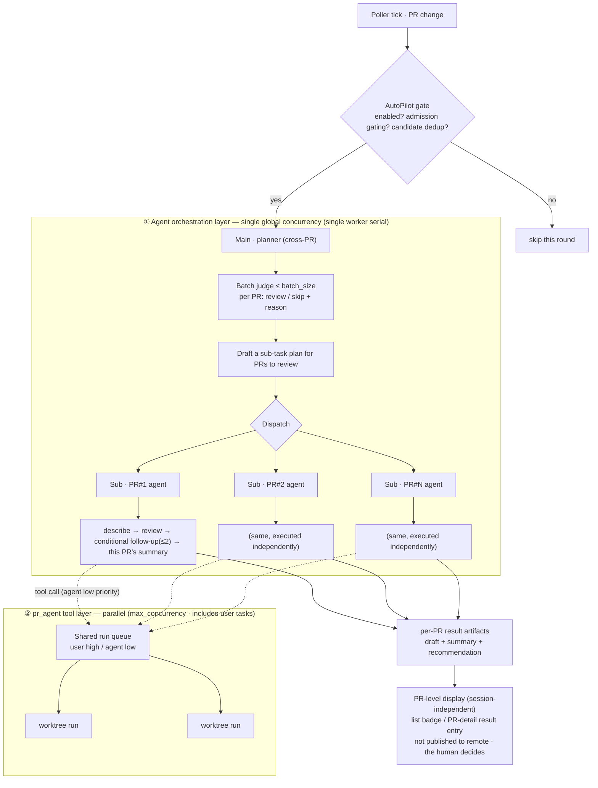

# AutoPilot & scheduling

## Responsibilities & boundaries

Make "auto-pre-run a review when a new / changed PR comes in" a **default-off, one-click-enable** background automation, with its trigger and exception policy governed by `AGENTS.md`; the decision still rests with the reviewer (drafts are not auto-published, mutating operations are constrained by the red line, see the tool conventions in [Agent & context](01-agent.md)).

Owns: poll triggering and admission gating, batch LLM judgment (exception rules), the layered execution of planner ↔ per-PR sub-agents, the bounded micro-flow and step budget, ledger dedup and result display, and user-first ordered scheduling.

Does not own: interactive sessions and natural-language routing (see [Agentic sessions](02-session.md)), the Agent directory and tool red line (see [Agent & context](01-agent.md)), findings parsing / draft pool / publishing (see [Review workflow](../01-platform/03-review-workflow.md)).

## Core design

### Layered architecture: planner (main) ↔ per-PR agent (sub)

Autopilot is not "one big agent running all PRs serially", but **main-sub two layers + two concurrency domains**:

- **Main = planner (cross-PR, single)**: batch-judges which PRs to review, drafts a sub-task plan for each PR to review,
  and dispatches; **touches no tool, produces no summary**.
- **Sub = per-PR agent (independent)**: each executes the **bounded micro-flow** the planner dispatched, and **produces this PR's
  summary after this PR's sub-task finishes** (per PR, no global summary).
- **Concurrency domain one: the Agent orchestration layer = a single global concurrency** — the reasoning of the planner and each per-PR agent is driven by a **single background worker
  serially** (bounded cost, deterministic order).
- **Concurrency domain two: the pr_agent tool layer = parallel** — the `/describe` · `/review` · `/ask` dispatched by sub-agents
  are consumed **in parallel via the shared run queue** (same pool as user tasks, user-first, see "Scheduling" below).

### Triggering & admission

**Enable switch**: the bottom status bar's **AutoPilot button**, **disabled by default**, enabled manually by the user; the state is persisted in config
(`agent.autopilot.enabled`, default `false`). When disabled, the logic below does not run at all.

**Trigger cadence**: AutoPilot hooks onto the Poller's "PR change" callback; the **evaluation cadence aligns with polling** — it evaluates once per poller tick
(interval = `poller.interval_seconds`), with **no separate minimum-interval guard**; admission gating + ledger dedup already prevent duplicate
review / hammering the LLM, and the global `busy` lock prevents a new round stacking on an unfinished one. Additionally, **on flipping the switch on (off → on) it triggers a poll immediately**,
so this round is evaluated at once, without waiting for the next polling cycle.

**Admission gating** (top-down; if any is unmet, skip that PR):

1. **Category + status hard gate** — trigger only for PRs under the **"Review Requested" category** (`discoveryFilters` contains `review-requested`) and in
   **"pending" status** (`localStatus === 'pending'`); already approved / marked needs work, or not "Review Requested", are never auto-reviewed. Platforms that don't support discovery categories (`discoveryFilters` empty) naturally don't match.
2. **Stop once reviewed** — once the session already has a valid `/describe` or `/review` output (succeeded or running, manual or auto)
   it is judged already-reviewed / reviewing, and no longer auto-triggered (see `hasReviewOutput`); a review that **failed with no output** does not count and can be retried next round.
3. **Skip dedup (ledger)** — exclude only PRs "already judged skip by the LLM for this version" (ledger `decision='skipped'` and
   `autoReviewedUpdatedAt` equals the current `updatedAt`), to avoid re-judging a PR that was judged skip; a PR to review with no output and not skipped is always let through (**no longer blocked just because the ledger has any record at all** — "already reviewed successfully" is judged by output at admission gate 2, not by the ledger).

**Auto-review state record (ledger)**: each PR records an AutoPilot ledger (the PR `updatedAt` at review time / judgment
result and reason / recommendation leaning). The ledger mainly serves:

- The recommendation badge in the PR list (★, treating manual / auto alike);
- The above "skip dedup" (looking only at `decision='skipped'`).

After a PR is pushed a new commit (`updatedAt` changes), the old skip record naturally invalidates and it can re-enter the candidate set.

**Removal / purge = terminate**: after each poll tick, for a PR **no longer in the local PR list** (purged after removal / soft-delete),
if it still has running agent operations (the orchestration controller + tool runs dispatched to the run queue), terminate them outright — the PR is gone,
so continuing to review is pointless and wastes LLM / occupies a worktree.

### Batch judgment (exception rules)

Candidate PRs aren't all run blindly; they first pass an LLM judgment:

1. Collect the candidates' **title + description** into a structured list.
2. **Single-context size is bounded**: at most `agent.autopilot.batch_size` (default 10) PRs per batch; excess is handled across rounds in batches,
   and the deferred count is `log`ged (no silent truncation).
3. Feed the LLM, which judges per PR "is it worth auto-reviewing" with a reason — e.g. **branch-merge / back-merge PRs can be skipped**,
   a pure dependency bump can be skipped, etc.; the exception rules are extensible in `AGENTS.md`.
   - **A branch-merge signal is only evidence, not the verdict**: whether it is a "pure branch merge" is **judged by the actual commit structure** (pull commits to see whether they are
     **all merge commits**), never solely by the source branch name (`classifyBranchMerge`). A source branch being a trunk (`main`/`dev`, etc.)
     alone is only a background signal handed to the judge and **does not constitute a skip reason** — to avoid mistakenly harming an original fork PR whose "source branch happens to be a trunk".
     The judge weighs title/description + these signals and chooses to review / skip.
4. The judgment lands in the ledger (including "skipped + reason", for auditing and UI display).

### Layered execution: planning & the micro-flow

Once judged "review", autopilot **does not run all PRs serially in a single agent**, but splits into two layers (this is also the structural means of "avoiding overly long tasks"):

- **Planning layer (planner, cross-PR)**: the batch judgment above is its job — decide "review / skip" per PR,
  and **draft a sub-task plan** for each PR to review (defaults to the micro-flow below, and the steps can also be customized via `AGENTS.md` rules).
  The planner **only plans and dispatches**; it runs no tool itself, produces no PR summary, and has a tiny budget.
- **Execution layer (each PR's own agent, independent)**: given the plan, **each PR's agent independently completes its own sub-task**,
  and **produces this PR's summary after this PR's sub-task finishes**. The summary is **per PR**, wrapped up by that PR's agent — **there is no cross-PR
  global summary**.

> The interactive entry has no planner: the user talks directly with a specific PR's agent (see [Agentic sessions](02-session.md)); the planner is autopilot's cross-PR exclusive.

Each PR's agent executes the following **bounded micro-flow** (i.e. the sub-task plan the planner dispatched), entering the tool queue at **low priority** (see "Scheduling" below):

1. `/describe` + `/review` — generate the description and findings; the artifacts enter the existing draft pool (see [Review workflow](../01-platform/03-review-workflow.md)).
2. **Conditional follow-up only on severe issues** — **no follow-up by default**. This PR's agent reads the tool output (findings and their
   `severity`), and only when a **particularly malignant / high-severity** suspicion arises (e.g. a suspected security vulnerability, data corruption, a severe logic defect that needs context verification) does it consider re-running
   `/ask` on that point. **Hard cap ≤2 questions** (`agent.strategy.max_followup_asks`, default 2):
   with no severe issue it asks nothing at all, never following up for the sake of it. `/ask` is a read-only tool, within the red-line-allowed range (see the tool conventions in [Agent & context](01-agent.md)).
3. **Per-PR wrap-up summary (strictly length-limited)** — produced **by that PR's agent after all of this PR's sub-tasks finish**, a **strictly length-limited** summary
   (constrained by `agent.summary_max_chars`, default within a few hundred characters; over the limit it must **compress itself, not truncate key points**; no cross-PR global summary). The content includes **key points, risks,
   and whether it leans toward approving** — giving one of the three tiers `approve` / `needs_work` / `manual_review` + a one-line reason.
   It lands as a **result artifact attached to the PR** (`summary` + `recommendation` + step log). **Key — display depends on no agent session view**:
   autopilot is a **background async task**, so the summary **cannot** parasitize the chat transcript. It is presented via three **PR-level, session-independent** surfaces:
   - The `recommendation` **badge** on the **PR list** item: cross-PR triage, read directly from the lightweight ledger, no session load needed.
   - The **PR detail's review-result area**: fold this autopilot artifact (draft findings + summary + `recommendation` chip) as a
     **result entry** into the existing run / review panel, **visible on opening the PR, no chat needed**.
   - An optional **completion notification / unread badge** "autopilot pre-review done".

   The step log is an **audit record expandable on demand**. **Only a non-binding recommendation**: "recommend approve" does not equal executing `/approve`, "recommend changes" does not trigger
   `/needswork` either — actually approving / rejecting is still a manual click by the reviewer (red line in the tool conventions of [Agent & context](01-agent.md)); the result entry can offer an
   **"adopt as PR status" button** to turn the recommendation into a manual action in one click, but the click always rests with the human.

**The step plan can be customized via rules (plan)**: the above micro-flow is the **default sequence** (`describe-review` → `judge` → `asks` →
`summary`, assembled by the step registry `REVIEW_STEP_REGISTRY` and `assembleReviewSteps`), not hard-coded. During batch judgment, the
planner can, per `AGENTS.md` rules, give a **custom plan** (an ordered set of step ids) for a single PR, thus **skipping / reordering /
adding-removing** steps. Available step ids: `describe-review`, `improve` (generate code-improvement suggestions, standalone, off by default, included when a rule wants it),
`judge`, `asks`, `summary` — e.g. "a config-type PR only generates the description and findings, skip the follow-up" gives `["describe-review",
"summary"]`. When the plan **is omitted or invalid, it falls back to the full default set**: validity check `isValidReviewPlan` — step ids must be in the registry, and if it contains
`judge` / `summary` it must first contain `describe-review` (the latter two read its artifacts); **double-guarded** at the judgment layer and the micro-flow driver.
**Only autopilot goes through a plan**: the manual review button does not pass the judgment layer and always runs the full default set. "Skip the whole thing" still uses the judgment's `review:false`.
Adding a tool step = register it in `REVIEW_STEP_REGISTRY` + add it to `ReviewStepKind` (the tool itself is in the unified registry `TOOLS`).

**No auto-publish**: all the above artifacts — drafts, follow-up answers, summary — **only land locally, in a to-be-confirmed state**, visible on entering the app,
**not auto-written to the remote** (unless explicitly granted under "Write permission extension" below). The decision still rests with the reviewer.

### Step budget & write permission

**Step cap — each layer has its own budget, structurally derived rather than borrowing `agent.max_steps`**:

- **Planner**: only "batch judgment + dispatch", a tiny budget (one judge pass + dispatch), no free divergence.
- **Each PR's agent**: **does not plan freely**, only executes the planner-dispatched micro-flow — the default template, or the rule-customized plan (trim / reorder / add-remove
  within the registry's existing steps, at most including one `improve` step, **never freely diverging**); the other variable within the template is
  0..N conditional follow-ups. Hence the step cap is **derived from the template shape + the plan**, not borrowing the wider interactive `agent.max_steps`: the hard cap ≈
  `2 (describe + review) + max_followup_asks + 1 (summary)` + a little judgment overhead,
  and **the only tunable that can raise it is `max_followup_asks`**. A separate structured hard backstop (derived by the formula above, never exceeded at runtime) provides a safety net,
  preventing a self-loop from blowing up the background task; on hitting the ceiling it stops and annotates "autopilot aborted due to step cap". Background automation's step count is therefore **predictable, determined by the template**.

**Write permission extension (constrained by the tool red line)**: a reserved future capability — if the user **explicitly grants** in `AGENTS.md` / `rules/` (see [Rules](04-rules.md)),
AutoPilot may perform auto-publish comment, auto `approve` / `needswork`. **All denied by default**; grants are per-item,
auditable explicit switches, released at runtime per the hard check of the [Agent & context](01-agent.md) tool conventions.

### Scheduling: a user-first ordered queue

Scheduling splits into **two concurrency domains**, constraining "agent orchestration" and "pr_agent tool running" respectively — this is the key trade-off of this design:

- **Agent orchestration layer — single global concurrency**: the **reasoning loops** of the planner and each PR agent are driven **serially by a single background autopilot worker**,
  with globally only one agent "thinking / dispatching" at a time. Reason: agent reasoning is the unpredictable, token-costly
  part, and serializing it keeps the background cost bounded and the order deterministic, avoiding N concurrent planning loops burning money at once. This concurrency is **fixed at 1** (not
  `max_concurrency`).
- **pr_agent tool-running layer — parallel**: the `/describe` · `/review` · `/ask` subprocesses still go through the existing **shared run queue** (see
  the `max_concurrency` + worktree concurrency model in [Review workflow](../01-platform/03-review-workflow.md)), **callable in parallel** — across PRs,
  and concurrent with user tasks. The single-concurrency agent loop only handles "dispatch"; the heavy work is consumed in parallel at the tool layer, so throughput
  isn't blocked by serial reasoning.
- **Priority swimlanes (tool layer)**: `user` (manually initiated, high) / `agent` (dispatched by the planner and each PR agent, low).
  A high-priority item is **inserted before all low-priority items** in the waiting queue, but **does not preempt** a running run (execution is non-preemptible, to avoid a half-done
  worktree / partial side effect); same-priority is FIFO. `QueueItem` gains `priority` / `origin` (user / agent /
  autopilot) fields, reusing the existing `AbortController` / `queueChanged` mechanism.

Effect: autopilot's agent reasoning is serial, cheap, controllable; the review subprocesses it dispatches and the `/review` the user clicks at any time
are consumed **in parallel** in the tool queue, user-first. The three `origin`s **share the same tool queue, concurrency budget and run-state store** —
no hidden background execution: an auto task occupies a visible concurrency slot like a manual task, and is visible in real time in the status bar and the corresponding PR view (see
"Run state visible and shared" in [Agentic sessions](02-session.md)).

## Data / interface contract

**Ledger layout** (lands at `state/prs/<hash>/agent/autopilot.json` in [State storage](../99-core/01-state-storage.md); a planner pass is recorded at the top level `state/agent/`).

Core shapes (described by name and shape, not bound to implementation):

- `AutopilotLedger` (**one per PR, read directly for the list badge, no session load needed**): `autoReviewedUpdatedAt` ·
  `decision` (`review` | `skipped`) · `reason` · `recommendation?` (`approve` | `needs_work` |
  `manual_review`) · `summaryRef` (points to the summary of that PR's sub-agent session) · `at`.
- `PlannerPass` (**the planner, cross-PR, not landing in a per-PR directory**): `batch[]` (per-PR judgment + sub-task plan) · `tokenUsage` · `at`.
- Run-queue `QueueItem` additions: `priority` (`user` | `agent`) · `origin` (`user` | `agent` | `autopilot`).
- **Concurrency model**: the agent orchestration layer is **fixed single-concurrency** (single background worker, not `max_concurrency`) / the pr_agent tool layer is
  **`max_concurrency`** (shared queue, see "Scheduling" above).

**IPC channels** (following the `invoke<K>` + `IpcChannels` constraint):

- `agent:autoReview`: the one-click auto review button — run the micro-flow immediately for the current PR (`user` priority, bypassing AutoPilot's three gates; see the interaction control in [Agentic sessions](02-session.md)).
- `agent:autopilotToggle` / `agent:autopilotState`: start/stop AutoPilot / read its state and ledger.
- The existing `pragent:*` queue channels are reused, only extended with `priority` / `origin`.

## Extension & caveats

- **Avalanche prevention relies on multiple gates**: AutoPilot's safety comes from **admission gating** (category + status) + **ledger dedup** + **batch cap**
  (`batch_size`) + the global `busy` lock + the evaluation cadence aligned with polling; missing any one could blow up the LLM quota under many PRs / high-frequency polling.
- **Batch judgment especially must control size**: the `batch_size` feeding the candidate list to the LLM is the key knob for cost and context; excess is handled across rounds in batches, no silent truncation.
- **Write permission is a hard constraint**: auto write operations (publish / approve / needswork) are all denied by default, and grants are per-item and released via a runtime hard check (see [Agent & context](01-agent.md)).
