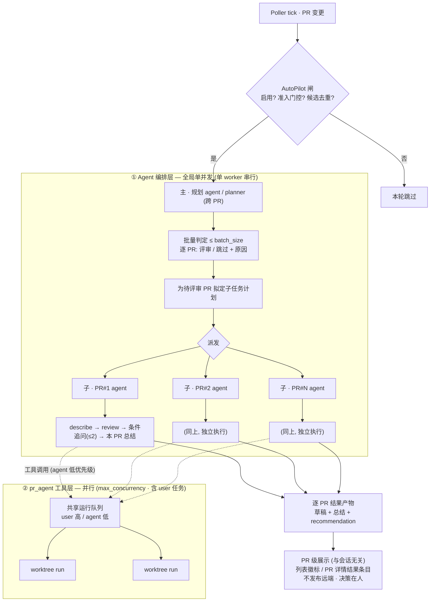

# AutoPilot 与调度

## 职责与边界

把「新 / 变更 PR 进来自动预跑评审」做成**默认关闭、可一键启用**的后台自动化，由 `AGENTS.md` 规定其触发与例外策略；决策权仍在评审者（草稿不自动发布，修改性操作受红线约束，见 [Agent 与上下文](01-agent.md) 的工具规范）。

负责：轮询触发与准入门控、批量 LLM 判定（例外规则）、规划 agent ↔ 各 PR 子 agent 的分层执行、有界微流程与步数预算、台账去重与结果展示、用户优先的有序调度。

不负责：交互式会话与自然语言路由（见 [会话 Agent 化](02-session.md)）、Agent 目录与工具红线（见 [Agent 与上下文](01-agent.md)）、findings 解析 / 草稿池 / 发布（见 [评审闭环](../01-platform/03-review-workflow.md)）。

## 核心设计

### 分层架构：规划 agent（主）↔ 各 PR agent（子）

autopilot 不是「一个大 agent 串跑所有 PR」，而是**主子两层 + 两个并发域**：

- **主 = 规划 agent（planner，跨 PR、唯一）**：批量判定哪些 PR 要评审、为每个待评审 PR
  拟定子任务计划、派发；**不碰工具、不出总结**。
- **子 = 每个 PR 的 agent（独立）**：各自执行 planner 派的**有界微流程**，并**在本 PR
  子任务结束后产出本 PR 的总结**（逐 PR，无全局总结）。
- **并发域一：Agent 编排层 = 全局单并发**——planner 与各 PR agent 的推理由**单个后台 worker
  串行**驱动（成本有界、顺序确定）。
- **并发域二：pr_agent 工具层 = 并行**——子 agent 派发的 `/describe`·`/review`·`/ask`
  走**共享运行队列并行**消化（与用户任务同池、用户优先，见下「调度」）。

### 触发与准入

**启用开关**：底部状态栏 **AutoPilot 按钮**，默认**禁用**，用户手动启用；状态持久化于配置
（`agent.autopilot.enabled`，默认 `false`）。禁用时下述逻辑完全不跑。

**触发节奏**：AutoPilot 挂在 Poller 的「PR 变更」回调上，**评估节奏对齐轮询**——每个 poller tick
（间隔 = `poller.interval_seconds`）评估一遍，**不单设独立的最小间隔守卫**；准入门控 + 台账去重已防止重复
评审 / 打爆 LLM，全局 `busy` 锁防止上一遍未完又叠跑。此外**启用开关时（关 → 开）立即触发一次 poll**，
让本轮即时评估、不必等下个轮询周期。

**准入门控**（自上而下，任一不满足即跳过该 PR）：

1. **分类 + 状态硬门控**——只对**「待我评审」分类**（`discoveryFilters` 含 `review-requested`）下、
   **「待处理」状态**（`localStatus === 'pending'`）的 PR 触发；已通过 / 标记需修改、或非「待我评审」
   的一律不自动评审。不支持发现分类的平台（`discoveryFilters` 为空）天然不命中。
2. **已评审即止**——会话中一旦已有 `/describe` 或 `/review` 的有效产出（成功或正在跑，手动或自动皆算）
   即判定已评审过 / 评审中，不再自动触发（见 `hasReviewOutput`）；评审**失败无产出**则不算、下轮可重试。
3. **跳过去重（台账）**——仅排除「本版本已被 LLM 判定 skip」的 PR（台账 `decision='skipped'` 且
   `autoReviewedUpdatedAt` 等于当前 `updatedAt`），避免对判过 skip 的 PR 反复重判；无产出又未被 skip 的
   待评审 PR 一律放行（**不再因台账里有任意记录就拦下**——「已成功评审」由准入闸 2 用产出判定，不靠台账）。

**自动评审状态记录（ledger）**：每个 PR 记录一份 AutoPilot 台账（评审时所对应的 PR `updatedAt` / 判定
结果与原因 / 建议倾向）。台账主要供：

- PR 列表的建议徽标（★，手动 / 自动一视同仁）；
- 上述「跳过去重」（只看 `decision='skipped'`）。

PR 被推新 commit（`updatedAt` 变）后，旧 skip 记录自然失效、可再次进入候选。

**移除 / purge 即终止**：每轮 poll tick 后，对**已不在本地 PR 列表**（被移除 / 软删后 purge）的 PR，
若其上仍有在执行的 agent 操作（编排控制器 + 派发到运行队列的工具 run），一律直接终止——PR 都没了，
继续评审无意义且空耗 LLM / 占用 worktree。

### 批量判定（例外规则）

候选 PR 不无脑全跑，先过一道 LLM 判定：

1. 收集候选 PR 的**标题 + 描述**，组织成结构化清单。
2. **单次上下文规模受限**：每批至多 `agent.autopilot.batch_size`（默认 10）个 PR；超出按批跨轮处理，
   并 `log` 出被推迟的数量（不静默截断）。
3. 喂入 LLM，按规则逐 PR 判「是否值得自动评审」并附原因——例如**分支合并 / 回合并类 PR 可跳过**、
   纯依赖升级可跳过等，例外规则在 `AGENTS.md` 里可扩充。
   - **分支合并信号只是证据、不是裁决**：是否「纯分支合并」**以实际提交结构判定**（拉 commits 看是否
     **全为 merge commit**），绝不仅凭源分支名（`classifyBranchMerge`）。源分支为主干（`main`/`dev` 等）
     单独只作背景信号一并交给 judge，**不构成跳过理由**——避免误伤「源分支恰为主干」的 fork 原创 PR。
     judge 综合标题/描述 + 这些信号自行选择评审 / 跳过。
4. 判定结果落台账（含「skipped + 原因」，便于审计与 UI 展示）。

### 分层执行：规划与微流程

判为「评审」后，autopilot **不由单个 agent 串跑所有 PR**，而是分两层（这也是「规避超长任务」的结构性手段）：

- **规划层（规划 agent / planner，跨 PR）**：上面的批量判定即其职责——逐 PR 定「评审 / 跳过」，
  并为每个待评审 PR **拟定子任务计划**（默认即下述微流程，亦可经 `AGENTS.md` 规则定制步骤）。
  planner **只规划与分发**，自身不跑工具、不产 PR 总结，预算极小。
- **执行层（每个 PR 各自的 agent，独立）**：拿到计划后，**各 PR 的 agent 独立完成自己的子任务**，
  并**在本 PR 子任务结束后产出本 PR 的总结**。总结是**逐 PR**的、由该 PR 的 agent 收尾——**不存在跨
  PR 的全局总结**。

> 交互式入口无 planner：用户直接与某个 PR 的 agent 对话（见 [会话 Agent 化](02-session.md)）；planner 是 autopilot 跨 PR 专属。

每个 PR 的 agent 执行如下**有界微流程**（即 planner 派发的子任务计划），按**低优先级**入工具队列（见下「调度」）：

1. `/describe` + `/review` —— 生成描述与 findings，产物进既有草稿池（见 [评审闭环](../01-platform/03-review-workflow.md)）。
2. **仅对严重问题条件性追问** —— **默认不追问**。该 PR 的 agent 读工具输出（findings 及其
   `severity`），仅当出现**特别恶性 / 高严重度**的疑点（例如疑似安全漏洞、数据损坏、严重逻辑缺陷且需核实上下文）才考虑就该点补跑
   `/ask`。**硬上限 ≤2 个问题**（`agent.strategy.max_followup_asks`，默认 2）：
   没有严重问题就一个都不问，绝不为追问而追问。`/ask` 是只读工具，属红线放行范围（见 [Agent 与上下文](01-agent.md) 的工具规范）。
3. **逐 PR 收尾总结（严格限长）** —— **由该 PR 的 agent 在本 PR 子任务全部结束后**产出一段**严格限长**的总结
   （受 `agent.summary_max_chars` 约束，默认数百字内；超限须**自行压缩、不截断要点**；无跨 PR 全局总结）。内容含**要点、风险、
   以及是否建议通过的倾向**——给出 `approve` / `needs_work` / `manual_review` 三档之一 + 一句理由。
   落盘为**挂在 PR 上的结果产物**（`summary` + `recommendation` + 步骤日志）。**关键——展示不依赖任何 agent 会话视图**：
   autopilot 是**后台异步任务**，故总结**不能**寄生在聊天 transcript。它经 **PR 级、与会话无关**的三个 surface 呈现：
   - **PR 列表**项的 `recommendation` **小徽标**：跨 PR triage，由轻量台账直接读，无需加载会话。
   - **PR 详情的评审结果区**：把本次 autopilot 产物（草稿 findings + 总结 + `recommendation` chip）作为一条
     **结果条目**并入既有 run / 评审面板，**打开 PR 即见、无需开聊天**。
   - 可选的**完成通知 / 未读角标**「autopilot 预评审完成」。

   步骤日志是**可按需展开的审计留档**。**仅为非约束性建议**：给「建议通过」不等于执行 `/approve`、「建议修改」也不触发
   `/needswork`——真通过 / 打回仍是评审者手动点按（红线见 [Agent 与上下文](01-agent.md) 的工具规范）；结果条目可放
   **「采纳为 PR 状态」按钮**把建议一键转成手动操作，但点按始终在人。

**步骤计划可经规则定制（plan）**：上述微流程是**默认序列**（`describe-review` → `judge` → `asks` →
`summary`，由步骤注册表 `REVIEW_STEP_REGISTRY` 组装、`assembleReviewSteps` 装配），而非写死。批量判定时，
规划 agent 可据 `AGENTS.md` 规则为单个 PR 给出**自定义计划**（一组有序步骤 id），从而**跳过 / 重排 /
增删**步骤。可用步骤 id：`describe-review`、`improve`（生成代码改进建议，独立、默认不含、规则要时纳入）、
`judge`、`asks`、`summary`——例如「配置类 PR 只生成描述与 findings、跳过追问」得 `["describe-review",
"summary"]`。计划**省略或非法时回落默认全集**：合法性校验 `isValidReviewPlan`——步骤 id 须在注册表内，且含
`judge` / `summary` 时必须先含 `describe-review`（后两步读其产物）；判定层与微流程驱动处**双重守卫**。
**仅 autopilot 走计划**：手动评审按钮不经判定层、恒跑默认全集。「跳过整篇」仍用判定的 `review:false`。
新增工具步 = 在 `REVIEW_STEP_REGISTRY` 登记 + 并入 `ReviewStepKind`（工具本身见统一注册表 `TOOLS`）。

**不自动发布**：上述全部产物——草稿、追问回答、总结——**只落本地、进待确认状态**，进应用即见，
**不自动写远端**（除非下「写权限扩展」显式授权）。决策权仍在评审者。

### 步数预算与写权限

**步数上限——分层各有预算，结构推导而非借用 `agent.max_steps`**：

- **规划 agent（planner）**：只做「批量判定 + 派发」，预算极小（一次 judge pass + 分发），不自由展开。
- **每个 PR 的 agent**：**不自由规划**，只执行 planner 派的微流程——默认模板，或规则定制的计划（在
  注册表既有步骤内裁剪 / 重排 / 增删，最多纳入一个 `improve` 步，**不会自由展开**）；模板内另一可变处是
  0..N 个条件性追问。故步数上限**由模板形状 + 计划推导**，不套用更宽的交互式 `agent.max_steps`：硬上限 ≈
  `2（describe + review）+ max_followup_asks + 1（summary）` + 少量判定开销，
  **唯一能推高它的可调量是 `max_followup_asks`**。另设结构化硬 backstop（按上式推导、运行期不超过它）兜底，
  防自循环把背景任务撑爆；触顶即停并标注「autopilot 步数上限中止」。背景自动化的步数因此**可预测、随模板而定**。

**写权限扩展（受工具红线约束）**：保留后续能力——若用户在 `AGENTS.md` / `rules/`（见 [规则](04-rules.md)）中**明确授权**，
AutoPilot 可执行自动发布 comment、自动 `approve` / `needswork`。**默认全部拒绝**；授权是逐项、
可审计的显式开关，运行时按 [Agent 与上下文](01-agent.md) 工具规范的硬校验放行。

### 调度：用户优先的有序队列

调度分**两个并发域**，分别约束「agent 编排」与「pr_agent 工具运行」——这是本设计的关键取舍：

- **Agent 编排层 —— 全局单并发**：planner 与各 PR agent 的**推理循环**由**单个后台 autopilot worker
  串行驱动**，全局一次只有一个 agent 在「思考 / 分发」。理由：agent 推理是不可预测、花 token
  的部分，串行化让背景成本有界、顺序确定，避免 N 个并发规划循环同时烧钱。该并发度**固定为 1**（非
  `max_concurrency`）。
- **pr_agent 工具运行层 —— 并行**：`/describe`·`/review`·`/ask` 子进程仍走既有**共享运行队列**（见
  [评审闭环](../01-platform/03-review-workflow.md) 的 `max_concurrency` + worktree 并发模型），**可并行调用**——跨 PR、
  且与用户任务并发。单并发的 agent 循环只管「分发」，重活在工具层并行消化，throughput
  不被串行推理卡住。
- **优先级泳道（工具层）**：`user`（手动发起，高）/ `agent`（planner 与各 PR agent 派发，低）。
  高优先级在等待队列**插到所有低优先级之前**，但**不打断**正在执行的 run（执行不可抢占，避免半截
  worktree / 部分副作用）；同级 FIFO。`QueueItem` 增 `priority` / `origin`（user / agent /
  autopilot）字段，复用既有 `AbortController` / `queueChanged` 机制。

效果：autopilot 的 agent 推理串行、便宜、可控；它派发的 review 子进程与用户随时点的 `/review`
在工具队列里**并行**消化、用户优先。三种 `origin` **共用同一工具队列、并发预算与运行态 store**——
没有隐形后台执行：自动任务与手动任务一样占可见并发槽、一样在状态栏与对应 PR 视图实时可见（见
[会话 Agent 化](02-session.md) 的「运行态可见且共享」）。

## 数据 / 接口契约

**台账布局**（落在 [状态存储](../99-core/01-state-storage.md) 的 `state/prs/<hash>/agent/autopilot.json`；planner pass 记于顶层 `state/agent/`）。

核心形状（以名称与形状描述，不绑定实现）：

- `AutopilotLedger`（**每 PR 一条，供列表徽标直接读、无需加载会话**）：`autoReviewedUpdatedAt` ·
  `decision`（`review` | `skipped`）· `reason` · `recommendation?`（`approve` | `needs_work` |
  `manual_review`）· `summaryRef`（指向该 PR 子 agent 会话的总结）· `at`。
- `PlannerPass`（**规划 agent，跨 PR，不落 per-PR 目录**）：`batch[]`（逐 PR 判定 + 子任务计划）· `tokenUsage` · `at`。
- 运行队列 `QueueItem` 增补：`priority`（`user` | `agent`）· `origin`（`user` | `agent` | `autopilot`）。
- **并发模型**：agent 编排层**固定单并发**（单后台 worker，非 `max_concurrency`）/ pr_agent 工具层
  **`max_concurrency`**（共享队列，见上「调度」）。

**IPC 通道**（沿用 `invoke<K>` + `IpcChannels` 约束）：

- `agent:autoReview`：一键自动评审按钮——对当前 PR 立即跑微流程（`user` 优先级，不经 AutoPilot 三道闸；见 [会话 Agent 化](02-session.md) 的交互控制）。
- `agent:autopilotToggle` / `agent:autopilotState`：启停 AutoPilot / 读其状态与台账。
- 既有 `pragent:*` 队列通道复用，仅扩展 `priority` / `origin`。

## 扩展与注意事项

- **防雪崩靠多道闸**：AutoPilot 的安全性来自**准入门控**（分类 + 状态）+**台账去重**+**批量上限**
  （`batch_size`）+ 全局 `busy` 锁 + 评估节奏对齐轮询，任一缺失都可能在大量 PR / 高频轮询下打爆 LLM 配额。
- **批量判定尤其要控规模**：候选清单喂 LLM 的 `batch_size` 是成本与上下文的关键旋钮，超出按批跨轮、不静默截断。
- **写权限是硬约束**：自动写操作（发布 / approve / needswork）默认全拒，授权逐项且经运行时硬校验放行（见 [Agent 与上下文](01-agent.md)）。
