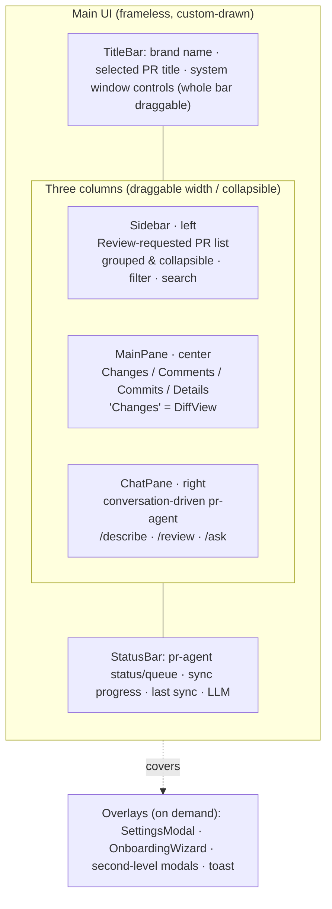

# GUI & interaction

## Responsibilities & boundaries

The overall layout of the render layer (React), each panel's responsibilities, cross-PR state persistence, and key interaction conventions. The render layer only handles display and interaction;
all data/IO goes through IPC to the main process (see [Architecture overview](../00-overview.md)).

Owns: UI structure, panel interaction, front-end state persistence, and interaction conventions such as external links / modals / local preferences. Does not own: business logic and IO (those live in the main-process modules).

## Core design

### Layout

After the root component mounts it runs a one-time bootstrap (fetching app info / config / PR list / pr-agent status / connections / last sync in parallel),
then renders the main UI of a custom-drawn title bar + three columns + status bar, plus on-demand overlays:

Responsibilities of each area:

- **TitleBar (top)**: the custom-drawn title bar of the frameless window (see "Frameless window" below), showing the brand name + selected PR title; the whole bar drags the window.
- **Sidebar (left)**: the review-requested PR list, grouped by `project/repo` with accordion collapse, sorted by `updatedAt` descending, with status filter + search;
  draggable width, collapsible as a whole.
- **MainPane (center)**: details of the selected PR, split into "Changes / Comments / Commits / Details" tabs. The Changes tab is **DiffView**.
- **ChatPane (right)**: conversation-driven pr-agent (`/describe` `/review` `/ask`), collapsed by default; draggable width.
- **StatusBar (bottom)**: pills for pr-agent status / queue, repo sync progress, last sync time, current LLM, etc.
- **Overlays**: SettingsModal (settings), OnboardingWizard (setup wizard), various confirm/edit second-level modals, and action-level toasts.

### Key panels

- **DiffView**: Monaco side-by-side diff + file tree (icons / Git coloring / draft & comment chips) + inline comments (view zone) +
  blame + cross-file search + inline draft editing (DraftZone). Switching files only renders the current file.
- **ChatPane**: run cards (RunMeta shows the model name + ↑input/↓output tokens); finding cards support "→ Edit" (jump to the Diff
  and enter draft editing) / "✗ Reject"; the queue is serial, interruptible/retryable; command completion + history.
- **DraftsPanel**: the "Drafts" tab, browsing drafts across files, publishing single/batch, and cross-referencing local-unsent vs. remote-published against the "Comments" tab.
- **SettingsModal**: visual CRUD for connection / LLM / proxy / rules directory / polling / repos_dir, with second-level edit modals for sub-items;
  connection/proxy come with a "Test" action.
- **OnboardingWizard**: first-launch onboarding that configures the code platform (+ optional LLM).

### Cross-PR state persistence

The live status of a pr-agent run, repo sync, and drafts are all held in **module-level stores** (`useSyncExternalStore`), and the root component
wires the main process's event streams (run progress / queue changes / sync progress / draft changes) into them on startup. This way, when switching PRs, running state,
live stdout, and the draft list are not lost when components unmount.

### Component layering: App = composition root, domain logic lives in hooks

`App.tsx` is the **composition root** — it does only three things: call each domain hook, assemble view models (cheap derivations), and pass data and callbacks through to child components such as TitleBar / Sidebar / MainPane / ChatPane / StatusBar. **No domain logic is piled inside App** (state machines, effects, IPC calls, ref sync, etc.); those sink into the respective domain hooks under `renderer/src/hooks/use*.ts`:

- `usePullRequests` (list / selection / review decision / merge / refresh / read), `useBootstrap` (startup + global lifecycle), `usePrNavigation` (discovery category / active·archived scope / archive lazy-load / open by URL / locate-and-jump / notification-click navigation / cross-component Diff·Tab jump intent), `useGlobalShortcuts` (window-level shortcuts), `usePanelLayout`, `useDockBadge`, `useTheme`, `useToast`, `useUpdateNotice`, `useExternalLinkGuard`, `useAppStores`.
- **Criterion**: a piece of logic that carries its own state/effect/ref sync, or that can be tested independently, should be a hook; if it is merely the "wire A's output into B's input" assembly and cheap derivation (e.g. filtering visible filter options by capability flags), it stays in the composition root.
- **Avoid reverse bloat**: interdependent state (e.g. scope / selectedId / discoveryFilter) is kept in **one** hook, not split into several small hooks that thread setters through each other's params. When hooks have dependencies, compose them one-directionally as "data source → derivation" (e.g. `usePrNavigation` composes on top of `usePullRequests`).

Historically App has tended to "grow back" as features iterate (notifications, shortcuts, and other sub-domains inlined and piling up) — when you notice App bloating again, extract the matured domains into hooks per the criterion above and return to the composition root.

### Frameless window

The main window removes the native OS title bar (`titleBarStyle: 'hidden'`), and the render layer custom-draws a 36px title bar (VS Code style),
letting the dark theme run continuously from top to bottom. Window control buttons are **not custom-drawn**; the system draws them to preserve native behavior (Snap Layouts / double-click to maximize / snapping):

- **macOS**: keep the traffic lights, with `trafficLightPosition` shifted down into the custom title bar; leave a 72px spacer on the left of the title bar to avoid overlap.
- **Windows / Linux**: `titleBarOverlay` lets the system draw minimize/maximize/close at the top-right; the render layer only takes over the middle title area,
  **do not place clickable elements in the top-right corner** (they get covered by the overlay). `titleBarOverlay.height` must match the render layer's `.app-titlebar` height (36px).

Drag implementation: the whole title bar is `-webkit-app-region: drag`, while the buttons/links/inputs and other interactive elements within it are each `no-drag`, otherwise a click is treated as a window drag.

Platform differences are decided via `AppInfo.platform` (delivered by the main process at bootstrap); the render layer does not read `process` directly.

### Interaction conventions

- **All external links open externally**: every `http(s)` link click inside UGC (comments / PR description / findings / chat) goes to the system default browser
  (global interception at the capture phase + `app:openExternal`), never navigating inside the app window to cover the UI.
- **Second-level modal backdrop click only closes its own layer**: for nested modals (connection/LLM/proxy editing, confirm dialogs) the backdrop click calls `stopPropagation`,
  so it does not bubble up to close the outer settings modal (including createPortal confirm dialogs — React synthetic events still bubble along the component tree).
- **Action-level toast vs. full-screen error**: a failed remote action (review decision/merge/publish) raises a toast, distinct from the full-screen error of a fatal bootstrap failure.
- **Auto-refresh on window focus**: when the window regains focus, proactively fetch PR meta once (to follow the "switch to the platform, make edits, then switch back" scenario).
- **Layout preferences persisted**: sidebar/chat width and collapse state, diff view mode, etc. are stored in localStorage.

## Data / interface contract

- The render layer calls the main process via the generic `invoke<K>(channel, req)` exposed through preload; event subscription goes via `subscribe(event, cb)`.
  All of it is constrained by the `IpcChannels` type map (see [Overview](../00-overview.md)).
- Domain types (PR / Finding / ReviewRun / Draft / config) come from `shared`, shared between front and back end.

## Extension & caveats

- **New interactions always go through IPC + the type map**: the render layer never touches Node / files / network directly.
- **State that must survive across PRs goes into a module-level store**, not component `useState` (switching PRs loses it).
- **Keep App.tsx a composition root**: the domain logic of a new interaction sinks into `hooks/use*.ts`, and App only assembles (see "Component layering"); when App bloats again, extract hooks by domain.
- **Security baseline**: `contextIsolation` on, no `nodeIntegration`, CSP; preload exposes only whitelisted capabilities.
- **When adding a second-level modal** remember the backdrop `stopPropagation`, otherwise it will also close the outer layer.
- **When changing the frameless title bar height**, the render layer's `.app-titlebar` and the main process's `titleBarOverlay.height` must stay in sync, otherwise the Windows window controls and title area misalign; remember to mark newly added interactive elements in the title bar as `no-drag`.
- Monaco's workers and view zones (inline comments/drafts) are heavy to render; watch lazy loading and disposal on large PRs.
