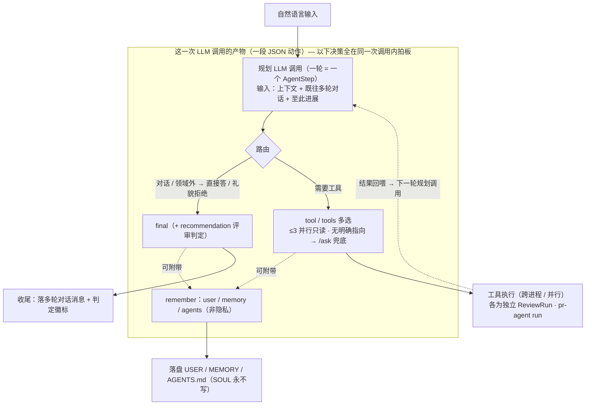
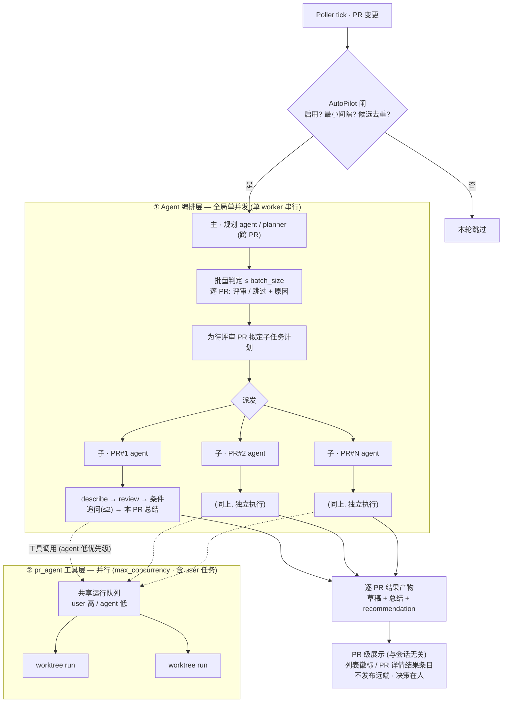

# 06 · Agent 设计

## 职责与边界

把「对话即问答」升级为「对话即委派」，并把「轮询发现 PR → 人工逐条点 `/describe`·`/review`」沉淀为可被规则约束的自动化。

两件事合在本模块：

1. **会话 Agent 化**——渲染层的自然语言输入不再直接落到 `/ask`，而是交给一个能读取本地 Agent 上下文、自主规划任务、按需编排多个 pr-agent 工具并把思考与结果留存输出的 **Agent 运行时**。直接的斜杠工具指令（`/describe`·`/review`·`/ask`）仍维持原有「直达工具」语义，不经 Agent。
2. **AutoPilot 预评审**——轮询发现新 / 变更 PR 后，按规则自动预跑评审，进应用即见待确认草稿。决策权仍在评审者（草稿不自动发布，修改性操作受红线约束）。

负责：Agent 上下文目录（灵魂 / 规范 / 记忆 / 用户画像 / 规则）的加载与注入、自然语言 → 任务规划、工具编排与过程记录、AutoPilot 候选筛选与 LLM 判定、与既有运行队列的优先级调度、修改性操作的授权红线、提示词模版与初始化。

不负责：pr-agent 进程本身与 token 采集（见 [04](04-pragent-runtime.md)）、findings 解析与草稿发布（见 [05](05-review-workflow.md)）、规则匹配的正则语义（见 [07](07-rules.md)；本模块只承载规则正文的存储位置 `<agent.dir>/rules/`）、PR 发现 / 软删 / 索引（沿用既有 Poller，见 [03](03-state-storage.md)）、平台写操作 API（见 [01](01-platform-adapter.md)）。

> 与 [07 规则系统](07-rules.md) 的关系：规则正文存于 Agent 目录的 `rules/` 子目录（`<agent.dir>/rules/`）；其「一文件一规则 + frontmatter 匹配 + 取首条命中 + per-tool 注入 `EXTRA_INSTRUCTIONS`」的匹配语义由 [07](07-rules.md) 定义，本模块只负责加载与注入。

## 核心设计

### 1. Agent 目录：分层上下文

Agent 目录是 Agent 的**完整人格与知识来源**，挂载于配置 `agent.dir`（路径，空 = 停用）+ `agent.enabled`（总开关）；与应用数据解耦，可指向独立目录或团队 git repo。

目录约定（缺任一文件不阻断，缺则该层上下文为空）：

```
<agent.dir>/
├── SOUL.md      # 灵魂：核心职责、工作边界、语气基调（Agent 只读·默认由预制模版规定）
├── AGENTS.md    # 工作规范：评审流程、AutoPilot 触发策略、工具使用红线（人写）
├── MEMORY.md    # 长期记忆：跨 PR / 跨会话的事实沉淀（Agent 可追加，人可编辑）
├── USER.md      # 用户画像：评审偏好与个人习惯（Agent 可追加，人可编辑）
└── rules/       # 规则化注入：沿用 06 的「一文件一规则 + frontmatter」（人写）
    └── *.md
```

关键取舍：

- **分层而非单文件**：`SOUL` 定职责边界（恒定）、`AGENTS` 定流程与红线（恒定）、`rules/` 定逐 PR 命中的细则（结构化、可正则匹配）、`MEMORY` / `USER` 是**可写记忆**（Agent 在工作中沉淀、人可校订）。
- **`SOUL.md` 对 Agent 只读**：灵魂是 Agent 自身无权改写的「宪法」——**禁止 Agent 修改 `SOUL.md`**，默认情况下其内容**完全由预制模版规定**（初始化时落地，见 §8）。约束在运行时强制：装配上下文时 `SOUL.md` 只读注入，Agent 工具目录里没有写 `SOUL.md` 的能力；即便 LLM 越权产出对它的写操作也被拒（与 §4 修改类红线同源）。这样 Agent 无法自我重定义职责与边界。仅人（或团队 git repo 的维护者）可改 `SOUL.md`。
- **读写边界清晰**：`SOUL` 仅人可改（Agent 只读）；`AGENTS` / `rules/` 人写为主；`MEMORY` / `USER` 是 Agent 与人共写的可写记忆。
- **整目录团队共享**：与 [07](07-rules.md) 同理——把 `agent.dir` 指向一个 git repo，团队 clone 即同一套灵魂 / 规范 / 规则。`MEMORY` / `USER` 虽可写，但仍属共享上下文（跨 PR 生效），写入走原子写（见下「会话隔离」）。
- **空目录 = 退化为原生**：`agent.dir` 为空或 `agent.enabled=false` 时，Agent 运行时降级——自然语言回退到等价 `/ask`、AutoPilot 不可用、pr-agent 走原生行为。保证「不配置也能用」。

### 2. 上下文注入：每次执行装配最新内容

**每次 Agent 执行都现读、现装配，无缓存**（与 [07](07-rules.md)「每次 run 现读规则」一致），确保用户刚改完 `SOUL.md` / 新写一条 MEMORY 立即生效。Agent 目录是寥寥几个小 Markdown，现读开销在毫秒级、相对一次数秒的 LLM 调用可忽略；且天然 stale-proof——`agent.dir` 常指向团队 git repo，外部 `git pull` 在应用之外发生，现读总能拿到最新。故**不引入内存缓存 / 文件监听作为加载权威**：监听器（跨平台可靠性坑、自写 `MEMORY/USER` 反触发回环）的收益主要是 UI 反应性而非 run 路径性能，可作为后续旁路信号（通知渲染层刷新「当前命中规则」chip），但绝不让正确性依赖它。

一次装配的系统上下文按固定次序拼接：

1. `SOUL.md` 正文 —— 人格与边界。
2. `AGENTS.md` 正文 —— 工作规范与红线。
3. **工具目录（tool catalog）** —— 环境内预定义的工具指令（`/describe`·`/review`·`/ask` 等）的名称、语义、参数与**可用性标记**（读类 / 修改类），由运行时**注入**而非写死在提示词里。新增工具只需在目录登记即对 Agent 可见。
4. 命中的 `rules/` 规则正文 —— 按当前 PR 上下文 `{projectKey, repoSlug, targetBranch, tool}` 匹配取首条（沿用 06）。
5. `MEMORY.md` + `USER.md` 正文 —— 长期记忆与用户画像。
6. **当前 PR 元数据** —— 标题 / 描述 / 目标分支 / 变更概况。
7. **当前会话快照** —— 本 PR 的 todo 与进度（见下），让 Agent 续上未完成的规划。
8. **语言行为指令** —— 执行时注入的显式国际化规则，覆盖两类语言行为：
   - **AI 输出语言**：Agent / 评审产物用目标语言输出，跟随 `config.language` / `resolveLanguage`（沿用既有「AI 回复语言随界面语言」，见 [04](04-pragent-runtime.md) 的响应语言注入、[11](11-i18n.md)）。
   - **记忆写入语言**：Agent 向 `MEMORY.md` / `USER.md` **追加新记忆时用用户习惯语言记录**（默认取 `config.language`，可由 `USER.md` 已记录的语言偏好细化），便于用户日后阅读自己的记忆。这条写入行为规则**必须显式写进提示词**——否则 Agent 可能按模版的 en-US 或随机语言落记忆。

**三个语言概念解耦**：①模版 / 上下文文件**写成什么语言**（en-US 单份、用户可改写，见 §8）；②**AI 输出语言**（跟随 `config.language`）；③**记忆写入语言**（用户习惯语言）。三者独立——`SOUL.md` 可以是英文，输出与新记忆仍按用户语言走中文；反之亦然。由第 8 项这组执行时规则单点控制输出与写入两类行为。

工具目录的「可用性标记」是红线落地的关键（见「工具规范」）：修改类工具在未授权时以**禁用态**注入，Agent 知其存在但不可调用。

### 3. 会话 Agent 化：路由、规划、过程留存

**输入路由**（在渲染层输入解析处分流）：

- `/describe`、`/review` 开头 → **直达工具**，维持既有「忽略其余文本、直接跑该 tool」语义。
- `/ask <text>` → **直达工具**，文本作为 question 直跑 `/ask`。
- 其余直接的工具 / 操作指令 → 维持各自原有调用。
- **无斜杠的自然语言** → **交给 Agent 运行时**（旧行为是等价 `/ask`，此为本模块的核心改动）。
- 未知 `/xxx` → 报错（不变）。

**Agent 规划循环**：Agent 运行时是一层位于既有运行队列之上的编排器，拥有独立的 LLM 通道（复用 LLM Profile 凭据、出站代理与 token 采集；见 [04](04-pragent-runtime.md)、[09](09-networking-proxy.md)）。一次会话：

1. 读上下文（§2）→ 产出 / 更新 **任务清单（todo）**，落盘到本 PR 工作目录。
2. 逐步执行：每步或是一次规划 / 判断的 LLM 调用，或是一次工具调用（把 `/describe`·`/review`·`/ask` 作为「工具」**入既有运行队列**执行，复用 worktree、并发与取消）。
3. 每步的**思考摘要**与**工具调用结果**写入会话 transcript，并实时流式推送渲染层；todo 项随之标记完成、进度落盘。
4. 满足完成条件或触达步数上限即收尾。

**工具选择与路由：哪些决策在「同一次 LLM 调用」内完成**：自由规划 Agent（自然语言入口）是一个
ReAct 循环——**每一轮就是一次编排级 LLM 调用**（一个 `AgentStep`）：输入「上下文、既往多轮对话、
至此进展」，输出一段 **JSON 动作**。关键边界是——**路由、工具选择、收尾、记忆这几类「决策」全在
这一次调用内拍板**；真正耗时的是动作里被选中的工具去 pr-agent 执行、以及循环本身的多轮往返。

一段动作（单次调用的产物）可同时承载：

- `thought`：本轮思考摘要（留档 + 流式推送）。
- **工具选择**，三选一：`tool`（单个，`/ask` 可带 `question`）；`tools`（**一次并行多选只读工具**，
  如 `["/describe","/review"]`，**上限 3**、彼此错开 100~200ms 起跑）；或不选工具直接 `final`（收尾）。
- `recommendation`：评审类收尾的非约束性判定（`approve` / `needs_work` / `manual_review` + 理由），
  与 `final` 在**同一次调用**产出，供 UI 展示判定徽标。
- `remember`：主动记下的**非隐私**条目，按目标可写文件分组（`user` → USER.md / `memory` → MEMORY.md
  / `agents` → AGENTS.md），随本轮动作一并返回、收尾后落盘（**`SOUL.md` 永不写**）。

**路由策略**（写进规划提示词，也在这同一次调用里裁决）：自然对话（问候 / 自我介绍 / 澄清）直接
`final` 回答、不调工具；评审领域外的任务礼貌拒绝、不调工具；与本 PR 相关但无明确工具指向时默认
`/ask` 兜底（带聚焦问题）；评审收尾固定为 `## 摘要` / `## 关键发现` / `## 建议` + `recommendation`。

**单次调用内 vs 跨多次调用**——这条边界是读懂运行态与计量（见下「步 vs 子任务」）的关键：

- **同一次 LLM 调用内**：路由判定、（可并行的）工具选择、收尾答复、判定建议、记忆写入意图。
- **跨多次调用 / 多进程**：被选中工具的实际执行（各为独立 `ReviewRun` / pr-agent run）、ReAct 的
  多轮循环（每轮一次新的规划调用）、以及固定微流程（§6）里 judge / summary 各自的独立 LLM 调用。



固定微流程（§6 的自动评审 / AutoPilot）是另一种形态：工具序列**预定**（describe + review → 条件
追问 → 总结），judge / summary 各是**独立**的编排级 LLM 调用，不走上面这套「单次调用内自由多选」的
规划——两者互补，见「步 vs 子任务」的计量口径。

**步 vs 子任务（pr-agent run）的计量边界**：**编排 agent**（交互式即 PR 自身的 agent，autopilot 即各 PR 的子 agent）**不只是规划分发**——每一步（`AgentStep`）是一次 plan / judge / 工具分发的**编排级 LLM 调用**：规划 todo、读 findings 判断是否追问、收尾总结都算它的步。而 `/describe`·`/review`·`/ask` 这些**拆给 pr-agent 子进程跑的任务**，在编排层维度**只计「分发」那一步**；pr-agent run **内部**自己的多次 LLM 调用**不计入 `stepCount`**——它是一条独立 `ReviewRun`，按自身 `tokenUsage` 计量。由此：① 步数是**编排级**概念，衡量编排 agent 的决策回合，不被子任务内部复杂度撑大；② **token 两层都采**——编排开销 + 各 pr-agent run 用量都归入会话计量（见「扩展与注意事项」的 Agent LLM 成本），只是不混进步数。§6 autopilot 的步数公式正按此口径数：describe / review / 每个 ask / summary 各算一步。

**过程留存**：思考步骤、工具结果、todo、进度均持久化于本 PR 工作目录，跨 PR 切换与组件卸载存活（与 05 的 run store 保活一致），可事后回看。

**交互控制**（聊天框）：

- **一键自动评审按钮**：在聊天框「指令（`/`）按钮」右侧提供一个**自动 Review 按钮**，点击即对当前 PR 触发 §6 的自动评审微流程（`/describe`+`/review`→ 仅严重问题条件性追问 → 总结）。它是**用户直接发起**：走 `user` 优先级（见 §7）、**立即执行**，不受 AutoPilot 总开关 / 最小间隔 / 台账去重约束（那三道闸只管后台自动触发）。等于把 AutoPilot 的微流程作为一个手动动作随时复用。
- **Stop（暂停保态）**：聊天框 Stop 按钮**一键停止当前 PR 下的所有 Agent 任务**——中止该 PR 正在执行的 run（复用 AbortController）、清掉其在等待队列里的 agent 任务，但**保留上下文状态**（`AgentSession` / todo / 进度 / transcript 原样落盘，会话状态置 `paused`）。这区别于既有 `cancel`「丢弃不留痕」：Stop 是**可续的暂停**。
- **Continue（续跑）**：对 `paused` 会话一键续跑——从保留的 todo / 进度接着规划执行（§3 的会话循环本就「读会话快照续上未完成规划」，Continue 即复用这条路径），无需从头重来。
- **运行态可见且共享**：PR 会话**直接展示该 PR 下正在执行的自动任务**——AutoPilot / Agent 编排出的 step 与 user 手动发起的 run **同进一条会话时间线**（同一 transcript + step 流式推送），不存在「后台跑、会话看不见」的隐形通道。三者**共享同一运行态占用**：复用既有跨 PR 保活的 run-state store（见 [05](05-review-workflow.md)、[10](10-ui-interaction.md)）与同一条运行队列 / 并发预算（见 §7）——一个 AutoPilot run 像手动 run 一样占用可见的并发槽，状态栏活动 chip / 队列浮层与 PR 会话对它的呈现一致。切走再切回该 PR，正在跑的自动任务仍在原位。

**规避超长任务**：会话受**步数上限** `agent.max_steps` 约束（默认取小值）。设计立场是「review 场景单次自动化操作通常不需要 10 个任务」——Agent 应倾向「少而准」的工具编排而非无限发散；触达上限即停并在 transcript 标注「因步数上限中止」，绝不静默截断。AutoPilot 路径另有更紧的预算（见 §6）。

### 4. 工具规范：修改性操作红线

工具目录按副作用分两类，运行时**硬性**区别对待（不只靠提示词约束）：

- **读 / 分析类**（`/describe`·`/review`·`/ask`、读 diff、读 findings、读 PR 列表等）：Agent 始终可自主调用。注意 `/describe`·`/review` 本身只产出本地草稿、不写远端，属安全操作。
- **修改类**（`/approve`、`/needswork`、发布 inline 评论、reply/edit/delete、合并 PR 等一切对远端有副作用的写）：**默认禁止 Agent 自主调用**。仅在两种授权下放行：
  1. **用户直接下达指令**（在会话里显式要求执行该操作）；
  2. **规则显式授权**（`AGENTS.md` / `rules/` 中明确授予 AutoPilot 某项写权限，见 §6 扩展）。

红线在运行时层强制：修改类工具在无授权时以**禁用态**注入工具目录，且执行入口二次校验授权标志——即便 LLM「越权」产出一个 `/approve` 调用，运行时也拒绝并记入 transcript。这样「提示词被绕过」不等于「操作被执行」。

### 5. 会话隔离与规则共享

- **规则 / 上下文共享**：`agent.dir`（SOUL / AGENTS / MEMORY / USER / rules）是**全局单份**，所有 PR 的 Agent 会话读同一套。改一处，处处生效。
- **会话隔离**：每个 PR 的 Agent 会话状态（todo、进度、plan、transcript）**按 PR 隔离**，落在该 PR 的 per-PR 目录下（见 [03](03-state-storage.md) 的 `state/prs/<hash>/`），互不串扰。不同 PR 并发跑 Agent 安全。
- **可写记忆的并发**：`MEMORY.md` / `USER.md` 是跨 PR 共享的可写文件，多个会话可能同时追加 → 走 StateStore 同款**原子写（tmp → fsync → rename）**、Main 进程单写者串行化；追加语义优先（不整文件覆盖），降低并发互覆风险。

### 6. AutoPilot：轮询触发的自动预评审

把「新 PR 进来自动预跑」做成一个**默认关闭、可一键启用**的后台自动化，由 `AGENTS.md` 规定其触发与例外策略。

**分层架构：规划 agent（主）↔ 各 PR agent（子）**——autopilot 不是「一个大 agent 串跑所有 PR」，而是**主子两层 + 两个并发域**：

- **主 = 规划 agent（planner，跨 PR、唯一）**：批量判定哪些 PR 要评审、为每个待评审 PR 拟定子任务计划、派发；**不碰工具、不出总结**。
- **子 = 每个 PR 的 agent（独立）**：各自执行 planner 派的**有界微流程**，并**在本 PR 子任务结束后产出本 PR 的总结**（逐 PR，无全局总结）。
- **并发域一：Agent 编排层 = 全局单并发**——planner 与各 PR agent 的推理由**单个后台 worker 串行**驱动（成本有界、顺序确定）。
- **并发域二：pr_agent 工具层 = 并行**——子 agent 派发的 `/describe`·`/review`·`/ask` 走**共享运行队列并行**消化（与用户任务同池、用户优先，见 §7）。



**启用开关**：底部状态栏新增 **AutoPilot 按钮**，默认**禁用**，用户手动启用；状态持久化于配置（`agent.autopilot.enabled`，默认 `false`）。禁用时下述逻辑完全不跑。

**触发与最小间隔**：AutoPilot 挂在 Poller 的「PR 变更」回调上，但**并非每次 poll 都唤起 AI**。两道闸：

1. **最小间隔守卫** `agent.autopilot.min_interval_seconds`（默认取较大值）——距上次 AI 评估不足间隔则本轮跳过，避免高频轮询把 LLM 判定打爆。
2. **候选去重**——只对「新发现」或「内容已变更且未自动评审过当前版本」的 PR 触发。

**自动评审状态记录（ledger）**：每个 PR 记录一份 AutoPilot 台账（`autoReviewedAt` / 评审时所对应的 PR `updatedAt` / 判定结果与原因）。是否「未执行过自动化 review」据此判定：台账记录的 `updatedAt` 与当前 PR `updatedAt` 不一致（含从无记录）即视为待处理——这样 PR 被推新 commit 后能再次进入候选，而内容未变则不重复跑。

**批量判定（例外规则）**：候选 PR 不无脑全跑，先过一道 LLM 判定：

1. 收集候选 PR 的**标题 + 描述**，组织成结构化清单。
2. **单次上下文规模受限**：每批至多 `agent.autopilot.batch_size`（默认 10）个 PR；超出按批跨轮处理，并 `log` 出被推迟的数量（不静默截断）。
3. 喂入 LLM，按规则逐 PR 判「是否值得自动评审」并附原因——例如**分支合并 / 回合并类 PR 可跳过**、纯依赖升级可跳过等，例外规则在 `AGENTS.md` 里可扩充。
4. 判定结果落台账（含「skipped + 原因」，便于审计与 UI 展示）。

**默认动作——规划与执行分层**：判为「评审」后，autopilot **不由单个 agent 串跑所有 PR**，而是分两层（这也是「规避超长任务」的结构性手段）：

- **规划层（规划 agent / planner，跨 PR）**：上面的批量判定即其职责——逐 PR 定「评审 / 跳过」，并为每个待评审 PR **拟定子任务计划**（autopilot 下子任务即下述固定微流程模板）。planner **只规划与分发**，自身不跑工具、不产 PR 总结，预算极小。
- **执行层（每个 PR 各自的 agent，独立）**：拿到计划后，**各 PR 的 agent 独立完成自己的子任务**，并**在本 PR 子任务结束后产出本 PR 的总结**。总结是**逐 PR**的、由该 PR 的 agent 收尾——**不存在跨 PR 的全局总结**。

> 交互式入口无 planner：用户直接与某个 PR 的 agent 对话；planner 是 autopilot 跨 PR 专属。

每个 PR 的 agent 执行如下**有界微流程**（即 planner 派发的子任务计划），按**低优先级**入工具队列（见 §7 调度）：

1. `/describe` + `/review` —— 生成描述与 findings，产物进既有草稿池（见 [05](05-review-workflow.md)）。
2. **仅对严重问题条件性追问** —— **默认不追问**。该 PR 的 agent 读 §1 工具输出（findings 及其 `severity`，见 [05](05-review-workflow.md)），仅当出现**特别恶性 / 高严重度**的疑点（例如疑似安全漏洞、数据损坏、严重逻辑缺陷且需核实上下文）才考虑就该点补跑 `/ask`。**硬上限 ≤2 个问题**（`agent.autopilot.max_followup_asks`，默认 2）：没有严重问题就一个都不问，绝不为追问而追问。`/ask` 是只读工具，属红线放行范围（见 §4）。
3. **逐 PR 收尾总结（严格限长）** —— **由该 PR 的 agent 在本 PR 子任务（describe / review / 追问）全部结束后**产出一段**严格限长**的总结（综合本 PR 的产出，受 `agent.summary_max_chars` 约束，默认数百字内；超限须**自行压缩、不截断要点**；无跨 PR 全局总结）。内容含**要点、风险、以及是否建议通过的倾向**——给出 `approve` / `needs_work` / `manual_review` 三档之一 + 一句理由。落盘为**挂在 PR 上的结果产物**（`summary` + `recommendation` + 步骤日志，持久化在该 PR 的 autopilot 结果记录里）。**关键——展示不依赖任何 agent 会话视图**：autopilot 是**后台异步任务**，用户未必在与之对话，本设计也**不引入「agent 主会话」UI**，故总结**不能**寄生在聊天 transcript / 常驻会话卡上。它经 **PR 级、与会话无关**的 surface 呈现：① **PR 列表**项的 `recommendation` **小徽标**（跨 PR triage，由轻量台账直接读，无需加载会话；一眼看出 autopilot 给哪些 PR 标了「建议修改」）；② **PR 详情的评审结果区**——把本次 autopilot 产物（草稿 findings + 总结 + `recommendation` chip）作为一条**结果条目**并入既有 run / 评审面板，**打开 PR 即见、无需开聊天**；③ 可选的**完成通知 / 未读角标**「autopilot 预评审完成」。步骤日志是**可按需展开的审计留档**，不是用户需实时盯的对话。**仅为非约束性建议**：给「建议通过」不等于执行 `/approve`、「建议修改」也不触发 `/needswork`——真通过 / 打回仍是评审者手动点按（红线见 §4）；结果条目可放**「采纳为 PR 状态」按钮**把建议一键转成手动操作，但点按始终在人。

**不自动发布**：上述全部产物——草稿、追问回答、总结——**只落本地、进待确认状态**，进应用即见,**不自动写远端**（除非 §4 / §6 扩展显式授权）。决策权仍在评审者。

**步数上限——分层各有预算，结构推导而非借用 `agent.max_steps`**：

- **规划 agent（planner）**：只做「批量判定 + 派发」，预算极小（一次 judge pass + 分发），不自由展开。
- **每个 PR 的 agent**：**不自由规划**，只执行 planner 派的**固定微流程模板**（唯一可变处是 0..N 个条件性追问）。故步数上限**由模板形状推导**，不套用更宽的交互式 `agent.max_steps`：硬上限 ≈ `2（describe + review）+ max_followup_asks + 1（summary）` + 少量判定开销，**唯一能推高它的可调量是 `max_followup_asks`**。另设结构化硬 backstop `agent.autopilot.max_steps`（默认按上式推导、运行期不超过它）兜底，防自循环把背景任务撑爆；触顶即停并标注「autopilot 步数上限中止」。

背景自动化的步数因此**可预测、随模板而定**，不被某次 LLM「想多了」吃满。

**写权限扩展（受 §4 红线约束）**：保留后续能力——若用户在 `AGENTS.md` / `rules/` 中**明确授权**，AutoPilot 可执行自动发布 comment、自动 `approve` / `needswork`。**默认全部拒绝**；授权是逐项、可审计的显式开关，运行时按 §4 的硬校验放行。

### 7. 调度：用户优先的有序队列

调度分**两个并发域**，分别约束「agent 编排」与「pr_agent 工具运行」——这是本设计的关键取舍：

- **Agent 编排层 —— 全局单并发**：planner 与各 PR agent 的**推理循环**由**单个后台 autopilot worker 串行驱动**，全局一次只有一个 agent 在「思考 / 分发」。理由：agent 推理是不可预测、花 token 的部分，串行化让背景成本有界、顺序确定，避免 N 个并发规划循环同时烧钱。该并发度**固定为 1**（非 `max_concurrency`）。
- **pr_agent 工具运行层 —— 并行**：`/describe`·`/review`·`/ask` 子进程仍走既有**共享运行队列**（见 [05](05-review-workflow.md) 的 `max_concurrency` + worktree 并发模型），**可并行调用**——跨 PR、且与用户任务并发。单并发的 agent 循环只管「分发」，重活在工具层并行消化，throughput 不被串行推理卡住。
- **优先级泳道（工具层）**：`user`（手动发起，高）/ `agent`（planner 与各 PR agent 派发，低）。高优先级在等待队列**插到所有低优先级之前**，但**不打断**正在执行的 run（执行不可抢占，避免半截 worktree / 部分副作用）；同级 FIFO。`QueueItem` 增 `priority` / `origin`（user / agent / autopilot）字段，复用既有 `AbortController` / `queueChanged` 机制。

效果：autopilot 的 agent 推理串行、便宜、可控；它派发的 review 子进程与用户随时点的 `/review` 在工具队列里**并行**消化、用户优先。三种 `origin` **共用同一工具队列、并发预算与运行态 store**——没有隐形后台执行：自动任务与手动任务一样占可见并发槽、一样在状态栏与对应 PR 视图实时可见（见 §3「运行态可见且共享」）。

### 8. 提示词模版与资源目录

- **工程内预建模版**：仓库内置一套默认 `SOUL.md` / `AGENTS.md` / `MEMORY.md` / `USER.md` 与示例 `rules/`，作为 Agent 目录的**初始化骨架**。
- **模版统一 en-US 单份、不做 i18n**：模版是用户的**著作内容**而非产品 UI，故不提供多语变体——一律以 **en-US** 落地（与项目 en-US 兜底一致）。用户初始化后可自由改写成目标语言（中文 / 日文 …）；改的是自己的上下文文件，与 AI 输出语言互不绑定（输出语言由 §2 第 8 项的执行时国际化规则单点控制）。
- **统一资源目录管理**：模版集中放在桌面应用的**单一资源目录**下，随应用打包（与嵌入式运行时等资源同级管理），由初始化逻辑按清单拷贝；不散落在各处。
- **初始化时机**：用户首次启用 Agent（指定空的 `agent.dir`、或首启向导引导）时，从模版目录 scaffold 出上述文件；已存在则不覆盖（幂等）。`AGENTS.md` / `MEMORY.md` / `USER.md` / `rules/` 是可编辑 Markdown，用户与 Agent 后续按各自权限改写。
- **`SOUL.md` 默认由模版规定**：灵魂的内容**默认完全来自预制模版**（初始化落地的就是模版正文），Agent 全程无权改写（见 §1）。这把「Agent 是谁、边界在哪」的定义权牢牢留在模版 / 维护者侧；个人或团队若要定制，仍由人去改 `agent.dir` 里的 `SOUL.md`（或在团队 git repo 中统一维护），而非交给 Agent 自演化。

## 数据 / 接口契约

**配置（`config.yaml`，`agent.*` 命名空间）**：

- `agent.dir`：Agent 目录路径（空 = 停用）。
- `agent.enabled`：总开关。
- `agent.max_steps`：单会话步数上限（默认取小值）。
- `agent.summary_max_chars`：收尾总结的严格篇幅上限（默认数百字内）。
- `agent.autopilot.enabled`：AutoPilot 开关（默认 `false`）。
- `agent.autopilot.min_interval_seconds`：两次 AI 评估的最小间隔。
- `agent.autopilot.batch_size`：单批判定的 PR 上限（默认 10）。
- `agent.autopilot.max_followup_asks`：自动评审微流程中条件性追问 `/ask` 的硬上限（默认 2）。
- `agent.autopilot.max_steps`：每个 PR 的子 agent 的结构化步数 backstop（默认按微流程模板推导：≈ `3 + max_followup_asks` + 少量开销）。
- `agent.autopilot.grants`：逐项写权限授权（默认全空 = 全拒）。

**Agent 目录文件清单**：`SOUL.md` / `AGENTS.md` / `MEMORY.md` / `USER.md` / `rules/*.md`（rules 的 frontmatter schema 沿用 [07](07-rules.md)）。

**per-PR 会话布局**（落在 [03](03-state-storage.md) 的 `state/prs/<hash>/` 下，按 PR 隔离）：

```
state/prs/<hash>/
├── ...                  # 既有 meta / comments / runs（不变）
└── agent/
    ├── session.json     # AgentSession：会话元数据 + todo + 进度 + 步数
    ├── transcript.json  # AgentStep[]：思考摘要 + 工具调用 + 结果（流式落盘）
    └── autopilot.json   # AutoPilot 台账：autoReviewedAt / updatedAt 快照 / 判定与原因
```

**核心形状（以名称与形状描述，不绑定实现）**：

- `AgentSession`（**每个 PR 一份，子 agent 所有**）：`status`（`running` | `paused` | `done` | `failed` | `cancelled`）/ `todo[]`（任务项 + 完成态）/ `stepCount` / `maxSteps` / `summary?`（本 PR 收尾总结正文，受 `summary_max_chars` 限长）/ `recommendation?`（`approve` | `needs_work` | `manual_review` + 理由；**非约束性建议**，不触发任何写操作）/ 计时与终止原因（含「步数上限中止」「用户暂停」）。`paused` 是可续状态，由 `agent:stop` 置、`agent:continue` 复活。
- `AgentStep`：`kind`（`plan` | `tool` | `judge`）/ `thought` / `toolCall?`（tool + 入参）/ `result?` / `tokenUsage?`。
- `PlannerPass`（**规划 agent，跨 PR，不落 per-PR 目录**，记于顶层 `state/agent/`）：`batch[]`（逐 PR 判定 + 子任务计划）/ `tokenUsage` / `at`。
- `ToolCatalogEntry`：`name` / `semantics` / `params` / `mutating`(bool) / `enabled`(按授权)。
- `AutopilotLedger`（**每 PR 一条，供列表徽标直接读、无需加载会话**）：`autoReviewedUpdatedAt` / `decision`（`review` | `skipped`）/ `reason` / `recommendation?`（`approve` | `needs_work` | `manual_review`）/ `summaryRef`（指向该 PR 子 agent 会话的总结）/ `at`。
- 运行队列 `QueueItem` 增补：`priority`（`user` | `agent`）/ `origin`（`user` | `agent` | `autopilot`）。
- **并发模型**：agent 编排层**固定单并发**（单后台 worker，非 `max_concurrency`）/ pr_agent 工具层 **`max_concurrency`**（共享队列，见 §7）。

**IPC 通道（新增，沿用既有 `invoke<K>` + `IpcChannels` 约束）**：

- `agent:run`：自然语言入口，发起一个 PR 的 Agent 会话。
- `agent:autoReview`：一键自动评审按钮——对当前 PR 立即跑 §6 微流程（`user` 优先级，不经 AutoPilot 三道闸）。
- `agent:stop` / `agent:continue`：暂停保态（中止当前 PR 全部 Agent 任务、置 `paused`、留状态）/ 续跑 `paused` 会话。**区别于** `agent:cancel`（丢弃不留痕）。
- `agent:getSession`：读会话快照（含 todo / 进度 / `summary`）。
- `agent:stepProgress`（push）：会话步骤的流式推送（思考 + 工具结果）。
- `agent:autopilotToggle` / `agent:autopilotState`：启停 AutoPilot / 读其状态与台账。
- 既有 `pragent:*` 队列通道复用，仅扩展 `priority` / `origin`。

## 扩展与注意事项

- **Agent LLM 成本**：规划 / 判定的 LLM 调用独立于 pr-agent，token 同样采集并归入会话计量，UI 需能区分「Agent 编排开销」与「评审本体开销」，避免成本不可见。AutoPilot 的批量判定尤其要控规模（`batch_size`）。
- **可写记忆的失控风险**：Agent 持续往 `MEMORY.md` / `USER.md` 追加可能膨胀 / 噪声化 → 需有体量上限或回收策略（后续可加 housekeeping），并保持人可随时编辑校订。
- **红线是硬约束、非软提示**：修改类工具的授权校验必须落在运行时执行入口，不能只写进 `SOUL.md` 期望 LLM 自觉；提示词与运行时双保险，运行时为准。
- **最小间隔与去重是防雪崩关键**：AutoPilot 必须同时满足「最小间隔」+「台账去重」+「批量上限」三道闸，任一缺失都可能在大量 PR / 高频轮询下打爆 LLM 配额。
- **语言三分**：①模版 / 上下文文件统一 en-US 单份、不做 i18n（用户可改写成任意语言）；②**AI 输出语言**由执行时注入的国际化规则控制，跟随 `config.language`；③**记忆写入语言**——Agent 追加 `MEMORY.md` / `USER.md` 时用用户习惯语言记录，此行为规则须显式注入提示词（见 §2 第 8 项、[11](11-i18n.md)）。三者解耦，别把「文件写成什么语言」与「输出 / 记忆用什么语言」绑死。规则匹配语义与语言无关。
- **后续可扩展**：Agent 规划器可接本机 agentic CLI（claude / codex 等，复用 [04](04-pragent-runtime.md) 的本地 CLI provider 思路）作为编排大脑；工具目录可纳入更多只读分析工具（按 changed_paths 聚焦、跨 PR 关联等）而不动红线框架。
