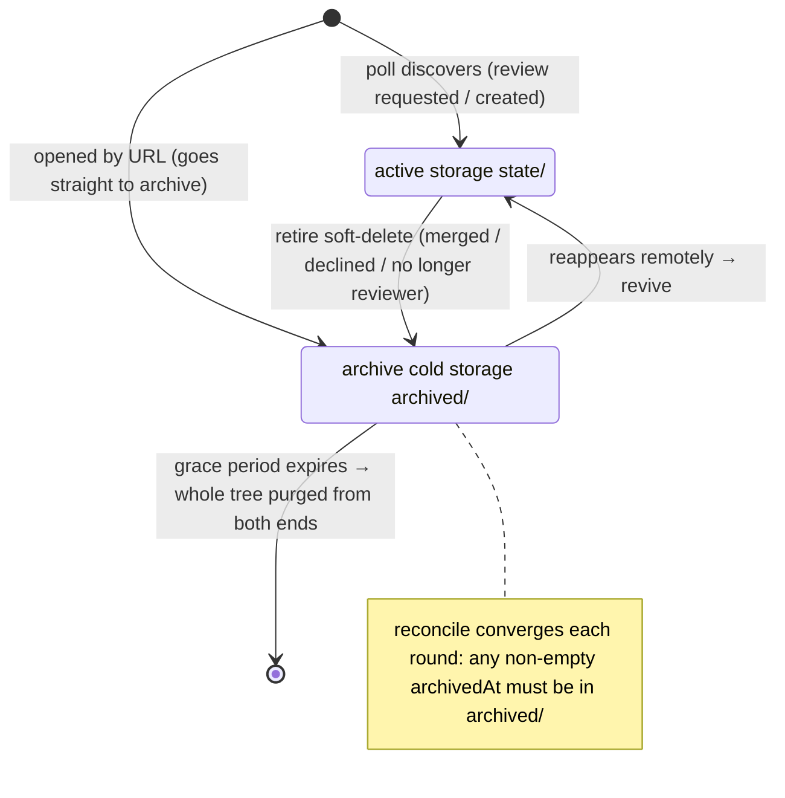

# State storage & data model

## Responsibilities & boundaries

Persist PR metadata, the comment cache, review runs, connections / observed repos, and so on. Phase one uses **JSON files** (not SQLite), wrapped behind the `StateStore` interface so the implementation can be swapped smoothly later.

In scope: state read/write, PR directory layout, soft-delete and cleanup, path safety. Out of scope: config / credentials (see [Config & secrets](02-config-and-secrets.md)) and the repo mirror (see [Repo mirror](../01-platform/02-repo-mirror.md)).

## Core design

### Storage model

- **JSON files + the `StateStore` abstraction**: `read/write/delete/deleteDir/list`. Phase one implements `JsonFileStateStore`, one file per key (relative to the `state/` root). **Atomic write**: tmp → fsync → rename, so a crash never leaves a half-written file. Single writer (the Main process holds it exclusively), no file locks. Every file carries a `schema_version`.
  Why not SQLite: the scale is small (at most a few hundred PRs / a few thousand findings); native modules must be recompiled per platform per Electron version, which complicates the CI matrix. Swap the implementation once a trigger threshold is hit (a single file >10MB read/written frequently / complex cross-entity queries / a measured bottleneck), with the business layer unchanged.
- **PR localId = hash**: `sha1("<platform>|<connectionId>|<group>|<repo>|<remoteId>").slice(0,12)`.
  Rationale: Bitbucket PR ids are per-repo incremental, so different repos on the same connection collide; the hash is unique and path-friendly (no `:`/`/`, no cross-platform sanitize needed); and multiple platforms share one identity.
- **Per-PR directory layout** (active PRs live in `state/prs/`; a retired PR has its whole tree relocated to the sibling `archived/prs/` cold storage):
  ```
  ~/.code-meeseeks/
  ├── state/prs/
  │   ├── index.json          # hash → PrIndexEntry (single source for lookup + retirement decisions; holds all active + archived entries)
  │   └── <hash>/             # active (present) PRs only
  │       ├── meta.json       # full PR metadata StoredPullRequest (carries its own platform field)
  │       ├── comments.json   # comment snapshot + cache key
  │       ├── read-state.json # user read watermark (used to derive the unread marker; written only by markRead)
  │       └── runs/<runId>.json # review session (same lifetime as the PR)
  └── archived/prs/<hash>/    # isomorphic cold storage for retired (soft-deleted) PRs; the whole tree is purged when the grace period expires
  ```
  - **Active / archived are physically separated**: `state/` and `archived/` are two sibling `StateStore` roots. Active storage holds only present PRs; when a PR is retired, its `prs/<hash>/` whole tree is moved into cold storage via `relocateTree(state → archived)`, and moved back on revive. The default list reads only active storage (`listStoredPullRequests` naturally excludes archives); beyond serving lifecycle cleanup, archives are also read on demand by the "Closed" view — `listArchivedPullRequests(state, archived)` (filters on the index by non-empty `archivedAt`, reading each meta from archive storage) produces the list, and when one is opened `findPrOrThrow` falls back to archive storage after missing in the active store, keeping its diff / comment / other paths resolvable.
  - **Per-PR storage is routed by archived state (write safety + supplemental review)**: within the closed scope, **merged / still-open** PRs still allow adding comments + re-running AI review (only merge / approval are withheld). This requires per-PR subtree read/write (comment cache / drafts / close relations / review runs / sessions / ledger / diff-base cache) to land in the correct root via `PrService.storeForPr(localId)` (resolved from the index's `archivedAt`) — otherwise a write to an archived PR would go into active storage and be wrongly deleted along with the archived data by the next poll's reconcile (`relocateTree` has the source overwrite the destination, **clearing the destination first**). **Writes for browse-only (declined) PRs are gated by the frontend per PR status** (the comment / review entry points are not rendered), but storage routing remains the prerequisite for backstop correctness.
  - **The index stays the single point**: `index.json` is maintained only in active storage and is the sole truth for "which hashes exist + archivedAt", covering all active + archived entries; the root the data lives in is implied by whether `archivedAt` is empty (empty = active storage / non-empty = archive storage).
  - There are also `connections.json` / `watched-repos.json` / `posted-comments.json` (cross-cutting idempotency records, decoupled from the PR directory).
- **Comment cache invalidated by PR `updatedAt`**: `comments.json` stores the `pr_updated_at` at write time; if it disagrees with the current PR meta's `updatedAt`, it is stale → re-fetch. Bitbucket bumps `updatedAt` on any PR change, so it is a sufficiently safe cache key.
- **Safety invariants**:
  - **A fetch failure doesn't touch local data**: if a connection's `listPendingPullRequests` throws → don't write its PRs, don't soft-delete, don't drop from the index; if all fail, the index gets zero writes and its mtime is unchanged (avoiding falsely triggering watchers / backups). The poll is the sole authority; the remote is the final truth.
  - **Path-escape barrier**: every fs operation passes a `subpathInside` check (rejects `..` / absolute paths / clearing the root), because the key is concatenated by the caller (including PR localId / runId) and must be guarded against unsanitized input reading/writing out of bounds.
- **Lenient reads, idempotent writes**: when a state file is externally deleted / corrupted, the read returns null/skip and the next poll rebuilds it; there is no startup reconcile / auto-backup.
- **Sweep orphan tmp files at startup**: in the atomic write "tmp → rename", a process force-killed / exiting between the two steps (e.g. an in-flight async write at the instant a window closes) leaves `*.tmp` orphans that accumulate across sessions. `sweepStaleTmpFiles` deletes all `*.tmp` early at startup, before any write — under the single-writer premise there is no in-flight write at this moment, so every tmp is an orphan from the last session and can be safely deleted; **never sweep during runtime**, to avoid wrongly deleting a tmp being used by a concurrent write / rename retry (so a conflict scenario doesn't delete spare files by mistake).
- **Sweep orphan archives at startup**: index-driven hard cleanup can't reach archived data whose "index entry was lost / dropped after a rebuild" (the poll only refills active PRs from the remote), which would linger forever in `archived/prs/`. `sweepOrphanedArchivedPrs` (at startup, before any write) is an index-free backstop: it walks `archived/prs/*` and deletes the whole tree of any that "has no corresponding entry in the unified index **and** whose directory mtime exceeds the grace period" (mtime stands in for archivedAt). The double conservatism avoids wrongly deleting a directory temporarily absent from the index; the mechanism is `JsonFileStateStore.sweepOrphanDirs`. **Normal cleanup still goes through the unified index's expiry-based hard cleanup; this only fills the gap of a lost index.**

### Business lifecycle

A PR's **presence state** in storage flows with its remote lifecycle — delimited by whether `index.json`'s `archivedAt` is empty (empty = active storage / non-empty = archive cold storage); cross-storage migration always goes through `relocateTree` (clear the destination first, delete the source last, idempotent and re-runnable):



- **Soft-delete + 1-week grace + relocation to cold storage**: when a PR disappears from the remote reviewer list (merged/declined/no longer a reviewer) → move the whole tree into `archived/` cold storage, then mark `archivedAt` (relocation precedes writing the index, so a crash is idempotently re-runnable); it is not deleted from disk immediately. Within the window the UI hides it but the data is retained; when it reappears remotely the whole tree moves back to active storage and auto-revives; when the grace period expires the next poll purges the whole directory from **both the archive and active ends** (clearing both ends catches old-layout / abnormal split-brain residue). This makes after-the-fact review convenient.
- **PRs opened by URL go straight to the archive**: someone else's PR pulled via the command palette "Open URL" (which never formally requested your review) is, after IPC `prs:openByUrl` authenticated-fetches it, written **directly with `writePrMeta(archiveStore)` + an index entry of `archivedAt=now`** — it is neither on the remote reviewer list nor needs to pass through the active state first, so it is treated as archived from the start, **reusing the same grace cleanup and reconcile** (purged from both ends once the grace period expires). When writing the index, it immediately re-reads and does a read-modify-write to shrink the race window against the poll rewriting the index. The mirror follows the lazy fetch of opening details (including locating a deleted source branch by the PR head ref).
- **Reconcile (eventual consistency)**: each poll round, while iterating the archived entries, if one not yet past grace still has data lingering in active storage → move the whole tree into archive storage (`relocateTree(state → archived)`; a no-op if already in place with the source missing). This covers pre-upgrade old-layout leftovers, abnormal split-brain residue, and interrupted relocations, converging "anything archived must be in archived/" automatically — no migration script needed. Reconcile only moves data, never touches the index, and doesn't break the "an all-failed poll writes zero to the index" invariant.
- **Unread marker**: `listStoredPullRequests` derives `StoredPullRequest.unread` (not persisted). Rules: **never opened** (no read-state) means unread — covering newly assigned / review-requested arrivals as well as the PRs flooding in after clearing the directory / a fresh install; **once opened**, it looks at whether the source head changed again (a new commit) or there is an "@me / reply to me" comment after the read time (`index.lastMentionAt > read-state.lastReadAt`). The two kinds of state are **split across files, with separate writers** to avoid races: the **read watermark** `read-state.json` (`lastReadHeadSha` + `lastReadAt`) is written **only** by `prs:markRead` (the user opening the PR) and never touched by the poll; the **mention cursor** `index.lastMentionAt` is maintained exclusively by the poll (the poll rewrites index.json wholesale and never overwrites the user watermark), fetching comments to scan only when the PR's `updatedAt` jumps and taking the max against history, at a cost proportional to the activity volume. Commit detection is common across platforms and doesn't depend on `updatedAt`. The early dev builds do no upgrade compatibility (they don't suppress old stock going red across the board; just clear the store / reinstall).
- **Unread mention count**: in the same comment scan, beyond the cursor it also accumulates the `createdAt` of "@me / reply to me" comments into `index.mentionAts` (unioned with and deduped against history, kept in descending time order to the most recent 10). `listStoredPullRequests` derives `StoredPullRequest.unreadMentionCount` from this (not persisted): counting those later than `read-state.lastReadAt` (all of them if never opened). It **coexists with, and does not replace, `unread`** — the count caps at 10 (the UI shows "10+" at capacity), and the UI replaces the unread dot with a numeric marker when there is a count, otherwise still showing the dot. It is likewise maintained exclusively by the poll and decoupled from the read watermark.

## Data / interface contract

**Abstract interfaces**

- `StateStore`: a key-value state read/write abstraction — `read` / `write` / `delete` / `deleteDir` / `list` (the key is a path relative to the `state/` root; `deleteDir` / `list` operate on a prefix in bulk).
- `relocateTree`: cross-store whole-tree relocation (list→read→write→deleteDir), moving a PR subtree between active ⇄ archive; the destination is cleared first (the source is authoritative), the source is deleted last (idempotent, re-runnable), and a missing source is a no-op — without breaking the `StateStore` abstraction.

**Core entities** (only the key fields carrying design meaning are listed; see each type definition for the full fields; every persisted file carries `schema_version`)

| Entity (file) | Purpose | Key fields |
| --- | --- | --- |
| `PrIndexEntry` (`index.json`) | single source for lookup + retirement decisions (all active + archived entries) | `identity` · `updatedAt` · `archivedAt\|null` (empty = active / non-empty = archived) · mention cursor `lastMentionAt?` · `mentionAts?` (most recent 10; the unread mention count is derived from this) |
| `StoredPullRequest` (`meta.json`) | full PR metadata, `platform` self-describing | derived states `unread` / `unreadMentionCount` not persisted |
| `PrReadStateFile` (`read-state.json`) | user read watermark, written only by `prs:markRead` | `lastReadHeadSha` · `lastReadAt` |
| `ReviewRun` (`runs/<runId>.json`) | review session (see [Review workflow](../01-platform/03-review-workflow.md)) | `findings` · `tokenUsage` · `model` · state-machine fields |

Cross-cutting idempotency records (decoupled from the PR directory): `connections.json` / `watched-repos.json` / `posted-comments.json`.

## Extension & caveats

- **Upgrading to SQLite**: swap only the `StateStore` implementation + data migration; the interface and business stay put.
- **grace period / hash length / cache key** are all intuitive values with room to tune (a change requires clearing `state/` and re-fetching).
- **Local development**: during a schema-change phase, just clear `state/` and re-fetch rather than writing a migration script.
- Orphan directories (no index entry) are not actively cleaned for now — they take disk space but don't affect functionality; add housekeeping later.
